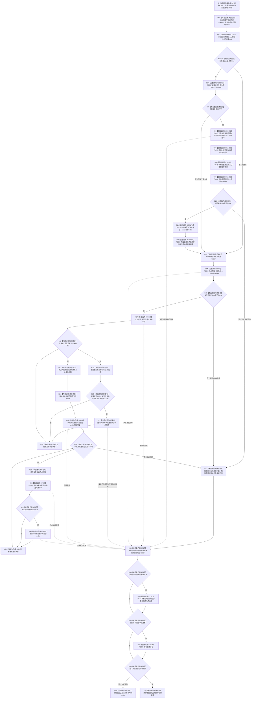

# CF-L6-0211 `关系仓库::获取子节点` 现状流程图

图类型：现状流程图
代码版本：`2c38ec4017e38b2e541b93c8c9ae038856f849c7`
源码 blob：`f7a9ea9a09d3065468208c16f9ea34f806b6e183`
覆盖文件：`海中鱼巣/核心/关系仓库.cpp:733-758`；宏展开依据同文件 `116-123`
唯一根函数：F0387
完整签名：`std::vector<海中鱼巣::节点句柄> 海中鱼巣::关系仓库::获取子节点(海中鱼巣::节点句柄 父节点) const`
参数：隐式 `this` 是调用期有效的 const `关系仓库` 非拥有借用；`父节点` 按值传入。本函数不保存调用方引用，也不把仓库记录、关系表迭代器、锁或事务许可返回给调用方
返回结果：先在关系仓库共享锁窗口内收集状态为 `有效`、类型为 `普通父子` 且源节点等于 `父节点` 的目标节点候选；释放关系仓库锁后再逐一经 F0343 复核节点当前有效性，按关系表迭代顺序返回仍有效的节点句柄值式向量。父节点无效、共享许可无效或没有合格候选时返回空向量
非法值 / 拒绝：共享许可宏在接域且没有既有关系令牌时取得许可；许可无效立即返回空向量。F0343 判定父节点无效时也返回空向量。候选目标在二次复核时失效只从结果中过滤，不区分从未存在、已删除、版本过期或其它无效原因
已登记调用方：F0218 经 E0851（`海中鱼巣/界面/投影.控制面板启动.ixx:111`）
直接项目函数：RCE1750 调用 F0336、RCE1751 调用 F0337、RCE1752 唯一解析到 F0397、RCE1756 调用 F0375、RCE1753 调用 F0338、RCE1754 调用 F0339、RCE1755 调用 F0340；E1765 在 `736`、`753` 两处调用 F0343；E1790 在已承载关系令牌范围离开函数时调用 F0344；E1818 同时登记完整表达式末已移空临时许可和函数离开时已承载自动许可的 F0345 析构
外部边界：X01019 在 `740` 构造 `std::shared_lock<std::shared_mutex>`。空 optional、两个 vector、关系表迭代、`push_back`、`size`、`reserve` 以及共享锁 / vector 析构均是当前代码中的标准库边界，但正式外部边界表没有为 F0387 分配独立稳定 ID，本文只标记聚合缺口
未解析项目调用：无。`关系共享许可范围` 宏中的函数指针按当前生产接线唯一解析到 F0397；其它宏展开项目调用均由静态接收者和现有同宏调用先例唯一绑定
调用图：`流程图/主程序可达调用关系/01_main可达项目调用边表.md`
外部边界表：`流程图/主程序可达调用关系/02_main可达外部边界表.md`
逐行映射表：`流程图/代码流程图/L6/CF-L6-0211_关系仓库获取子节点_逐行代码映射表.md`
输入契约 / 调用语境表：本文“读取语境与非成功分账”
非成功返回二分审查表：本文“读取语境与非成功分账”
偏差清单：本文“当前边界与聚合缺口”
依据提交 / 结构化消息：冻结提交 `2c38ec4017e38b2e541b93c8c9ae038856f849c7`；F0387、E0851、E1765、E1790、E1818、RCE1750—RCE1756、X01019 由正式 main 可达关系表、队列、当前源码和同宏已登记调用先例交叉复核；发布前在 `48a8a0a730f6fc9aef307b95abeee4f38a75826e` 复核目标源码 blob 未变化
结构读取与写入：只读取事务接线、关系表和节点仓库有效性。局部 vector 只承载值式候选和返回材料；不创建、修改、删除、失效或发布节点、关系、索引及领域记录
逻辑内返回：许可无效、父节点无效或没有仍有效的普通父子目标时返回空向量，零机器事实写入
内部错误：裸空向量合并许可拒绝、父节点拒绝和合法空候选，调用方不能仅凭空向量区分原因。关系表候选在锁释放后再做节点有效性复核；未接域并发下结果是两个读取时点的组合，不能解释为永久完整的树快照
生命周期与资源释放：宏先声明 `自动许可`，后声明 `自动令牌范围`；RCE1752 返回的临时许可先经 RCE1756 移动构造进 optional，随后在完整表达式末经 E1818 第一次析构。已承载时函数正常返回或异常展开均先经 E1790 析构 F0344，再经 E1818 第二次析构自动许可中的 F0345。关系仓库共享锁只覆盖 `740-749`；正常路径在构造第二个 vector 前已释放，异常路径先释放锁，再释放已构造 vector、关系令牌范围和许可
异常：未声明 `noexcept` 且不捕获；共享许可取得、X01019、F0343 及 vector 分配 / 追加异常均向调用方传播。异常展开按已完成构造状态逆序释放资源，不把异常包装为空向量
并发 / 幂等：函数零写入，可重复调用；每次调用仅按本次共享许可 / 关系锁窗口和后继节点复核形成返回材料。返回后许可、锁和局部候选均已释放，后续结构变化不改变已返回 vector，但也不保证它仍代表后续当前结构
验证入口：`关系仓库.cpp:116-123,733-758`、E0851、E1765、E1790、E1818、RCE1750—RCE1756、X01019，以及各被调函数稳定身份
验证输出：26 行源码完整映射；正式登记 10 条项目出边、1 条项目入边、1 个外部边界、0 个未解析项目调用；容器 / 迭代等未获稳定 X 身份的标准库操作按当前聚合口径保留为具名边界缺口；本批不运行构建或程序
依据：`规范/0050_项目通用机器逻辑与禁止性规则总纲_20260721.md`、`规范/0600_代码函数流程图应用与维护规范.md`、`规范/4010_子规范_统一仓库稳定句柄与通用关系索引边界.md`、`规范/4040_子规范_不透明结构事务候选确认撤销与最后发布.md`、`规范/4050_子规范_入口拒绝逻辑内结果与内部逻辑错误.md`
不得作为施工许可：是
不得宣称：空向量唯一证明没有普通父子关系、返回向量是原子全仓快照、返回后目标节点仍有效、宏展开缺边已经补入共享聚合、代码已经构建或运行验证，或本函数修改了任何机器结构

## 流程图

## 正式稳定项目调用合同

| 调用边 | 节点 | 被调函数 | 实参 | 调用前置 / 结果用途 | 被调图 |
| --- | --- | --- | --- | --- | --- |
| RCE1750 | C02 | F0336 `bool 结构事务接线::已接域() const` | `this=&事务接线_` | 宏进入后判断是否需要按生产接线取得共享许可 | 待生成 |
| RCE1751 | C04 | F0337 `const 结构事务令牌* 读取当前关系令牌(const 关系仓库&)` | `*this` | 仅已接域时读取当前线程是否已有同仓关系令牌 | 待生成 |
| RCE1752 | C06 | F0397 `结构事务许可 结构事务协调器::生成接线()::<lambda>::operator()(const std::shared_ptr<void>&) const` | `事务接线_.运行期状态` | 已接域且没有既有关系令牌时，按当前生产接线唯一取得共享许可 | 待生成 |
| RCE1756 | C07 | F0375 `结构事务许可::结构事务许可(结构事务许可&&) noexcept` | RCE1752 返回的临时许可右值 | 把临时许可移动构造进 `自动许可` optional | 待生成 |
| RCE1753 | C09 | F0338 `bool 结构事务许可::有效() const` | `this=&自动许可.value()` | 移动构造和临时许可析构完成后复核已承载许可 | 待生成 |
| RCE1754 | C11 | F0339 `const 结构事务令牌& 结构事务许可::读取令牌() const` | `this=&自动许可.value()` | 仅许可有效时借用令牌，供 C12 构造令牌范围 | 待生成 |
| RCE1755 | C12 | F0340 `关系令牌范围::关系令牌范围(const 关系仓库&,const 结构事务令牌&)` | `*this`、C11 返回的令牌 const 引用 | 建立当前线程关系令牌语境，离开函数时由 E1790 恢复 | 待生成 |
| E1765 | C14 | F0343 `bool 关系仓库::节点有效_(节点句柄) const` | 同一 `this`、按值 `父节点` | 许可宏完成后、取得关系锁前拒绝无效父节点 | `流程图/代码流程图/L6/CF-L6-0022_关系仓库节点有效_现状流程图.md` |
| E1765 | C28 | F0343 `bool 关系仓库::节点有效_(节点句柄) const` | 同一 `this`、按值 `候选` | 关系锁已经释放；决定候选是否追加到返回 vector | `流程图/代码流程图/L6/CF-L6-0022_关系仓库节点有效_现状流程图.md` |
| E1790 | D35 | F0344 `关系令牌范围::~关系令牌范围() noexcept` | `this=&自动令牌范围.value()` | 仅自动令牌范围实际承载对象；正常返回或异常展开时恢复前序关系令牌语境 | `流程图/代码流程图/L6/CF-L6-0023_关系令牌范围析构_现状流程图.md` |
| E1818 | D08 / D37 | F0345 `结构事务许可::~结构事务许可() noexcept` | `this=&RCE1752返回的已移空临时许可`；`this=&自动许可.value()` | 第一次发生在移动构造完整表达式末；第二次仅自动许可实际承载对象并严格发生在 D35 之后 | `流程图/代码流程图/L6/CF-L6-0024_结构事务许可析构_现状流程图.md` |

## 已登记调用方

| 调用边 | 调用方 / 位置 | 当前前置 | 结果用途 | 调用方图 |
| --- | --- | --- | --- | --- |
| E0851 | F0218 `生成控制面板世界树节点材料(...)` / `投影.控制面板启动.ixx:111` | 当前节点已通过句柄、递归深度、父链、节点记录和显示语义检查，并已压入当前父链 | 取得直接子节点组，随后按节点编号排序并递归形成控制面板树材料 | `流程图/代码流程图/L5/CF-L5-0098_生成控制面板世界树节点材料_现状流程图.md` |

## 读取语境与非成功分账

| 语境 | 当前前置 | 空结果或过滤原因 | 二分口径 | 结构后果 |
| --- | --- | --- | --- | --- |
| 接域、无既有关系令牌且许可有效 | 共享许可与关系令牌范围均已建立 | 父节点无效、没有匹配关系或目标节点二次复核失效 | 普通只读空候选；若正式上游保证完整树结构则沿父关系与节点当前性追根因 | F0344 后 F0345 释放；零机器事实写入 |
| 接域、无既有关系令牌但许可无效 | 自动许可已形成，自动令牌范围尚未形成 | 宏立即返回空向量 | 当前裸空向量把许可拒绝折叠为空候选 | 只经 E1818 释放许可；零写入 |
| 已有同仓关系令牌 | 宏不另取许可，也不建立新令牌范围 | 按现有令牌语境读取；其它空结果同上 | 当前嵌套只读语境 | 本函数不经 E1790 / E1818 释放外层令牌或许可 |
| 完全未接域 | 不建立自动许可或令牌范围 | 父节点无效、关系为空、没有匹配目标或目标节点失效 | 普通只读空候选 | 仅使用关系仓库共享锁和 F0343 自身读取边界；零写入 |
| 关系候选形成后目标失效 | 关系锁已经在 U23 释放 | C28 返回 false，该候选不进入结果 | 当前允许的后置过滤；强事务快照前置下需核对跨仓一致性 | 仅改变局部返回材料，不改变关系或节点结构 |

## 当前边界与聚合缺口

- F0387 的正式稳定项目边为 E1765、E1790、E1818、RCE1750—RCE1756，正式稳定入边为 E0851，正式外部边界为 X01019。
- `关系共享许可范围({})` 在源码中是一条宏调用，但运行路径展开为接线读取、既有令牌读取、动态取得许可、许可移动、临时许可析构、有效性复核、令牌读取和令牌范围构造。RCE1750—RCE1756 逐项登记宏内项目调用；同一 caller/callee 的两次 F0345 析构合并在 E1818，并保留两个生命周期语境。
- X01019 只登记共享锁构造。共享锁析构、vector 构造 / 析构、`size`、`reserve`、两处 `push_back` 和两组范围迭代均有实际标准库边界，但没有 F0387 稳定外部边界 ID；本文以“外部边界-聚合缺口”标出。
- 正常顺序固定为：宏许可 / 令牌范围先形成，候选 vector 再形成，关系共享锁在内层块形成并于 `749` 先释放，返回 vector 随后形成；函数离开时剩余局部对象逆序释放，已承载令牌范围经 E1790 先于已承载许可经 E1818 析构。
- 返回 vector 只保留通过二次 F0343 复核的目标句柄；它不携带关系句柄、父子顺序号、关系版本、锁或读取见证，不能独立证明完整、原子或后续仍当前的树结构。
