# CF-L6-0212 `控制面板窗口::窗口实现::读取只读材料` 现状流程图

图类型：现状流程图
代码版本：`2c38ec4017e38b2e541b93c8c9ae038856f849c7`
源码 blob：`fe9dad1eb3728c823beccf305c783be96a3df33d`
覆盖文件：`海中鱼巣/界面/控制面板窗口.cpp:386-416`
唯一根函数：F0388
完整签名：`bool 海中鱼巣::控制面板窗口::窗口实现::读取只读材料(bool 允许保留旧快照 = false)`
参数：隐式 `this` 是调用期有效的 `窗口实现` 独占可写借用；`允许保留旧快照` 按值传入并只转交 R0176。本函数不保存参数引用
返回结果：总览、六类树材料或启动结构统计任一不满足当前边界时，经 F0393 标记人读追根因错误并返回 `false`；三类材料均通过时先替换当前快照中的总览和六类树材料，再返回 R0176 的 bool 结果
非法值 / 拒绝：入口不拒绝 bool 参数；材料完整性检查发生在当前快照两项替换之前。失败不调用 R0176，但 F0393 会改变窗口人读错误状态
已登记调用方：E0855 / F0223 在 `控制面板窗口.cpp:1553` 显式传入 `false`；RCE0651 / R0164 在 1434 行使用默认参数 `false`
直接项目函数：RCE0176 调用 R0202 创建只读请求；RCE0177 调用 R0304 生成总览；RCE0178 调用 R0306 生成六类树材料；RCE1749 表示 X01021 遍历时调用 R0612 局部判定 lambda；RCE0179 调用 F0393；RCE0180 调用 R0176
外部边界：X01021 调用 `std::all_of`；X01022 从宽字符串字面量构造 F0393 实参；X01023、X01024 分别复制当前概念根和当前页游标 optional 作为 R0176 实参
未解析项目调用：无
调用图：`流程图/主程序可达调用关系/01_main可达项目调用边表.md`
外部边界表：`流程图/主程序可达调用关系/02_main可达外部边界表.md`
逐行映射表：`流程图/代码流程图/L6/CF-L6-0212_控制面板窗口读取只读材料_逐行代码映射表.md`
输入契约 / 调用语境表：本文“调用语境与非成功分账”
非成功返回二分审查表：本文“调用语境与非成功分账”
偏差清单：原 X01020 把已具名项目函数 R0306 重复登记为外部边界；本批按当前静态接收者删除该重复外部项。397—401 行局部 lambda 是项目源码函数，新增稳定身份 R0612 和标准算法回调边 RCE1749
依据提交 / 结构化消息：冻结提交 `2c38ec4017e38b2e541b93c8c9ae038856f849c7`；源码自正式冻结提交以来零差异；E0855、RCE0651、RCE0176—RCE0180、X01021—X01024 与当前源码逐调用点复核
结构读取与写入：读取控制面板服务生成的人读候选材料和当前启动结构统计；验证通过后写窗口 `当前快照.总览材料`、`当前快照.树视图材料组`，随后由 R0176 决定是否替换当前树投影。只更新界面值式快照和人读错误状态，不写节点、关系、索引或业务机器事实
逻辑内返回：本函数没有普通空候选成功；材料边界不满足返回 `false`，R0176 的逻辑拒绝或保留旧快照结果由其自身合同裁决
内部错误：总览、六类树材料或启动结构统计在当前已确认调用路径中不满足只读投影边界时，代码调用 F0393 标记追根因错误并返回 `false`
生命周期与资源释放：总览和树材料先形成局部值；X01021 只在调用期间借用数组元素。验证通过后复制进当前快照；X01023 / X01024 形成按值 optional 实参，R0176 返回后全部局部值结束生命周期
异常：未声明 `noexcept` 且不捕获；R0202、R0304、R0306、X01021、X01022、快照赋值、X01023 / X01024 或 R0176 抛出的异常直接传播。异常发生前已经完成的窗口局部赋值不会由本函数撤销
并发 / 幂等：本函数无内部锁，要求窗口线程独占 `窗口实现`。重复调用会重新生成候选并覆盖当前投影快照；结果是否相同取决于服务读取到的当前材料
验证入口：`控制面板窗口.cpp:386-416`、E0855、RCE0651、RCE0176—RCE0180、RCE1749、X01021—X01024
验证输出：31 行源码完整映射；6 个项目出边、4 个外部边界、0 个未解析项目调用；本批不运行构建或程序
依据：`规范/0050_项目通用机器逻辑与禁止性规则总纲_20260721.md`、`规范/0600_代码函数流程图应用与维护规范.md`、`规范/4050_子规范_入口拒绝逻辑内结果与内部逻辑错误.md`、`规范/8120_子规范_程序入口启动模式与运行宿主边界_20260726.md`
不得作为施工许可：是
不得宣称：界面快照成为机器事实、材料检查通过证明底层业务能力完成、返回 `true` 证明数据库或仓库已恢复，或保留旧快照等于当前读取成功

## 流程图

```mermaid
flowchart TD
    S["S【本函数内具体指令】进入F0388；独占借用this并按值接收允许保留旧快照"]
    C01["C01【函数调用 RCE0176】R0202 创建只读请求()→请求"]
    C02["C02【函数调用 RCE0177】R0304 控制面板.生成只读总览材料(请求)→总览材料"]
    C03["C03【函数调用 RCE0178】R0306 控制面板.生成六类树视图候选材料()→树材料组"]
    B04{"B04【本函数内具体指令】总览状态是否为可展示"}
    B05{"B05【本函数内具体指令】总览是否标记为人读材料"}
    B06{"B06【本函数内具体指令】总览是否来源显示服务"}
    B07{"B07【本函数内具体指令】总览是否禁止写业务事实"}
    N08["N08【本函数内具体指令】保存总览有效bool"]
    X09["X09【外部边界 X01021】std::all_of遍历树材料组"]
    C10["C10【函数调用 RCE1749】R0612 判定当前树视图材料→bool"]
    N11["N11【本函数内具体指令】保存树材料有效bool"]
    B12{"B12【本函数内具体指令】启动结构统计命名空间类型是否为结构统计"}
    B13{"B13【本函数内具体指令】启动结构统计来源是否为结构仓库集合"}
    N14["N14【本函数内具体指令】保存统计快照有效bool"]
    B15{"B15【本函数内具体指令】三个有效bool是否全部为true"}
    X16["X16【外部边界 X01022】从宽字符串字面量构造错误阶段文本"]
    C17["C17【函数调用 RCE0179】F0393 标记追根因错误(阶段文本)"]
    RF["RF【本函数内具体指令】按bool返回false"]
    N18["N18【本函数内具体指令】复制总览材料到当前快照"]
    N19["N19【本函数内具体指令】复制树材料组到当前快照"]
    X20["X20【外部边界 X01023】复制当前概念根optional"]
    X21["X21【外部边界 X01024】复制当前页游标optional"]
    C22["C22【函数调用 RCE0180】R0176 读取并替换当前树(当前分类,概念根,页游标,允许保留旧快照)→bool"]
    RT["RT【本函数内具体指令】按值返回R0176结果"]

    S --> C01 --> C02 --> C03 --> B04
    B04 -- "否" --> N08
    B04 -- "是" --> B05
    B05 -- "否" --> N08
    B05 -- "是" --> B06
    B06 -- "否" --> N08
    B06 -- "是" --> B07 --> N08
    N08 --> X09 --> C10
    C10 -- "每个已访问元素的判定结果" --> N11
    N11 --> B12
    B12 -- "否" --> N14
    B12 -- "是" --> B13 --> N14
    N14 --> B15
    B15 -- "否" --> X16 --> C17 --> RF
    B15 -- "是" --> N18 --> N19 --> X20 --> X21 --> C22 --> RT
```

## 项目源码调用合同

| 调用边 | 节点 | 被调函数 | 实参 | 调用前置 / 结果用途 | 被调图 |
| --- | --- | --- | --- | --- | --- |
| RCE0176 | C01 | R0202 `控制面板请求 创建只读请求()` | 无 | 函数进入后形成 R0304 的只读请求 | 待生成 |
| RCE0177 | C02 | R0304 `控制面板材料 控制面板服务::生成只读总览材料(const 控制面板请求&) const` | C01 返回请求 | 形成待验证总览值式材料 | 待生成 |
| RCE0178 | C03 | R0306 `std::array<控制面板树视图材料,6> 控制面板服务::生成六类树视图候选材料() const` | 隐式 `this=&控制面板` | 形成待验证六类树材料数组 | 待生成 |
| RCE1749 | C10 | R0612 `bool F0388::<lambda>(const 控制面板树视图材料& 材料) const` | X01021 当前遍历元素 const 引用 | 返回该元素是否满足可展示、可作为树分类且非详情材料 | 待生成 |
| RCE0179 | C17 | F0393 `void 窗口实现::标记追根因错误(std::wstring 阶段)` | X01022 形成的阶段文本 | 仅任一材料边界失败时写窗口人读错误状态 | 待生成 |
| RCE0180 | C22 | R0176 `bool 窗口实现::读取并替换当前树(控制面板树分类,std::optional<节点句柄>,std::optional<控制面板根页游标>,bool)` | 当前分类、X01023、X01024、`允许保留旧快照` | 三类材料通过并写入快照后，结果直接成为 F0388 返回值 | 待生成 |

## 调用语境与非成功分账

| 语境 | 当前前置 | 当前结果 | 二分口径 | 结构后果 |
| --- | --- | --- | --- | --- |
| E0855 窗口创建后首次读取 | F0223 已形成窗口实现和启动快照，显式传入 false | 验证通过后替换只读投影并调用 R0176 | 只读投影刷新 | 不保留旧树失败结果 |
| RCE0651 刷新当前分类 | R0164 使用默认 false | 与显式 false 相同 | 只读投影刷新 | 不因消息来源取得机器事实 |
| 总览边界失败 | 状态、人读、来源显示服务、禁止写业务事实任一不成立 | F0393 后返回 false | 追根因错误 | 不写总览 / 树材料到当前快照 |
| 六类树材料边界失败 | X01021 经 R0612 发现至少一项无效 | F0393 后返回 false | 追根因错误 | 不写总览 / 树材料到当前快照 |
| 启动结构统计边界失败 | 类型或来源不匹配 | F0393 后返回 false | 追根因错误 | 不写总览 / 树材料到当前快照 |
| 三类边界通过 | 总览、树材料、统计快照均有效 | 先覆盖两项当前快照，再返回 R0176 结果 | 正常只读刷新 | R0176 决定当前树替换 / 保留旧快照 |

## 当前边界与规范核对

- F0388 只消费控制面板服务生成的只读候选与启动结构统计，并更新窗口投影；界面、显示字符串和快照不取得机器事实身份。
- X01020 原签名实际是 R0306 的项目成员调用，已由 RCE0178 表达，不能同时保留为外部标准库边界。
- 397—401 行 lambda 具有非平凡三条件判定，由 X01021 在标准算法遍历期间回调；当前图以 R0612 / RCE1749 建立独立项目函数身份和调用边。
- 失败门禁位于 N18 / N19 之前，因此三类材料校验失败不会部分替换这两项当前快照；F0393 的人读错误状态仍会变化。
- N18 / N19 已完成后，R0176 抛异常或返回 false 时本函数不撤销两项新快照；是否保留旧树只由 R0176 和参数合同裁决。
