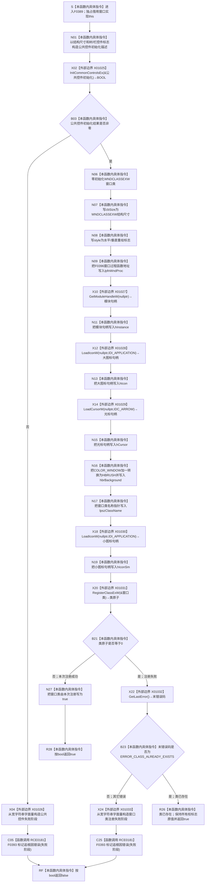

# CF-L6-0213 `控制面板窗口::窗口实现::注册窗口类` 现状流程图

图类型：现状流程图
代码版本：`bab41cae4223289e1297a5b7850f79b5b967fb06`
源码 blob：`fe9dad1eb3728c823beccf305c783be96a3df33d`
覆盖文件：`海中鱼巣/界面/控制面板窗口.cpp:422-452`
唯一根函数：F0389
完整签名：`bool 海中鱼巣::控制面板窗口::窗口实现::注册窗口类()`
参数：无显式参数；隐式 `this` 是调用期间有效的 `窗口实现` 独占可写借用。本函数读取静态窗口类名称和 F0396 函数地址，可能写 `追根因错误`、`失败阶段` 与 `窗口类由本次注册`
返回结果：公共控件初始化失败时标记追根因错误并返回 `false`；窗口类首次注册成功时把 `窗口类由本次注册` 写为 true 并返回 `true`；窗口类已存在时不改变该成员并返回 `true`；其它窗口类注册错误标记追根因错误并返回 `false`
非法值 / 拒绝：函数没有外部材料参数，也不预先拒绝 `GetModuleHandleW`、`LoadIconW` 或 `LoadCursorW` 的空结果；这些值原样写入 `WNDCLASSEXW`，最终由 `RegisterClassExW` 结果收口
已登记调用方：F0223 经 E0856 在 `控制面板窗口.cpp:1553` 调用；F0388 已成功读取只读材料，F0389 返回 false 时 F0223 停止后续主窗口、菜单和快捷键创建并返回启动失败结果
直接项目函数：RCE0181 在第 428、445 行调用 F0393 `标记追根因错误(std::wstring)`；第 435 行只把 F0396 `窗口过程` 的函数地址写入 `WNDCLASSEXW::lpfnWndProc`，不是本函数内直接调用
外部边界：X01025 初始化公共控件；X01026 / X01033 构造两处错误阶段宽字符串；X01027 读取当前模块句柄；X01028 / X01030 加载大小图标；X01029 加载光标；X01031 注册窗口类；X01032 读取紧随注册失败后的 Win32 末错误
回调边界：RCB0018 记录第 435 行的 F0396 `窗口过程` 注册材料。仅 X01031 非零成功时，本次调用把该函数地址注册进窗口类；`ERROR_CLASS_ALREADY_EXISTS` 分支没有用本次 `WNDCLASSEXW` 替换既有类定义
未解析项目调用：无；F0396 是赋入 `lpfnWndProc` 的唯一静态项目函数目标，后续由 Win32 消息分发调用
调用图：`流程图/主程序可达调用关系/01_main可达项目调用边表.md`
外部边界表：`流程图/主程序可达调用关系/02_main可达外部边界表.md`
逐行映射表：`流程图/代码流程图/L6/CF-L6-0213_控制面板窗口注册窗口类_逐行代码映射表.md`
输入契约 / 调用语境表：本文“调用语境与非成功分账”
非成功返回二分审查表：本文“调用语境与非成功分账”
偏差清单：本文“当前边界与规范核对”
依据提交 / 结构化消息：冻结提交 `f9b9c72195967682df88b8a95b0c5f8408c83bbe`；F0389、F0393、F0396、E0856、RCE0181、X01025—X01033、RCB0018 由正式 main 可达关系表和当前源码交叉复核
结构读取与写入：写 Win32 公共控件 / 窗口类进程资源和 `窗口实现` 内部宿主状态；错误路径经 F0393 写人读追根因标志与首个失败阶段。它不创建、修改、删除或发布节点、主信息、关系、索引、语素、需求、任务、方法或其它业务机器事实
逻辑内返回：`RegisterClassExW` 返回 0 且 `GetLastError()==ERROR_CLASS_ALREADY_EXISTS` 时，当前代码把既有窗口类作为可继续条件并返回 true；本次不取得注册所有权，也不验证既有类的窗口过程、样式、图标或其它字段与当前候选相同
内部错误：公共控件初始化失败，或窗口类注册失败且原因不是类已存在时，代码调用 F0393 标记人读追根因错误并返回 false，F0223 停止窗口启动依赖路径
生命周期与资源释放：两个 Win32 描述结构是栈内局部值；窗口类首次注册成功后由进程持有，`窗口类由本次注册=true` 使 F0224 析构时调用 `UnregisterClassW`。类已存在分支不重置该成员；其值保持进入本函数前的状态
异常：函数未声明 `noexcept` 且不捕获；Win32 API 以返回值报告失败。X01026 / X01033 构造 `std::wstring` 若抛出，则 F0393 和随后 bool 返回不会发生，异常直接传播
并发 / 幂等：本函数无内部锁，按窗口线程独占使用。公共控件初始化可重复请求；窗口类重复注册由 `ERROR_CLASS_ALREADY_EXISTS` 收口。对同一对象重复调用时，`窗口类由本次注册` 不在入口重置
验证入口：`控制面板窗口.cpp:422-452`、E0856、RCE0181、X01025—X01033、RCB0018，以及 F0224 的条件反注册路径
验证输出：31 行源码完整映射；1 个项目入边、1 个项目出边记录（2 个调用点）、9 个外部边界、1 个具名回调注册、0 个动态未解析调用；本子任务不运行构建或程序
依据：`规范/0050_项目通用机器逻辑与禁止性规则总纲_20260721.md`、`规范/0600_代码函数流程图应用与维护规范.md`、`规范/4050_子规范_入口拒绝逻辑内结果与内部逻辑错误.md`、`规范/8120_子规范_程序入口启动模式与运行宿主边界_20260726.md`
不得作为施工许可：是
不得宣称：返回 true 证明公共控件或窗口已经可见、类已存在分支由本次注册了 F0396、错误阶段文本是机器事实、窗口注册证明控制面板业务能力完成，或本函数修改了任何业务结构

## 流程图

## 项目源码调用合同

| 调用边 | 节点 | 被调函数 | 实参 | 调用前置 / 结果用途 | 被调图 |
| --- | --- | --- | --- | --- | --- |
| RCE0181 | C05 | F0393 `void 窗口实现::标记追根因错误(std::wstring 阶段)` | X01026 构造的“Windows 公共控件初始化失败” | 仅 X01025 返回 0 时写窗口追根因状态；随后 RF 返回 false | 待生成 |
| RCE0181 | C25 | F0393 `void 窗口实现::标记追根因错误(std::wstring 阶段)` | X01033 构造的“控制面板窗口类注册失败” | 仅 X01031 返回 0 且末错误不是类已存在时写窗口追根因状态；随后 RF 返回 false | 待生成 |

## 已登记调用方与回调

| 边 | 调用方 / 目标 | 当前前置 | 结果用途 / 调度方式 | 配对图 |
| --- | --- | --- | --- | --- |
| E0856 | F0223 `窗口实现::运行(...)` / `控制面板窗口.cpp:1553` | F0388 读取只读材料返回 true | false 停止后续创建；true 继续 F0390 创建主窗口 | `流程图/代码流程图/L5/CF-L5-0103_控制面板窗口实现运行_现状流程图.md` |
| RCB0018 | F0396 `窗口实现::窗口过程(HWND,UINT,WPARAM,LPARAM)` | N09 写函数地址；X01031 本次注册成功，或既有类原先已经使用同一过程 | 后续创建窗口与 `DispatchMessageW` 期间由 Win32 同步回调；不是 F0389 内直接调用 | 待生成 |

## 调用语境与非成功分账

| 节点 / 语境 | 当前前置 | 当前结果 | 二分口径 | 结构后果 |
| --- | --- | --- | --- | --- |
| X02=false | F0223 已通过只读材料门禁，开始窗口宿主初始化 | C05 标记追根因错误，RF 返回 false | 追根因解决 | 不尝试注册窗口类；窗口人读错误状态改变 |
| X20非零 | 公共控件初始化成功，窗口类描述已经填充 | N27 写本次注册所有权，R28 返回 true | 正常宿主资源建立 | Win32 登记类及 F0396 过程；F0224 后续负责反注册 |
| X20=0、X22=类已存在 | 公共控件初始化成功；当前注册请求未建立新类 | R26 保持所有权标志原值并返回 true | 当前代码允许的可继续结果 | 本次不注册候选描述，不验证既有类定义；首次调用通常仍无反注册所有权 |
| X20=0、X22=其它错误 | 公共控件初始化成功，但类注册失败 | C25 标记追根因错误，RF 返回 false | 追根因解决 | 不写新的本次注册所有权；窗口人读错误状态改变 |
| X01027—X01030 返回空 | 当前代码不检查模块、图标或光标句柄 | 空值进入 X01031；其结果决定后继 | 证据不足；不能把未检查空值写成成功 | 除候选描述和后续注册结果外无业务结构变化 |

## 当前边界与规范核对

- F0389 只建立 Win32 宿主资源与窗口内部人读状态，不读写领域仓库，也不把 Win32 句柄、错误码或 bool 返回升级为业务机器事实。
- RCE0181 的两个调用点共享同一 F0393 目标和稳定边身份；两次都先经对应标准库字符串构造边界，再写追根因标志和首个失败阶段。
- 第 435 行是项目函数地址写入，不是 F0396 的直接调用。RCB0018 只有在候选窗口类实际登记或既有类已具备相同过程时，才能支持后续 Win32 回调；类已存在分支本身不证明候选过程被采用。
- X01031 非零是本次注册成功，N27 才取得反注册责任。类已存在分支不重置 `窗口类由本次注册`；对新构造对象该值来自构造器默认 false，对重复调用对象可能保留先前 true。
- X01027—X01030 的空返回没有独立门禁；当前代码把它们交给窗口类注册结果间接收口。返回 true 只说明本函数按当前条件允许继续创建窗口，不证明窗口已创建、显示或完成消息循环。
