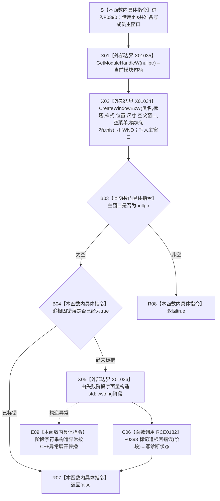

# CF-L6-0214 `控制面板窗口::窗口实现::创建主窗口` 现状流程图

图类型：现状流程图
代码版本：`bab41cae4223289e1297a5b7850f79b5b967fb06`
源码 blob：`fe9dad1eb3728c823beccf305c783be96a3df33d`
覆盖文件：`海中鱼巣/界面/控制面板窗口.cpp:454-475`
唯一根函数：F0390
完整签名：`bool 海中鱼巣::控制面板窗口::窗口实现::创建主窗口()`
参数：无显式参数；隐式 `this` 是调用期有效的 `控制面板窗口::窗口实现` 非拥有借用。本函数读取窗口类名称、窗口标题和 `追根因错误`，写入成员 `主窗口`；创建失败且尚未标错时，经 F0393 写入诊断成员
返回结果：X01034 返回非空 `HWND` 时，成员 `主窗口` 保存该句柄并返回 `true`；返回空句柄时，保留已经形成的追根因错误，或经 RCE0182 补记“控制面板主窗口创建失败”，随后返回 `false`
非法值 / 拒绝：本函数没有显式输入拒绝。唯一调用方 F0223 只在只读材料读取和窗口类注册均成功后经 E0857 调用；X01035 返回的模块句柄未单独复核，直接作为 X01034 的实例句柄实参
已登记调用方：F0223 经 E0857（`控制面板窗口.cpp:1553`）；返回 bool 参与运行初始化短路，`false` 使 F0223 返回失败的结构化窗口运行结果
直接项目函数：RCE0182 调用 F0393 `标记追根因错误(std::wstring)`；仅在 X01034 返回空句柄且 `追根因错误 == false` 时执行
外部边界：X01035 调用 `GetModuleHandleW(nullptr)` 取得当前模块句柄；X01034 调用 `CreateWindowExW(...)` 并返回主窗口句柄；X01036 从宽字符串字面量构造传给 F0393 的 `std::wstring`
未解析项目调用：无
调用图：`流程图/主程序可达调用关系/01_main可达项目调用边表.md`
外部边界表：`流程图/主程序可达调用关系/02_main可达外部边界表.md`
逐行映射表：`流程图/代码流程图/L6/CF-L6-0214_控制面板窗口创建主窗口_逐行代码映射表.md`
输入契约 / 调用语境表：本文“调用语境与非成功分账”
非成功返回二分审查表：本文“调用语境与非成功分账”
偏差清单：本文“当前边界与规范核对”
依据提交 / 结构化消息：初始派发基线 `f9b9c72195967682df88b8a95b0c5f8408c83bbe`；落盘前 main 前进到 `8e9b7a5ceb9305df4200cab754078b6c1922d26d`，复核确认目标源码、正式关系表、队列和目标文件均无差异 / 重叠。F0390、F0393、E0857、RCE0182、X01034—X01036 由正式 main 可达关系表、制图队列和当前源码交叉复核
结构读取与写入：通过 X01034 请求 Win32 创建窗口对象，并把返回 `HWND` 写入成员 `主窗口`；失败诊断经 F0393 写入 `追根因错误` 和首个 `失败阶段`。不读取或写入节点、关系、主信息、索引、需求、任务、方法或其它业务机器结构
逻辑内返回：无。当前调用语境中，`false` 表示主窗口创建路径失败并停止后续菜单栏 / 快捷键表创建，不是普通空候选或等待
内部错误：X01034 返回空句柄时进入追根因错误路径。若同步窗口创建过程已经先设置 `追根因错误`，本函数保留原先失败阶段，不用“主窗口创建失败”覆盖它
生命周期与资源释放：成功句柄保存在 `窗口实现::主窗口`，本函数不销毁它；后继初始化失败时 F0223 销毁非空主窗口，正常窗口生命周期由窗口过程和运行宿主管理。失败路径没有可由本函数销毁的有效主窗口句柄
异常：X01034、X01035 是 Win32 返回值协议，不产生 C++ 异常结果。X01036 构造 `std::wstring` 可抛；本函数不捕获，异常传播且不会执行 RCE0182 或返回 `false`
并发 / 幂等：本函数不提供重复调用防护；每次调用都请求创建一个新的 Win32 顶层窗口并覆盖成员 `主窗口`。当前唯一调用路径在一次 F0223 运行初始化中调用一次
验证入口：`控制面板窗口.cpp:454-475`、E0857、RCE0182、X01034—X01036、调用点 `控制面板窗口.cpp:1551-1557` 及 F0393 `控制面板窗口.cpp:1526-1531`
验证输出：22 行源码完整映射；10 个流程节点、1 个项目出边、3 个外部边界、0 个未解析项目调用；本批不运行构建或程序
依据：`规范/0050_项目通用机器逻辑与禁止性规则总纲_20260721.md`、`规范/0600_代码函数流程图应用与维护规范.md`、`规范/4050_子规范_入口拒绝逻辑内结果与内部逻辑错误.md`、`规范/8110_子规范_线程生命周期状态上报与控制面板线程信息_20260720.md`、`规范/8120_子规范_程序入口启动模式与运行宿主边界_20260726.md`
不得作为施工许可：是
不得宣称：非空 `HWND` 证明全部控件、菜单、快捷键、显示、消息循环或业务能力完成；`false` 是普通逻辑内空结果；失败阶段文本是机器事实；或本函数修改了任何业务机器结构

## 流程图

## 项目源码调用合同

| 调用边 | 节点 | 被调函数 | 实参与绑定 | 调用前置 / 结果用途 | 被调图 |
| --- | --- | --- | --- | --- | --- |
| RCE0182 | C06 | F0393 `void 控制面板窗口::窗口实现::标记追根因错误(std::wstring 阶段)` | X01036 构造的 `std::wstring{L"控制面板主窗口创建失败"} -> 阶段`；隐式 `this` 保持不变 | 仅主窗口为空且尚未标错时调用；设置 `追根因错误=true`，并只在 `失败阶段` 为空时保存阶段 | 待生成 |

## 外部边界调用合同

| 边界 | 节点 | 调用 | 实参 | 结果用途 | 当前前置 |
| --- | --- | --- | --- | --- | --- |
| X01035 | X01 | `GetModuleHandleW(nullptr)` | `nullptr` | 结果作为 X01034 的 `HINSTANCE` 实参 | F0223 已完成只读材料读取与窗口类注册；返回值未单独复核 |
| X01034 | X02 | `CreateWindowExW(...)` | 扩展样式 0；固定类名 / 标题；重叠窗口和裁剪子窗口样式；默认位置；1120×720；空父窗口 / 菜单；X01035 结果；`this` | 返回 `HWND` 写入成员 `主窗口`，空 / 非空决定失败或成功 | 已注册窗口类；Win32 可在调用期间同步进入已登记窗口过程 |
| X01036 | X05 | `std::wstring(const wchar_t*)` | `L"控制面板主窗口创建失败"` | 形成 RCE0182 的按值阶段实参 | X01034 返回空且尚无追根因错误 |

## 已登记调用方

| 调用边 | 调用方 / 位置 | 当前前置 | 返回用途 | 调用方图 |
| --- | --- | --- | --- | --- |
| E0857 | F0223 `控制面板窗口::窗口实现::运行(...)` / `控制面板窗口.cpp:1553` | 同一短路表达式中的 `读取只读材料()` 与 `注册窗口类()` 已返回 true | 返回 bool 取反；false 停止后续创建并形成失败窗口运行结果，true 继续创建菜单栏 | 待生成 |

## 调用语境与非成功分账

| 语境 | 当前前置 | 当前结果 | 二分口径 | 结构后果 |
| --- | --- | --- | --- | --- |
| Win32 返回非空主窗口 | 只读材料和窗口类注册成功；X01035 / X01034 已执行 | 成员保存 `HWND`，返回 true | 正常结果 | 建立 Win32 窗口资源；不写业务机器结构 |
| Win32 返回空，尚未标错 | 同上，但 X01034 未形成有效窗口 | X01036 构造阶段字符串，RCE0182 标记追根因错误，返回 false | 追根因解决 | 写本地诊断状态；F0223 停止后继创建 |
| Win32 返回空，已标错 | 同步窗口创建过程已经设置 `追根因错误` | 不调用 RCE0182，保留首个失败阶段并返回 false | 追根因解决 | 不覆盖既有诊断原因；F0223 停止后继创建 |
| 阶段字符串构造抛出 | X01034 已返回空且尚未标错 | E09 传播异常；不调用 F0393，也不返回 false | 当前无结构化收口 | 主窗口保持空；诊断阶段可能仍为空 |

## 当前边界与规范核对

- F0390 是运行宿主的 Win32 窗口资源创建函数，成功只证明 X01034 返回非空句柄；菜单栏、快捷键表、显示、计时器和消息循环都由后继函数处理。
- X01034 在 Win32 内可以同步进入先前注册的窗口过程；正式图谱把该关系作为窗口类注册 / 回调边界单独分账，不把回调正文伪造为 F0390 的直接项目出边。F0390 的正式项目出边仍只有 RCE0182。
- `追根因错误` 和 `失败阶段` 是本地诊断 / 结构化运行结果材料，不是节点、关系、任务、需求或其它业务机器事实。已有错误时不覆盖首个阶段。
- X01035 返回值没有独立判断，直接传入 X01034；X01034 失败也没有读取 Win32 错误码，当前只保留通用阶段文本。
- 未发现超出 E0857、RCE0182、X01034—X01036 的必需直接聚合边；同步回调继续沿正式回调分账，不在本批补造边。
