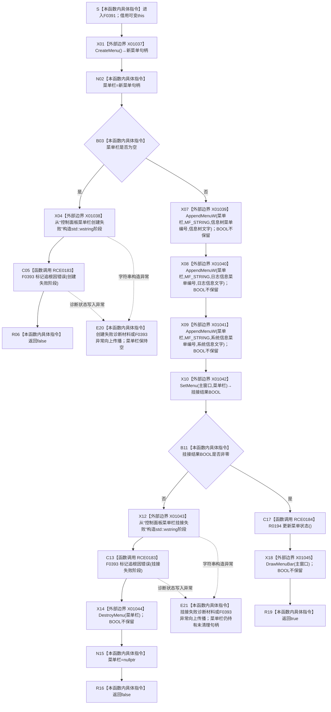

# CF-L6-0215 `控制面板窗口::窗口实现::创建菜单栏` 现状流程图

图类型：现状流程图
代码版本：`bab41cae4223289e1297a5b7850f79b5b967fb06`
源码 blob：`fe9dad1eb3728c823beccf305c783be96a3df33d`
覆盖文件：`海中鱼巣/界面/控制面板窗口.cpp:477-496`
唯一根函数：F0391
完整签名：`bool 海中鱼巣::控制面板窗口::窗口实现::创建菜单栏()`
参数：无显式参数；隐式 `this` 是调用期有效的可变 `控制面板窗口::窗口实现` 非拥有借用。函数读取 `主窗口`、三个菜单编号和当前分页状态，写入成员 `菜单栏`，失败时经 F0393 写入人读追根因诊断状态
返回结果：`CreateMenu` 返回空句柄时记录“控制面板菜单栏创建失败”并返回 false；非空菜单句柄依次尝试追加三个菜单项，`SetMenu` 失败时记录“控制面板菜单栏挂接失败”、尝试销毁菜单、把成员清空并返回 false；`SetMenu` 成功时经 R0194 更新当前分页菜单状态，调用 `DrawMenuBar` 后返回 true
非法值 / 拒绝：函数不显式复核 `主窗口`；它把 `SetMenu(主窗口, 菜单栏)` 的零返回统一作为挂接失败。三个 `AppendMenuW`、失败清理的 `DestroyMenu`、成功后的 `DrawMenuBar` 返回值均未读取，不参与本函数 bool 结果
已登记调用方：F0223 经 E0858（`海中鱼巣/界面/控制面板窗口.cpp:1553`）；仅当前置的 F0388、F0389、F0390 均返回 true 时才由短路表达式调用本函数
直接项目函数：RCE0183 在 `480`、`488` 两处调用 F0393；RCE0184 在 `493` 调用 R0194
外部边界：X01037 调用 `CreateMenu`；X01038 / X01043 从宽字符串字面量构造 F0393 的 `std::wstring` 实参；X01039—X01041 依次调用三个 `AppendMenuW`；X01042 调用 `SetMenu`；X01044 调用 `DestroyMenu`；X01045 调用 `DrawMenuBar`
未解析项目调用：无
调用图：`流程图/主程序可达调用关系/01_main可达项目调用边表.md`
外部边界表：`流程图/主程序可达调用关系/02_main可达外部边界表.md`
逐行映射表：`流程图/代码流程图/L6/CF-L6-0215_控制面板窗口创建菜单栏_逐行代码映射表.md`
输入契约 / 调用语境表：本文“调用语境与非成功分账”
非成功返回二分审查表：本文“调用语境与非成功分账”
偏差清单：本文“当前边界与规范核对”
依据提交 / 结构化消息：派发基线 `f9b9c72195967682df88b8a95b0c5f8408c83bbe`；开工和验证期间主线先后前进到 `8e9b7a5ceb9305df4200cab754078b6c1922d26d`、冻结提交 `bab41cae4223289e1297a5b7850f79b5b967fb06`，各提交间目标源码、F0391 身份、E0858、RCE0183 / RCE0184、X01037—X01045 和制图队列零差异；顶层维护智能体确认目标切片未漂移后继续
结构读取与写入：只改变 Win32 菜单资源、窗口菜单挂接、窗口对象成员和人读诊断状态；不创建、修改、删除、失效或发布节点、关系、索引、领域记录、需求、任务、方法、状态、动态或因果
逻辑内返回：窗口宿主资源创建或菜单挂接失败时返回 false，供 F0223 收口为控制面板窗口启动失败；该 bool 和诊断文本都不是机器事实
内部错误：本函数未把外部 API 的全部失败结果纳入 bool。任一 `AppendMenuW` 失败仍继续挂接，可能形成缺项菜单并最终返回 true；`DrawMenuBar` 失败仍返回 true；`DestroyMenu` 失败时成员仍被清空，函数返回 false 但不保留可用于再次清理的句柄
生命周期与资源释放：X01037 成功后句柄先存入成员 `菜单栏`。X01042 失败路径按源码顺序先经 RCE0183 记录诊断，再经 X01044 尝试销毁菜单，随后把成员置空；X01044 的结果不改变后继。X01042 成功路径保留句柄供窗口后续生命周期使用，本函数不销毁
异常：未声明 `noexcept` 且不捕获。X01038 构造诊断字符串或第一次 RCE0183 调用异常时，`菜单栏` 已为空；X01043 或第二次 RCE0183 调用异常时，非空菜单句柄尚未经过 X01044，成员保持非空并向上抛出。Win32 BOOL / 句柄调用按其 C 接口返回值表达失败，不产生 C++ 异常
并发 / 幂等：本函数面向窗口线程初始化顺序，代码没有并发保护或重复调用拒绝。重复调用会覆盖成员 `菜单栏`，当前函数不先销毁旧句柄；本文只表达单次由 F0223 启动链调用的当前路径
验证入口：`控制面板窗口.cpp:477-496,754-763,1526-1531,1551-1557`、E0858、RCE0183、RCE0184、X01037—X01045
验证输出：20 行源码完整映射；2 条项目出边、1 条项目入边、9 个外部边界、0 个未解析项目调用；本批不运行构建或程序
依据：`规范/0050_项目通用机器逻辑与禁止性规则总纲_20260721.md`、`规范/0600_代码函数流程图应用与维护规范.md`、`规范/8120_子规范_程序入口启动模式与运行宿主边界_20260726.md`
不得作为施工许可：是
不得宣称：返回 true 证明三个菜单项均已追加、菜单已经成功重绘、控制面板展示成为机器事实、失败诊断已经修复资源问题、本函数可安全重复调用、代码已经构建或运行验证，或控制面板旧能力已经等价重建

## 流程图

## 项目源码调用合同

| 调用边 | 节点 | 被调函数 | 实参 | 调用前置 / 结果用途 | 被调图 |
| --- | --- | --- | --- | --- | --- |
| RCE0183 | C05 | F0393 `void 控制面板窗口::窗口实现::标记追根因错误(std::wstring 阶段)` | X01038 构造的 `L"控制面板菜单栏创建失败"` 值式字符串 | 仅 X01037 返回空句柄；写窗口宿主追根因标志和首个失败阶段，随后返回 false | 待生成 |
| RCE0183 | C13 | F0393 `void 控制面板窗口::窗口实现::标记追根因错误(std::wstring 阶段)` | X01043 构造的 `L"控制面板菜单栏挂接失败"` 值式字符串 | 仅 X01042 返回零；诊断后进入菜单销毁尝试 | 待生成 |
| RCE0184 | C17 | R0194 `void 控制面板窗口::窗口实现::更新菜单状态() const` | 隐式 `this` | 仅 X01042 返回非零；按当前分页尝试更新菜单单选状态 | 待生成 |

## 已登记调用方

| 调用边 | 调用方 / 位置 | 当前前置 | 结果用途 | 调用方图 |
| --- | --- | --- | --- | --- |
| E0858 | F0223 `控制面板窗口::窗口实现::运行(const volatile std::sig_atomic_t*)` / `控制面板窗口.cpp:1553` | F0388、F0389、F0390 在同一短路表达式中均返回 true | false 进入窗口启动失败清理，true 才继续 F0392 创建快捷键表 | `流程图/代码流程图/L5/CF-L5-0103_控制面板窗口实现运行_现状流程图.md` |

## 调用语境与非成功分账

| 语境 | 当前前置 | 非成功结果 | 二分口径 | 结构后果 |
| --- | --- | --- | --- | --- |
| 创建菜单句柄失败 | F0223 前三项已经成功，X01037 返回空 | C05 后返回 false | 窗口宿主初始化失败，由 F0223 结构化收口；诊断文本仅人读 | 菜单栏保持空；零业务机器事实写入 |
| 追加任一菜单项失败 | X01037 返回非空；X01039—X01041 某次返回零但结果被忽略 | 本函数没有非成功分支，继续 X01042 | 当前代码无法把缺项菜单反映到 bool；属于外部 UI 结果未检查 | OS 菜单可能只含部分项目；成员仍持有菜单句柄 |
| 挂接菜单失败且清理调用完成 | X01042 返回零；X01043、C13 正常完成 | X01044 结果被忽略，成员置空并返回 false | 窗口宿主初始化失败 | 尝试销毁 OS 菜单；无论销毁是否成功都丢弃成员句柄 |
| 挂接失败诊断材料或诊断写入抛异常 | X01042 已返回零，尚未调用 X01044 | 原异常向 F0223 之外传播 | 当前代码无 bool 收口和 RAII 清理 | 菜单栏仍持有非空、未清理句柄 |
| 挂接成功 | X01042 返回非零 | R0194 / X01045 的底层 Win32 失败均不改变最终 true | 当前代码的窗口宿主成功口径 | OS 窗口已接受菜单句柄；菜单状态或重绘是否成功未由本函数证明 |

## 当前边界与规范核对

- F0391 的一条入边 E0858、两条项目出边 RCE0183 / RCE0184 和九个外部边界 X01037—X01045与 `477-496` 的全部显式调用闭合；本次未发现需要新增稳定身份的聚合缺口。
- X01039—X01041、X01044、X01045 都返回 Win32 `BOOL`，当前代码不保存、不判断这些结果。图中的直线后继表达“返回值被忽略”，不表示外部调用成功。
- X01042 是唯一参与 F0391 bool 成败裁决的挂接调用。挂接失败时顺序固定为诊断、销毁尝试、成员清空、false；X01044 失败也不会阻止成员清空。
- 菜单句柄和菜单勾选状态属于窗口宿主资源与人读投影。F0393 的标志 / 文本只帮助 F0223 形成失败阶段，均不得反向裁决节点、关系、需求、任务、方法或其它机器事实。
- 当前代码没有菜单句柄 RAII 宿主。第二次诊断材料构造或诊断写入异常发生在 X01044 之前，会留下仍由成员引用的菜单句柄；重复调用也会直接覆盖旧成员。本图只登记当前实现事实，不形成修复授权。
