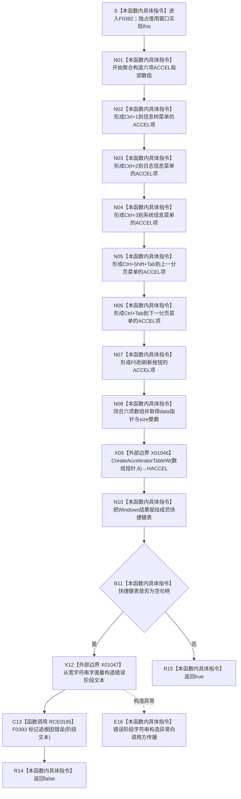

# CF-L6-0216 `控制面板窗口::窗口实现::创建快捷键表` 现状流程图

图类型：现状流程图
代码版本：`bab41cae4223289e1297a5b7850f79b5b967fb06`
源码 blob：`fe9dad1eb3728c823beccf305c783be96a3df33d`
覆盖文件：`海中鱼巣/界面/控制面板窗口.cpp:498-513`
唯一根函数：F0392
完整签名：`bool 海中鱼巣::控制面板窗口::窗口实现::创建快捷键表()`
参数：无显式参数；隐式 `this` 是调用期间有效的 `窗口实现` 独占可写借用，本函数不保存额外引用
返回结果：六项快捷键材料提交给 Windows 并取得非空 `HACCEL` 时返回 `true`；Windows 返回空句柄时经 F0393 写窗口人读追根因错误并返回 `false`
非法值 / 拒绝：函数不接收外部快捷键材料；六项 `ACCEL` 均由源码常量形成。空句柄不是成功或空候选，而是当前窗口资源创建失败
已登记调用方：F0223 经 E0859（`控制面板窗口.cpp:1553`）
直接项目函数：RCE0185 在第 509 行调用 F0393 `标记追根因错误(std::wstring)`
外部边界：X01046 在第 507 行调用 `CreateAcceleratorTableW`；X01047 在第 509 行从宽字符串字面量构造 F0393 的值式实参
未解析项目调用：无
调用图：`流程图/主程序可达调用关系/01_main可达项目调用边表.md`
外部边界表：`流程图/主程序可达调用关系/02_main可达外部边界表.md`
逐行映射表：`流程图/代码流程图/L6/CF-L6-0216_控制面板窗口创建快捷键表_逐行代码映射表.md`
输入契约 / 调用语境表：本文“调用语境与结果分账”
非成功返回二分审查表：本文“调用语境与结果分账”
偏差清单：本文“当前边界与规范核对”
依据提交 / 结构化消息：冻结提交 `f9b9c72195967682df88b8a95b0c5f8408c83bbe`；F0392、F0393、E0859、RCE0185、X01046—X01047 由正式 main 可达关系表和当前源码交叉复核
结构读取与写入：只读取编译期快捷键与菜单编号常量；第 507 行把 Windows 返回的快捷键表句柄写入窗口成员，第 509 行失败路径写窗口人读错误状态；不写节点、主信息、关系、索引或其它业务机器事实
逻辑内返回：无普通拒绝或空候选
内部错误：X01046 返回空句柄时标记追根因错误并返回 `false`
生命周期与资源释放：局部 `std::array<ACCEL,6>` 只活到函数退出；成功句柄由窗口成员持有，后续由 F0395 `销毁快捷键表()` 负责释放。失败时成员保持空句柄
异常：函数未声明 `noexcept` 且不捕获；X01047 的 `std::wstring` 构造若抛出则异常传播，当前函数不把异常转换为 `false`
并发 / 幂等：要求窗口线程独占调用；本函数没有先销毁已有非空句柄的逻辑，重复成功调用会覆盖成员并使旧句柄失去本函数内释放路径
验证入口：`控制面板窗口.cpp:498-513`、E0859、RCE0185、X01046—X01047
验证输出：16 行源码完整映射；1 个项目入边、1 个项目出边、2 个外部边界、0 个未解析项目调用；本批不运行构建或程序
依据：`规范/0050_项目通用机器逻辑与禁止性规则总纲_20260721.md`、`规范/0600_代码函数流程图应用与维护规范.md`、`规范/8120_子规范_程序入口启动模式与运行宿主边界_20260726.md`
不得作为施工许可：是
不得宣称：快捷键创建成功证明控制面板业务能力完成、菜单编号是业务机器身份、失败文本取得机器裁决权，或本函数修改了业务仓库

## 流程图

## 项目源码与外部调用合同

| 调用边 / 边界 | 节点 | 调用 | 实参 | 结果用途 | 当前前置 |
| --- | --- | --- | --- | --- | --- |
| X01046 | X09 | `CreateAcceleratorTableW(LPACCEL,int)` | `const_cast<ACCEL*>(快捷键组.data())`、`static_cast<int>(快捷键组.size())` | 返回值写入窗口成员 `快捷键表` | 六项数组已完整构造 |
| X01047 | X12 | `std::wstring::wstring(const wchar_t*)` | `L"控制面板快捷键表创建失败"` | 形成 RCE0185 的值式阶段文本 | X01046 返回空句柄 |
| RCE0185 | C13 | F0393 `void 窗口实现::标记追根因错误(std::wstring 阶段)` | X01047 形成的阶段文本 | 写窗口人读错误状态，随后返回 false | X01046 返回空句柄且字符串构造成功 |

## 调用语境与结果分账

| 语境 | 当前前置 | 当前结果 | 二分口径 | 结构后果 |
| --- | --- | --- | --- | --- |
| E0859 首次窗口资源创建 | F0223 已创建窗口实现并依次完成前置窗口资源步骤 | 形成固定六项快捷键并向 Windows 请求 HACCEL | 资源创建路径 | 只写窗口资源句柄 |
| X01046 返回非空 | Windows 已创建快捷键表 | 成员持有句柄并返回 true | 正常成功 | 后续由 F0395 释放 |
| X01046 返回空 | 六项本地材料已形成但系统资源创建失败 | F0393 后返回 false | 追根因错误 | 成员为空；只写人读错误状态 |
| X01047 抛异常 | Windows 已返回空句柄 | 异常传播 | 非逻辑内返回 | 不调用 F0393，不形成 bool 返回 |

## 当前边界与规范核对

- F0392 只建立原生窗口快捷键资源；快捷键、菜单编号和人读错误文本不取得业务机器事实身份。
- `快捷键组.data()`、`快捷键组.size()` 和固定宽窄整数转换未在正式外部边界表中取得独立 X 身份，本图按当前聚合口径作为 N02—N08 的本函数内具体指令表达。
- 当前代码没有重复调用保护。若成员已有非空 HACCEL，再次成功会直接覆盖；这是现状生命周期风险，不在本图形成代码修改许可。
