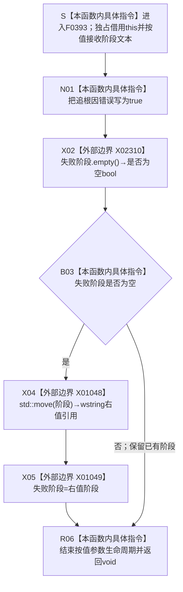

# CF-L6-0217 `控制面板窗口::窗口实现::标记追根因错误` 现状流程图

图类型：现状流程图
代码版本：`d57a650198ffbd7358b9eabc3c3f44fd93b60c94`
源码 blob：`fe9dad1eb3728c823beccf305c783be96a3df33d`
覆盖文件：`海中鱼巣/界面/控制面板窗口.cpp:1526-1531`
唯一根函数：F0393
完整签名：`void 海中鱼巣::控制面板窗口::窗口实现::标记追根因错误(std::wstring 阶段)`
参数：隐式 `this` 是调用期间有效的 `窗口实现` 独占可写借用；`阶段` 由调用方按值构造并转移给本函数。本函数不保存参数引用；只有成员 `失败阶段` 当前为空时才尝试移动保存该值
返回结果：`void`；调用完成后 `追根因错误` 一定被写为 true。若进入时 `失败阶段` 为空，则把 `阶段` 移动赋给该成员；若已有失败阶段，则保持原文本
非法值 / 拒绝：函数不拒绝空字符串。若第一次传入空 `阶段`，移动后成员仍可能为空，因此后续调用仍可写入新的阶段；当前 39 个正式可达调用点均以非空宽字符串字面量构造实参
已登记调用方：E0860、RCE0179、RCE0181—RCE0183、RCE0185、RCE0620、RCE0641、RCE0647、RCE0655、RCE0665、RCE0685、RCE0690、RCE0696、RCE0698、RCE0700、RCE0704、RCE0705、RCE0720、RCE0732，共 20 条稳定入边、39 个源码调用点
直接项目函数：无；函数体没有项目源码函数调用
外部边界：X02310 调用 `失败阶段.empty()`；X01048 对按值参数执行 `std::move(阶段)`；X01049 把所得右值移动赋给 `失败阶段`
未解析项目调用：无
调用图：`流程图/主程序可达调用关系/01_main可达项目调用边表.md`
外部边界表：`流程图/主程序可达调用关系/02_main可达外部边界表.md`
逐行映射表：`流程图/代码流程图/L6/CF-L6-0217_控制面板窗口标记追根因错误_逐行代码映射表.md`
输入契约 / 调用语境表：本文“调用语境与诊断分账”
非成功返回二分审查表：本文“调用语境与诊断分账”
偏差清单：本文“当前边界与规范核对”
依据提交 / 结构化消息：冻结提交 `d57a650198ffbd7358b9eabc3c3f44fd93b60c94`；F0393、20 条正式入边、X01048—X01049、X02310 与当前源码 39 个调用点交叉复核
结构读取与写入：只写 `窗口实现` 的人读诊断状态 `追根因错误` 和首个非空 `失败阶段`；不创建、修改、删除或发布节点、主信息、关系、索引、语素、需求、任务、方法或其它业务机器事实
逻辑内返回：无入口拒绝、候选为空或业务逻辑内结果；函数只记录调用方已经裁决进入的窗口追根因诊断
内部错误：本函数不裁决根因是否成立，也不修复调用方错误；它把追根因标志置为 true，并按“成员为空才保存”保留首个阶段。调用方必须独立停止或收口受影响路径
生命周期与资源释放：`阶段` 是本函数按值局部参数；写入分支经 X01048 / X01049 把其字符串资源移动到成员，跳过分支时参数在返回时直接析构。成员随 `窗口实现` 生命周期存在
异常：函数未声明 `noexcept` 且不捕获；`empty()` 与 X01048 不抛。X01049 的正式签名是条件 `noexcept`；若移动赋值抛出，`追根因错误=true` 已经写入且本函数不回滚，异常继续传播
并发 / 幂等：无内部锁，要求窗口线程独占 `窗口实现`。串行重复调用会保持 `追根因错误=true`；已有非空失败阶段时不覆盖，形成首个非空阶段保留语义。并发调用同一对象会竞争两个成员
验证入口：`控制面板窗口.cpp:1526-1531`、正式 20 条入边对应的 39 个调用点、X01048—X01049、X02310
验证输出：6 行源码完整映射；20 个项目入边记录、39 个调用点、0 个项目出边、3 个外部边界、0 个动态未解析调用；本子任务不运行构建或程序
依据：`规范/0050_项目通用机器逻辑与禁止性规则总纲_20260721.md`、`规范/0600_代码函数流程图应用与维护规范.md`、`规范/4050_子规范_入口拒绝逻辑内结果与内部逻辑错误.md`、`规范/8120_子规范_程序入口启动模式与运行宿主边界_20260726.md`
不得作为施工许可：是
不得宣称：诊断标志或阶段文本是机器事实、记录诊断等于根因已排除、`void` 返回证明调用方已经安全收口、首个阶段一定非空，或本函数修改了任何业务结构

## 流程图

## 已登记调用方

| 调用边 | 调用方 | 调用位置 | 当前触发语境 |
| --- | --- | --- | --- |
| E0860 | F0223 `窗口实现::运行(...)` | `1564, 1582` | 停止信号计时器创建失败；消息循环读取失败 |
| RCE0179 | F0388 `读取只读材料(bool)` | `406` | 总览、树分类材料或启动结构统计不符合边界 |
| RCE0181 | F0389 `注册窗口类()` | `428, 445` | 公共控件初始化失败；窗口类注册失败 |
| RCE0182 | F0390 `创建主窗口()` | `470` | 主窗口创建失败 |
| RCE0183 | F0391 `创建菜单栏()` | `480, 488` | 菜单栏创建失败；菜单栏挂接失败 |
| RCE0185 | F0392 `创建快捷键表()` | `509` | 快捷键表创建失败 |
| RCE0620 | R0151 `创建控件()` | `1017, 1086, 1121` | 字体、必需控件或数据库审计列表列创建失败 |
| RCE0641 | R0158 `请求并重建当前树页(...)` | `1378` | 当前页切换失败且旧页恢复失败 |
| RCE0647 | R0160 `切换概念根(std::size_t)` | `1393` | 概念根选择入口无效 |
| RCE0655 | R0164 `刷新显示材料()` | `1459` | 当前按需页刷新失败且旧页恢复失败 |
| RCE0665 | R0165 `生成操作请求材料()` | `1480` | 操作请求壳结果越过不执行动作边界 |
| RCE0685 | R0176 `读取并替换当前树(...)` | `328, 372` | 按需候选结构不一致；完整复核失败 |
| RCE0690 | R0183 `重建导航栏()` | `561, 568, 574` | 导航栏入口、条目创建或选中索引异常 |
| RCE0696 | R0187 `插入控制面板树节点(...)` | `610` | 树节点创建失败 |
| RCE0698 | R0188 `插入分类树根(std::uint32_t)` | `624, 635` | 分类索引越界；分类树根创建失败 |
| RCE0700 | R0189 `重建当前树视图()` | `643, 666, 676, 685` | 树视图入口、真实根、树项引用建立或读回异常 |
| RCE0704 | R0191 `定位当前分类树根()` | `696` | 分类树根定位入口无效 |
| RCE0705 | R0192 `重建概念根下拉()` | `707, 716, 728, 736` | 下拉入口、活动根选项、选项创建或当前根异常 |
| RCE0720 | R0199 `切换分页(控制面板分页)` | `908` | 分页索引越界 |
| RCE0732 | R0201 `处理导航选择(std::uint32_t)` | `940, 968, 984, 993, 1003` | 三类导航越界、旧页恢复失败或未知分页 |

## 调用语境与诊断分账

| 节点 / 语境 | 当前前置 | 当前结果 | 二分口径 | 结构后果 |
| --- | --- | --- | --- | --- |
| N01 | 调用方已经检测到窗口资源、投影材料、导航或消息循环的具名异常 | 无条件写 `追根因错误=true` | 人读追根因诊断；不替代调用方结果分类 | 只改变窗口诊断标志 |
| B03=false | 此前已有非空失败阶段 | 不读取 / 移动保存本次阶段，直接返回 void | 保留首个非空阶段 | 诊断标志保持 true，阶段不变 |
| B03=true、阶段非空 | 尚无失败阶段 | X01048 / X01049 保存本次阶段后返回 void | 记录首个非空人读阶段 | 只改变窗口阶段文本 |
| B03=true、阶段为空 | 尚无失败阶段且调用方传入空文本 | 移动后成员仍可为空 | 当前函数没有空输入拒绝 | 后续调用仍可能覆盖阶段 |
| X01049 抛异常 | 已写 `追根因错误=true`，成员原先为空 | 异常传播，没有 void 正常返回 | 非逻辑内返回 | 标志已变化；阶段状态依移动赋值异常保证而定 |

## 当前边界与规范核对

- 当前源码共有 39 个 F0393 调用点；正式边表的 20 条稳定入边覆盖相同 20 个调用方和全部 39 个位置，未发现缺失直接项目边。
- 第 1528 行显式调用 `std::wstring::empty() const noexcept`，现已按同表既有字符串边界口径登记为 X02310；它只读取人读失败阶段是否为空。
- 本函数是“首个非空失败阶段”人读锁存器，不是机器错误账。所有正式调用点当前都传入非空字面量，但函数自身不建立非空契约。
- 调用方在 F0393 返回后仍各自负责返回 false、销毁资源、恢复旧页或停止消息循环；F0393 的 `void` 返回不裁决这些后继已经成功执行。
