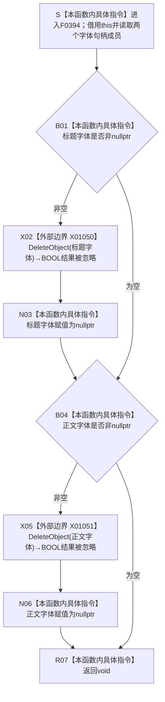

# CF-L6-0218 `控制面板窗口::窗口实现::销毁字体` 现状流程图

图类型：现状流程图
代码版本：`d57a650198ffbd7358b9eabc3c3f44fd93b60c94`
源码 blob：`fe9dad1eb3728c823beccf305c783be96a3df33d`
覆盖文件：`海中鱼巣/界面/控制面板窗口.cpp:1533-1542`
唯一根函数：F0394
完整签名：`void 海中鱼巣::控制面板窗口::窗口实现::销毁字体()`
参数：无显式参数；隐式 `this` 是调用期有效的 `控制面板窗口::窗口实现` 非拥有借用。本函数读取并改写成员 `标题字体` 和 `正文字体`
返回结果：`void`。对每个非空字体句柄调用一次 `DeleteObject`，随后不检查删除结果即把对应成员置为 `nullptr`；已为空的成员直接跳过
非法值 / 拒绝：没有入口拒绝。空字体句柄是允许的幂等跳过条件；非空句柄是否仍有效、是否已选入设备上下文，以及是否属于本对象，当前函数均不复核
已登记调用方：F0223 经 E0862（`控制面板窗口.cpp:1587`）在消息循环退出后调用；F0224 经 E0866（`控制面板窗口.cpp:311`）在 `窗口实现` 析构中、快捷键表清理后再次调用
直接项目函数：无；F0394 的正式项目出边集合为空
外部边界：X01050 在 1535 行调用 `DeleteObject(标题字体)`；X01051 在 1539 行调用 `DeleteObject(正文字体)`
未解析项目调用：无
调用图：`流程图/主程序可达调用关系/01_main可达项目调用边表.md`
外部边界表：`流程图/主程序可达调用关系/02_main可达外部边界表.md`
逐行映射表：`流程图/代码流程图/L6/CF-L6-0218_控制面板窗口销毁字体_逐行代码映射表.md`
输入契约 / 调用语境表：本文“调用语境与非成功分账”
非成功返回二分审查表：本文“调用语境与非成功分账”；外部删除失败没有被当前代码转换为返回或诊断分支
偏差清单：本文“当前边界与规范核对”
依据提交 / 结构化消息：冻结提交 `d57a650198ffbd7358b9eabc3c3f44fd93b60c94`；F0394、E0862、E0866、X01050—X01051 由正式 main 可达关系表、制图队列和当前源码交叉复核
结构读取与写入：只请求删除两个 Win32 GDI 字体对象并清空本地句柄成员；不读取或写入节点、关系、主信息、索引、需求、任务、方法或其它业务机器结构
逻辑内返回：空句柄时跳过对应删除属于本函数允许的局部清理分支；函数仍以 `void` 结束
内部错误：X01050 / X01051 返回 `FALSE` 时，当前代码不读取结果、不标记追根因错误，并仍把成员置空；因此当前实现无法区分“资源已删除”和“删除失败但句柄已丢弃”
生命周期与资源释放：字体在 `创建控件()` 中由 `CreateFontW` 形成并保存到成员。F0223 在消息循环退出后执行首次清理；F0224 析构再次调用时，正常情况下两个成员已为空而直接跳过。只有 DeleteObject 返回非零时才能证明相应 GDI 对象已由本次调用释放
异常：Win32 `DeleteObject` 使用 BOOL 返回协议，不形成 C++ 异常；本函数不含可抛的 C++ 对象构造或异常处理
并发 / 幂等：成员为空时重复调用不再访问 Win32，成员状态上的清理是幂等的；函数没有锁或线程复核。由于删除返回值被忽略，成员为空不能独立证明系统资源释放成功
验证入口：`控制面板窗口.cpp:1533-1542`、E0862、E0866、X01050—X01051、字体创建点 `控制面板窗口.cpp:1007-1019` 以及两个调用点 `控制面板窗口.cpp:309-315,1583-1592`
验证输出：10 行源码完整映射；8 个流程节点、0 个项目出边、2 个外部边界、0 个未解析项目调用；本批不运行构建或程序
依据：`规范/0050_项目通用机器逻辑与禁止性规则总纲_20260721.md`、`规范/0600_代码函数流程图应用与维护规范.md`、`规范/4050_子规范_入口拒绝逻辑内结果与内部逻辑错误.md`、`规范/8110_子规范_线程生命周期状态上报与控制面板线程信息_20260720.md`、`规范/8120_子规范_程序入口启动模式与运行宿主边界_20260726.md`
不得作为施工许可：是
不得宣称：成员为空证明两个 GDI 字体对象实际删除成功、删除失败已被诊断或追根因收口、字体资源清理属于业务机器事实，或本函数修改了任何业务结构

## 流程图

## 外部边界调用合同

| 边界 | 节点 | 调用 | 实参 | 当前结果处理 | 当前前置 |
| --- | --- | --- | --- | --- | --- |
| X01050 | X02 | `DeleteObject(HGDIOBJ) -> BOOL` | 非空 `标题字体` | BOOL 被忽略；无论成功 / 失败都执行 N03 清空成员 | B01 已确认成员非空 |
| X01051 | X05 | `DeleteObject(HGDIOBJ) -> BOOL` | 非空 `正文字体` | BOOL 被忽略；无论成功 / 失败都执行 N06 清空成员 | B04 已确认成员非空 |

## 已登记调用方

| 调用边 | 调用方 / 位置 | 当前前置 | 返回用途 | 调用方图 |
| --- | --- | --- | --- | --- |
| E0862 | F0223 `控制面板窗口::窗口实现::运行(...)` / `控制面板窗口.cpp:1587` | Win32 消息循环已经退出 | `void`；随后调用 F0395 清理快捷键表并形成运行结果 | 待生成 |
| E0866 | F0224 `控制面板窗口::窗口实现::~窗口实现()` / `控制面板窗口.cpp:311` | 析构已经先调用 F0395 清理快捷键表 | `void`；随后按注册所有权决定是否注销窗口类 | 待生成 |

## 调用语境与非成功分账

| 语境 | 当前前置 | 当前路径与结果 | 二分口径 | 资源 / 结构后果 |
| --- | --- | --- | --- | --- |
| 两个字体句柄均为空 | 尚未成功创建字体，或先前清理已把成员清空 | 跳过 X01050 / X01051，返回 void | 合法幂等跳过 | 不访问 Win32；零业务结构变化 |
| 字体句柄非空且 DeleteObject 成功 | 对应成员保存字体句柄，Win32 返回非零 | 删除 GDI 对象后把成员置空 | 正常清理结果 | 系统资源释放，成员清空 |
| 字体句柄非空但 DeleteObject 失败 | 对应成员非空，Win32 返回 FALSE | 返回值被忽略，成员仍置空，函数最终返回 void | 当前未形成可区分结果；资源清理证据缺失 | 可能遗留 GDI 对象且丢失本地句柄 |
| F0223 清理后进入 F0224 析构兜底 | 首次清理已经把成员无条件置空 | 析构调用跳过两次删除 | 成员状态上的幂等分支 | 不能借二次跳过证明首次 Win32 删除成功 |

## 当前边界与规范核对

- F0394 只清理控制面板的 Win32 字体资源和本地句柄槽，不写任何业务机器结构；清理日志或句柄空值都不能充当业务事实。
- 正式项目出边集合为空；两次 Win32 调用已分别由 X01050、X01051 登记。未发现需要补登记的项目源码直接边或外部调用边。
- 两个 `DeleteObject` 的 BOOL 结果均被丢弃，随后成员无条件置空。这是当前清理结果不可验证风险，不是聚合关系缺口；本批只记录并报告，不修改代码、规范或共享图谱。
- 两个调用方形成“运行退出清理 + 析构兜底”。由于首次调用无条件清空成员，析构中的第二次调用通常只跳过，不能补偿首次删除失败。
