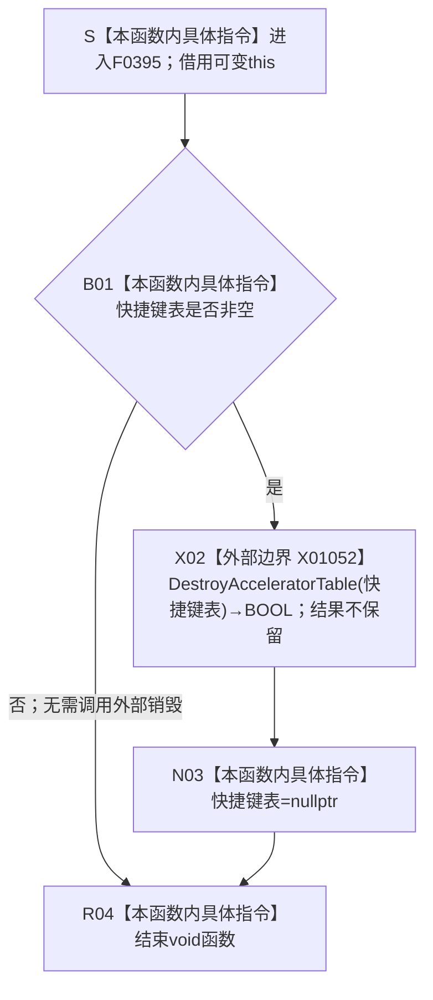

# CF-L6-0219 `控制面板窗口::窗口实现::销毁快捷键表` 现状流程图

图类型：现状流程图
代码版本：`d57a650198ffbd7358b9eabc3c3f44fd93b60c94`
源码 blob：`fe9dad1eb3728c823beccf305c783be96a3df33d`
覆盖文件：`海中鱼巣/界面/控制面板窗口.cpp:1544-1549`
唯一根函数：F0395
完整签名：`void 海中鱼巣::控制面板窗口::窗口实现::销毁快捷键表()`
参数：无显式参数；隐式 `this` 是调用期有效的可变 `控制面板窗口::窗口实现` 非拥有借用。函数只读取并可能清空成员 `快捷键表`
返回结果：无返回值。成员为空时直接结束；成员非空时经 X01052 调用 `DestroyAcceleratorTable`，忽略返回 BOOL，随后无条件把成员置为 `nullptr` 并结束
非法值 / 拒绝：空句柄被当作无需销毁的已收口状态，不调用 X01052；函数没有结构化失败结果，也不复核非空句柄是否仍由当前窗口对象拥有
已登记调用方：F0223 经 E0863（`海中鱼巣/界面/控制面板窗口.cpp:1588`）；F0224 经 E0865（`海中鱼巣/界面/控制面板窗口.cpp:310`）
直接项目函数：无
外部边界：X01052 在 `1546` 调用 `DestroyAcceleratorTable(HACCEL)`；返回 BOOL 未绑定、未判断
未解析项目调用：无
调用图：`流程图/主程序可达调用关系/01_main可达项目调用边表.md`
外部边界表：`流程图/主程序可达调用关系/02_main可达外部边界表.md`
逐行映射表：`流程图/代码流程图/L6/CF-L6-0219_控制面板窗口销毁快捷键表_逐行代码映射表.md`
输入契约 / 调用语境表：本文“调用语境与非成功分账”
非成功返回二分审查表：本文“调用语境与非成功分账”
偏差清单：本文“当前边界与规范核对”
依据提交 / 结构化消息：冻结提交 `d57a650198ffbd7358b9eabc3c3f44fd93b60c94`；F0395、E0863、E0865、X01052 由正式 main 可达关系表、制图队列和当前源码交叉复核
结构读取与写入：只尝试释放 Win32 快捷键表资源并清空窗口对象成员；不创建、修改、删除、失效或发布节点、关系、索引、领域记录、需求、任务、方法、状态、动态或因果
逻辑内返回：成员已经为空时零操作结束；非空时无论 X01052 返回值如何都清空成员并结束。`void` 结果不能表达资源是否真实释放
内部错误：X01052 返回零时当前代码仍丢弃句柄，调用方和后继析构无法再用该成员重试或核对释放结果；函数没有诊断或结构化失败通道
生命周期与资源释放：F0223 在消息循环退出后先 F0394 销毁字体，再经 E0863 调用本函数；后续 F0224 析构还会经 E0865 再次调用，本函数因成员已空而跳过 X01052。若没有经过 F0223 清理，F0224 直接承担一次清理尝试
异常：函数未声明 `noexcept`，但当前正文只有成员比较 / 赋值和 Win32 C 接口调用；X01052 通过 BOOL 表达失败，当前代码没有 C++ 异常分支
并发 / 幂等：当前代码没有并发保护；按窗口运行收口与对象析构的串行语境使用。成功销毁或空句柄路径在成员层面可重复调用；X01052 失败后成员仍被清空，因此成员层面的“已空”不证明外部资源已经释放
验证入口：`控制面板窗口.cpp:309-315,1544-1549,1578-1593`、E0863、E0865、X01052，以及 F0223 / F0224 调用方现状图
验证输出：6 行源码完整映射；0 条项目出边、2 条项目入边、1 个外部边界、0 个未解析项目调用；本批不运行构建或程序
依据：`规范/0050_项目通用机器逻辑与禁止性规则总纲_20260721.md`、`规范/0600_代码函数流程图应用与维护规范.md`、`规范/8120_子规范_程序入口启动模式与运行宿主边界_20260726.md`
不得作为施工许可：是
不得宣称：成员置空证明快捷键表已经成功销毁、F0223 与 F0224 的两次调用会执行两次外部销毁、窗口资源状态是机器事实、代码已经构建或运行验证，或本函数具备并发安全和可观测失败合同

## 流程图

## 已登记调用方

| 调用边 | 调用方 / 位置 | 当前前置 | 结果用途 | 调用方图 |
| --- | --- | --- | --- | --- |
| E0863 | F0223 `控制面板窗口::窗口实现::运行(const volatile std::sig_atomic_t*)` / `控制面板窗口.cpp:1588` | 消息循环已经结束，F0394 字体清理调用已完成 | 清理本次运行持有的快捷键表；void 结果不参与 F0223 成败分支 | `流程图/代码流程图/L5/CF-L5-0103_控制面板窗口实现运行_现状流程图.md` |
| E0865 | F0224 `控制面板窗口::窗口实现::~窗口实现()` / `控制面板窗口.cpp:310` | 析构体进入后无条件调用 | 对尚未由 F0223 清空的快捷键表再执行一次清理入口；成员已空时零操作 | `流程图/代码流程图/L5/CF-L5-0104_控制面板窗口实现析构_现状流程图.md` |

## 调用语境与非成功分账

| 语境 | 当前前置 | 当前结果 | 二分口径 | 结构后果 |
| --- | --- | --- | --- | --- |
| F0223 正常或错误消息循环收口 | 快捷键表可能由创建入口形成，F0394 已调用 | 非空时调用 X01052 后清空；空时直接结束 | 窗口宿主资源清理；没有结构化失败结果 | 只改变 OS 资源与窗口成员，不改变业务机器结构 |
| F0224 析构兜底 | 对象生命周期结束；可能已由 F0223 清理 | 成员已空时跳过；非空时尝试一次 X01052 | 析构期资源清理 | 成员清空后继续其它析构步骤 |
| X01052 返回非零 | 传入非空快捷键表句柄 | 当前代码不读取结果，随后清空成员 | 外部资源释放调用发生；本函数不保留成功证据 | 句柄引用被清空 |
| X01052 返回零 | 传入非空快捷键表句柄 | 当前代码仍清空成员并结束 | 外部 UI 资源失败被静默折叠；不能由 void 区分 | 可能遗留无法再由该成员定位的外部资源 |

## 当前边界与规范核对

- F0395 的两条正式入边 E0863 / E0865、零项目出边和一个外部边界 X01052与 `1544-1549` 全部显式行为闭合；本次未发现缺失直接边或需要新增稳定身份的共享聚合缺口。
- X01052 返回 Win32 `BOOL`，当前代码不绑定、不判断。X02 到 N03 的无条件后继只表达源码顺序，不证明快捷键表成功销毁。
- 成员 `快捷键表` 是窗口宿主的外部资源句柄，不是长期机器身份。成员清空只改变窗口对象的资源引用，不能成为业务事实或资源释放成功证据。
- E0863 后通常由 E0865 再次进入本函数，但第一次调用已清空成员时第二次不会触发 X01052；调用边存在不等于外部销毁实际发生两次。
