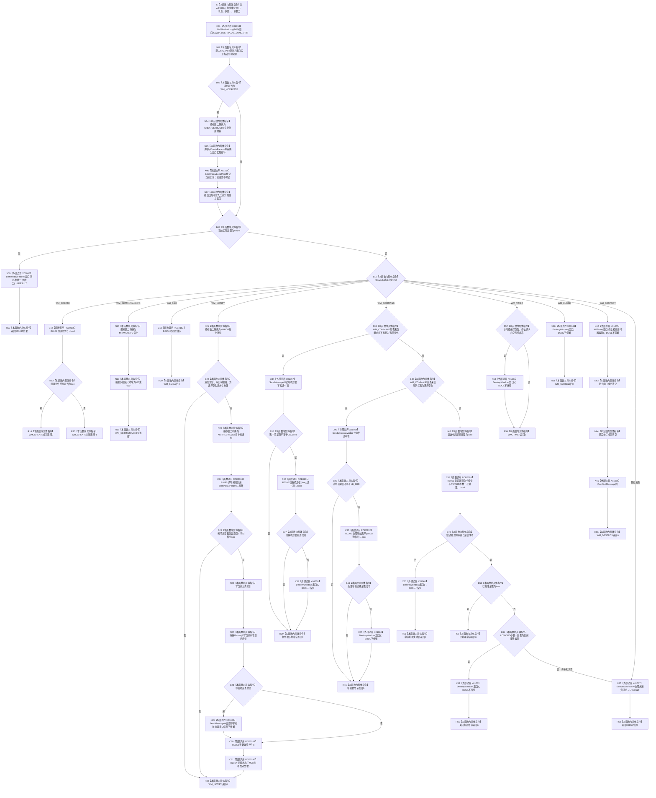

# CF-L6-0220 `控制面板窗口::窗口实现::窗口过程` 现状流程图

图类型：现状流程图
代码版本：`d57a650198ffbd7358b9eabc3c3f44fd93b60c94`
源码 blob：`fe9dad1eb3728c823beccf305c783be96a3df33d`
覆盖文件：`海中鱼巣/界面/控制面板窗口.cpp:1595-1696`
唯一根函数：F0396
完整签名：`LRESULT CALLBACK 海中鱼巣::控制面板窗口::窗口实现::窗口过程(HWND 窗口, UINT 消息, WPARAM 参数一, LPARAM 参数二)`
参数：四个 Win32 消息参数均按值传入；函数是静态窗口过程，没有隐式 `this`。它先从窗口用户数据读取 `窗口实现*`，并在 `WM_NCCREATE` 时从 `CREATESTRUCTW::lpCreateParams` 恢复和登记该指针
返回结果：已处理的创建、尺寸、通知、命令、计时、关闭和销毁消息返回 `0`，其中 `WM_CREATE` 的控件创建失败返回 `-1`；对象指针尚不可用或消息未被当前分支处理时返回 `DefWindowProcW` 的 `LRESULT`
非法值 / 拒绝：`当前实现 == nullptr` 时不解引用项目对象，直接转交默认窗口过程。当前代码不验证 `WM_NCCREATE` 的 `参数二` 或 `lpCreateParams` 是否为空，也不验证通知材料和树通知的消息类型之外内存有效性
已登记调用方：F0223 经 E0864；F0389 在 RCB0018 把本函数地址登记为 `WNDPROC`，F0223 的消息循环调用 `DispatchMessageW` 后由 Win32 同步调度
直接项目函数：RCE0186→R0151 `创建控件()`；RCE0187→R0156 `布局控件()`；RCE0188→R0185 `读取树项引用(LPARAM)`；RCE0189→R0153 `更新详情控件()`；RCE0190→R0167 `设置状态栏文本(const wchar_t*)`；RCE0191→R0160 `切换概念根(std::size_t)`；RCE0192→R0201 `处理导航选择(std::uint32_t)`；RCE0193→R0166 `尝试处理命令编号(WORD,bool&)`
外部边界：X01053—X01067，分别覆盖窗口用户数据读写、两个默认窗口过程、三个 `SendMessageW`、六个 `DestroyWindow`、`KillTimer` 和 `PostQuitMessage`
未解析项目调用：无；回调目标已经由 RCB0018 和 E0864 唯一解析为 F0396
调用图：`流程图/主程序可达调用关系/01_main可达项目调用边表.md`
外部边界表：`流程图/主程序可达调用关系/02_main可达外部边界表.md`
逐行映射表：`流程图/代码流程图/L6/CF-L6-0220_控制面板窗口窗口过程_逐行代码映射表.md`
输入契约 / 调用语境表：本文“消息语境与结果分账”
非成功返回二分审查表：本文“消息语境与结果分账”
偏差清单：本文“当前边界与规范核对”
依据提交 / 结构化消息：冻结提交 `d57a650198ffbd7358b9eabc3c3f44fd93b60c94`；F0396、E0864、RCE0186—RCE0193、X01053—X01067、RCB0018 由正式 main 可达关系表、制图队列和当前源码交叉复核
结构读取与写入：只读写 Win32 窗口用户数据、窗口对象成员、原生控件选择、显示投影、计时器和消息循环状态；不直接创建、修改、删除或发布节点、关系、索引、需求、任务、方法、动态或因果机器事实
逻辑内返回：当前实现指针为空或消息未由本函数处理时转交默认窗口过程；已处理的通知、命令和计时消息返回 0。选择不存在或命令未处理属于当前窗口消息协议内结果
内部错误：R0151 创建控件失败时按 Win32 `WM_CREATE` 协议返回 -1；R0160、R0201 或 R0166 返回 false 时请求销毁窗口。`DestroyWindow`、`KillTimer`、用户数据写入和多处控件消息的失败结果未被检查
生命周期与资源释放：`WM_NCCREATE` 绑定 `窗口实现*` 和主窗口句柄；`WM_DESTROY` 停止计时器、清空主窗口与菜单栏成员并发布退出消息。其它销毁请求只调用 `DestroyWindow`，实际成员清空发生在后续 `WM_DESTROY`
异常：函数未声明 `noexcept` 且不捕获；八个项目被调函数若抛出，异常会穿过 Win32 回调边界。当前函数没有把异常转换为 `LRESULT` 或结构化失败
并发 / 幂等：按 Win32 窗口线程串行消息语境使用，无内部锁。消息可以重复到达；重复尺寸、通知、命令和计时消息按当前成员状态重复执行
验证入口：`控制面板窗口.cpp:435,1578,1595-1696`、E0864、RCE0186—RCE0193、X01053—X01067、RCB0018
验证输出：102 行源码完整映射；69 个流程节点、1 个项目入边、8 个项目出边、15 个外部边界、1 个回调登记、0 个未解析项目调用；本批不运行构建或程序
依据：`规范/0050_项目通用机器逻辑与禁止性规则总纲_20260721.md`、`规范/0600_代码函数流程图应用与维护规范.md`、`规范/8120_子规范_程序入口启动模式与运行宿主边界_20260726.md`
不得作为施工许可：是
不得宣称：返回 0 证明外部 API 成功、销毁请求已经销毁窗口、显示文本或选择是业务机器事实、窗口回调证明完整控制面板能力完成，或本函数已通过构建和运行验证

## 流程图

## 项目源码调用合同

| 调用边 | 节点 | 被调函数 | 实参与返回绑定 | 当前前置 / 结果用途 | 被调图 |
| --- | --- | --- | --- | --- | --- |
| RCE0186 | C12 | R0151 `bool 窗口实现::创建控件()` | 隐式 `this=当前实现`；bool 决定返回 0 或 -1 | `消息==WM_CREATE` | 待生成 |
| RCE0187 | C19 | R0156 `void 窗口实现::布局控件() const` | 隐式 `this=当前实现` | `消息==WM_SIZE`，完成后返回 0 | 待生成 |
| RCE0188 | C24 | R0185 `const 控制面板树项引用* 窗口实现::读取树项引用(LPARAM) const` | `树通知->itemNew.lParam`；返回绑定 `树项` | 有效树选择变化通知 | 待生成 |
| RCE0189 | C30 | R0153 `void 窗口实现::更新详情控件() const` | 隐式 `this=当前实现` | 树项有效并已更新当前选择 | 待生成 |
| RCE0190 | C31 | R0167 `void 窗口实现::设置状态栏文本(const wchar_t*) const` | 按 `树项->是结构节点` 选择两段字面量之一 | 更新详情后同步人读状态栏 | 待生成 |
| RCE0191 | C36 | R0160 `bool 窗口实现::切换概念根(std::size_t)` | 把下拉选中项转换为 `size_t`；false 请求销毁窗口 | 概念根下拉选择有效 | 待生成 |
| RCE0192 | C43 | R0201 `bool 窗口实现::处理导航选择(std::uint32_t)` | 把导航选中项转换为 `uint32_t`；false 请求销毁窗口 | 导航栏选择有效 | 待生成 |
| RCE0193 | C48 | R0166 `bool 窗口实现::尝试处理命令编号(WORD,bool&)` | `LOWORD(参数一)`、局部 `已处理` 引用；bool 表示处理过程成功，引用表示是否消费命令 | WM_COMMAND 未由两个选择控件分支消费 | 待生成 |

## 已登记调用方与回调

| 边 | 调用方 / 注册者 | 当前前置 | 调度 / 返回用途 | 配对图 |
| --- | --- | --- | --- | --- |
| RCB0018 | F0389 `注册窗口类()` / `控制面板窗口.cpp:435` | 候选窗口类成功注册，或既有窗口类已经使用同一过程 | 把 F0396 地址作为 WNDPROC 交给 Win32；不是 F0389 内直接调用 | `流程图/代码流程图/L6/CF-L6-0213_控制面板窗口注册窗口类_现状流程图.md` |
| E0864 | F0223 `运行(...)` / `控制面板窗口.cpp:1578` | 消息循环从 `GetMessageW` 取得消息并调用 `DispatchMessageW` | Win32 同步调用 F0396，LRESULT 返回给系统消息协议 | `流程图/代码流程图/L5/CF-L5-0103_控制面板窗口实现运行_现状流程图.md` |

## 消息语境与结果分账

| 消息 / 语境 | 当前前置 | 当前结果 | 二分口径 | 结构后果 |
| --- | --- | --- | --- | --- |
| `WM_NCCREATE` | X01053 尚未取到对象指针；参数二按 Win32 合同指向创建材料 | 从 `lpCreateParams` 恢复对象，登记用户数据并写主窗口 | 宿主对象绑定 | 只改变 Win32 用户数据和窗口成员 |
| 当前实现为空 | 非创建消息早于对象绑定，或用户数据不可用 | X01055 默认处理并原样返回 | 消息协议内转交 | 不调用项目成员函数 |
| `WM_CREATE` | 对象已绑定 | R0151 成功返回 0，失败返回 -1 | 失败是 Win32 创建中止协议 | 可能已形成部分控件资源，由后续窗口销毁路径收口 |
| 树选择通知 | 通知来自树视图、类型匹配且不在重建 | 有效树项更新选择、导航、详情和状态栏；其它情况只返回 0 | 无效 / 过期树项是消息内忽略 | 只改变窗口投影成员和控件显示 |
| 下拉 / 导航选择 | 对应控件发送选择变化 | 无选择时忽略；业务投影函数返回 false 时请求销毁窗口 | false 进入宿主追根因退出路径 | 销毁请求结果未检查，实际清空等待 `WM_DESTROY` |
| 其它命令 | 两个选择控件分支未消费 | R0166 可处理、未处理或失败；失败请求销毁，关闭按钮也请求销毁 | 未处理命令最终转交默认过程 | `已处理` 与 bool 分别承担消费和成功语义 |
| 停止计时器 | 编号匹配且停止指针非空 | 值非零时请求销毁；无论是否请求都返回 0 | 停止请求是宿主控制条件 | 不直接发布业务状态 |
| `WM_DESTROY` | 系统已经进入窗口销毁消息 | 尝试停止计时器、清空两个成员、发布退出消息并返回 0 | 宿主生命周期完成通知 | 外部调用结果不证明计时器已停止 |
| 其它消息 | 对象存在但当前 switch 未消费 | X01067 默认处理并返回其结果 | 消息协议内转交 | 不增加项目机器事实 |

## 当前边界与规范核对

- F0396 的正式项目边集合是 E0864 和 RCE0186—RCE0193，外部边界集合是 X01053—X01067；第 435 行的 RCB0018 只记录函数地址注册和系统回调条件。
- `WM_NCCREATE` 分支在解引用 `创建材料` 前没有空指针门禁，X01054 的旧值 / 错误结果也被忽略；这是当前宿主边界事实，不在现状图内形成修复许可。
- 通知和命令路径的显示选择、详情文本、状态栏文字及菜单 / 控件状态均是人读投影，不反向定义节点、关系、需求、任务、方法或其它机器事实。
- 六次 `DestroyWindow` 的 BOOL 均不保留。图中的后继“返回 0”只表示本回调消费当前消息，不证明窗口已经销毁；真正清空成员和发布退出消息发生在后续 `WM_DESTROY`。
- X01065 `KillTimer` 的 BOOL 不检查，X01066 无返回值；当前实现即使停止计时器失败也会清空成员并发布退出消息。
- 八个项目成员调用都可能有非平凡内部过程，必须由各自独立现状流程图表达；本图只冻结调用合同和当前消息分支，不把被调函数正文压入 F0396。
