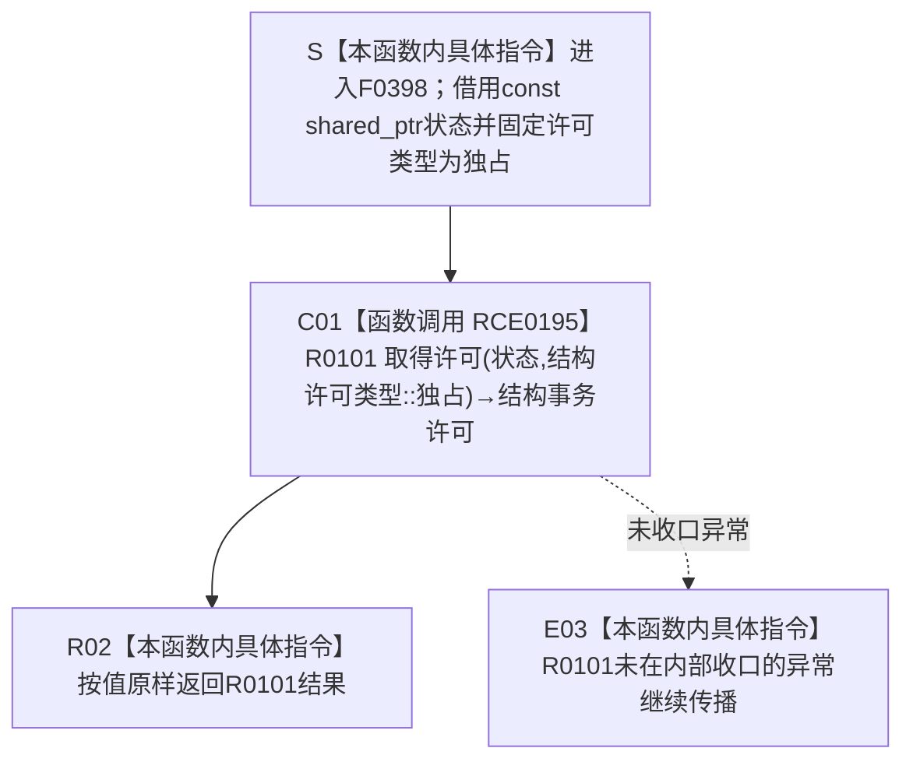

# CF-L6-0221 `结构事务协调器::生成接线` 取得独占许可 lambda 现状流程图

图类型：现状流程图
代码版本：`9ce1a8acb973155ef7a14c307e22a2b2358c173d`
源码 blob：`946512e4b88d29bbf6d43eb07b02823471489dae`
覆盖文件：`海中鱼巣/核心/协调.结构事务.ixx:153`
唯一根函数：F0398
完整签名：`海中鱼巣::结构事务许可 海中鱼巣::结构事务协调器::生成接线()::<lambda@协调.结构事务.ixx:153>::operator()(const std::shared_ptr<void>& 状态) const`
参数：`状态` 是调用期有效的 `const std::shared_ptr<void>&` 非拥有借用；lambda 无捕获，不保存引用，也不延长调用方实参本身的生命周期。R0101 在内部按自己的合同取得类型化运行期状态材料
返回结果：把同一 `状态` 引用和固定枚举 `结构许可类型::独占` 传给 R0101，并把 R0101 返回的 `结构事务许可` 按值原样返回；本函数不改写、降级或补造许可结果
非法值 / 拒绝：本 lambda 自身没有判断。空 / 错误状态、事务域隔离、同线程重入、活动登记失败、锁取得失败或等待期间隔离等结果都由 R0101 裁决并以无效许可收口；R0101 未收口的异常由本 lambda 继续传播
已登记调用方：F0233 经 E0872 把无捕获 lambda 转换并绑定到 `结构事务接线::取得独占许可` 函数指针；R0116 经 RCE0556 在有效执行器路径调用该函数指针，传入 `接线_.运行期状态`，返回值绑定到局部 `许可`
直接项目函数：RCE0195 调用 R0101 `结构事务内部::取得许可(const std::shared_ptr<void>&, 结构许可类型)`，第二个实参固定为 `结构许可类型::独占`
外部边界：无。当前聚合材料曾把同一 153 行项目函数调用重复登记为 X01069；顶层维护复核已裁决其为 RCE0195→R0101 的误分类重复项，并在共享聚合收口中删除。本图不把它画成第二次运行调用
未解析项目调用：无；RCE0556 已把生产执行器的函数指针调用唯一解析到 F0398
调用图：`流程图/主程序可达调用关系/01_main可达项目调用边表.md`
外部边界表：`流程图/主程序可达调用关系/02_main可达外部边界表.md`
逐行映射表：`流程图/代码流程图/L6/CF-L6-0221_结构事务接线取得独占许可lambda_逐行代码映射表.md`
输入契约 / 调用语境表：本文“调用语境与非成功分账”
非成功返回二分审查表：本文“调用语境与非成功分账”；具体许可拒绝分支属于 R0101 内部流程
偏差清单：本文“当前边界与规范核对”
依据提交 / 结构化消息：冻结提交 `9ce1a8acb973155ef7a14c307e22a2b2358c173d`；F0398、R0101、E0872、RCE0556、RCE0195 由正式 main 可达关系表、制图队列和当前源码交叉复核；X01069 重复误分类由顶层维护复核消息裁决，不作为本图外部调用
结构读取与写入：F0398 自身只转发状态和固定许可类型。R0101 负责转换运行期状态、登记活动记录、签发令牌、取得独占结构锁并形成许可，或按其内部路径撤销登记 / 返回无效许可
逻辑内返回：本函数不自行产生结果类别；R0101 返回的无效许可被原样传给调用方，R0116 随后通过 `许可.有效()` 把它映射为 `结构写入状态::许可拒绝`
内部错误：F0398 不检查或修复 R0101 结果。若正式调用语境保证的状态 / 接线与 R0101 观察不一致，根因对象属于事务域或 R0101；本 lambda 不把无效许可改写为成功
生命周期与资源释放：无捕获 lambda 可转换为函数指针并存入接线；每次调用只借用状态引用。成功许可按值返回并按 R0101 / `结构事务许可` 合同持有运行期状态、令牌及释放函数，F0398 不另持有资源
异常：F0398 未声明 `noexcept` 且不捕获。R0101 对独占锁取得异常有内部清理和无效许可返回，但在其内部捕获范围之外产生的异常仍由 C01 传播到 E03
并发 / 幂等：F0398 不增加自己的锁或状态；并发、同线程重入、隔离和唯一活动写入权由 R0101 裁决。重复调用不是幂等查询，每次都可能申请新的独占许可
验证入口：`协调.结构事务.ixx:153`、E0872、RCE0556、RCE0195、R0101 `协调.结构事务.ixx:84-131`、接线函数指针声明 `结构事务接线.数据.h:62-70` 和生产调用点 `执行器.结构写入.ixx:74-77`
验证输出：153 单行完整映射；4 个流程节点、1 个项目出边、0 个外部边界、0 个未解析项目调用；本批不运行构建或程序
依据：`规范/0050_项目通用机器逻辑与禁止性规则总纲_20260721.md`、`规范/0600_代码函数流程图应用与维护规范.md`、`规范/4040_子规范_不透明结构事务候选确认撤销与最后发布.md`、`规范/4050_子规范_入口拒绝逻辑内结果与内部逻辑错误.md`
不得作为施工许可：是
不得宣称：lambda 自身已经完成事务写入、取得许可等于业务结构已经发布、无效许可唯一表示某一种原因、X01069 是第二次运行调用，或本函数绕过 R0101 获得结构锁

## 流程图

## 项目源码调用合同

| 调用边 | 节点 | 被调函数 | 实参与绑定 | 结果用途 | 被调图 |
| --- | --- | --- | --- | --- | --- |
| RCE0195 | C01 | R0101 `结构事务许可 结构事务内部::取得许可(const std::shared_ptr<void>& 状态, 结构许可类型 类型)` | F0398 `状态 -> 状态`；固定 `结构许可类型::独占 -> 类型` | 返回许可由 R02 原样移交 F0398 调用方 | 待生成 |

## 已登记调用方

| 调用边 | 调用方 / 位置 | 当前前置与绑定 | 返回用途 | 调用方图 |
| --- | --- | --- | --- | --- |
| E0872 | F0233 `结构事务协调器::生成接线()` / `协调.结构事务.ixx:153` | `状态_` 非空；无捕获 lambda 转换为函数指针 | 函数指针写入 `结构事务接线::取得独占许可` | 待生成 |
| RCE0556 | R0116 `结构写入执行器::执行(...) const` / `执行器.结构写入.ixx:76` | R0116 已确认执行器有效；`接线_.运行期状态 -> 状态` | 返回值绑定局部 `许可`；无效时映射为许可拒绝，有效时读取令牌建立写入会话 | 待生成 |

## 调用语境与非成功分账

| 语境 | 当前前置 | 当前路径与结果 | 二分口径 | 结构后果 |
| --- | --- | --- | --- | --- |
| 生成接线时绑定函数指针 | F0233 的 `状态_` 非空 | E0872 只形成无捕获函数指针身份，不执行 lambda 正文 | 不适用 | 接线取得独占许可入口指向 F0398 |
| 生产执行器请求独占许可 | R0116 `有效()` 为 true，传入接线运行期状态 | RCE0556 进入 F0398，RCE0195 调用 R0101 并原样返回许可 | 具体成功 / 许可拒绝由 R0101 结果和 R0116 解释 | 成功时 R0101 持有独占写入权；失败时不形成有效许可 |
| R0101 返回无效许可 | 状态无效、隔离、同线程重入、登记 / 锁取得失败或等待期间隔离等任一 R0101 路径成立 | F0398 不分支，R02 原样返回无效许可 | 由调用方形成许可拒绝；强前置冲突时沿 R0101 追根因 | 不由 F0398 新增机器结构 |
| R0101 抛出未收口异常 | R0101 捕获范围之外的分配等操作抛出 | E03 继续传播，F0398 不返回许可 | 当前无 F0398 层结构化收口 | R0101 已发生的内部资源变化按其异常点裁决 |

## 当前边界与规范核对

- F0398 是独占许可函数指针的无捕获适配 lambda，只固定 `结构许可类型::独占` 并委托 R0101；它不复制 R0101 的事务活动登记、锁、令牌或隔离算法。
- E0872 表示函数指针绑定，不是一次 lambda 正文执行；RCE0556 才是生产执行器当前唯一解析到 F0398 的运行调用。
- RCE0195 已唯一闭合 153 行对项目函数 R0101 的调用。X01069 对同一调用点、同一签名的“Standard library”记录是误分类重复项，顶层维护将从共享外部边界聚合删除；本图只保留一个运行调用节点 C01。
- 未发现 RCE0195 之外的项目源码出边或未解析调用；X01069 删除后本函数外部边界集合为空。
