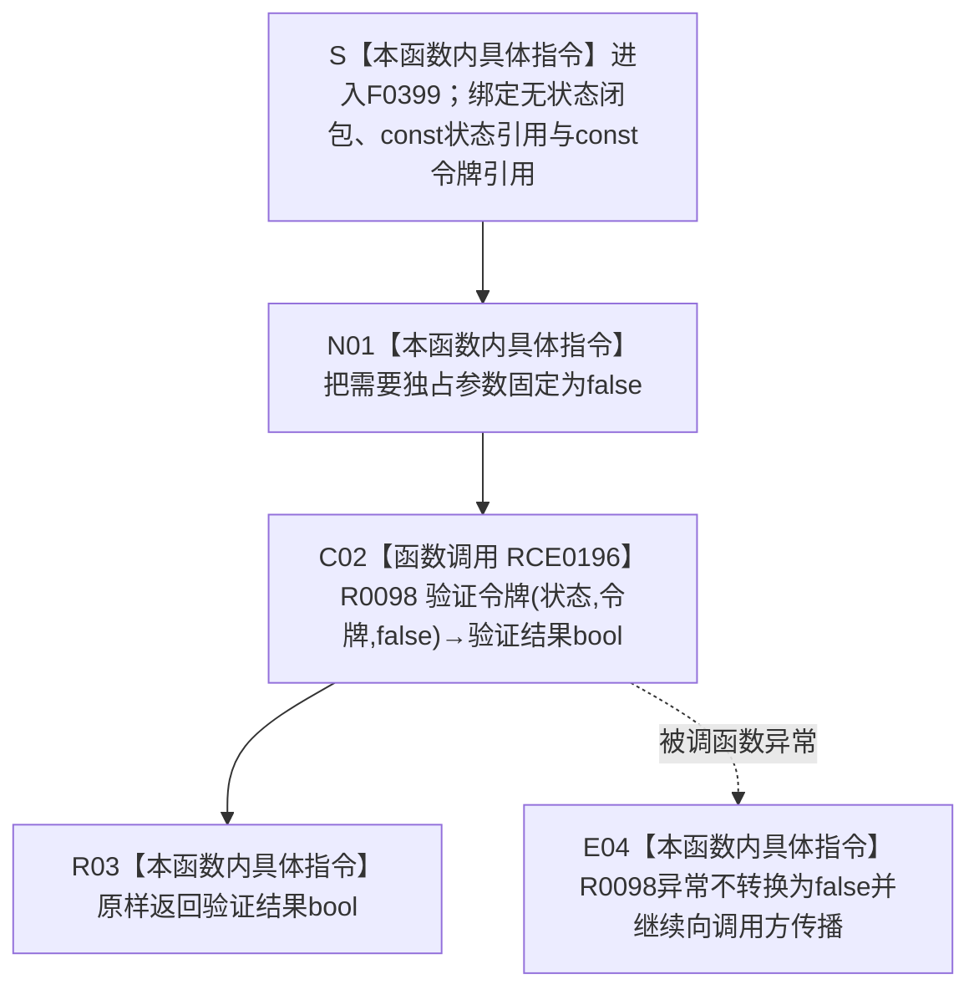

# CF-L6-0222 `结构事务接线验证共享令牌 lambda` 现状流程图

图类型：现状流程图
代码版本：`9ce1a8acb973155ef7a14c307e22a2b2358c173d`
源码 blob：`946512e4b88d29bbf6d43eb07b02823471489dae`
覆盖文件：`海中鱼巣/核心/协调.结构事务.ixx:154`
唯一根函数：F0399
完整签名：`bool 海中鱼巣::结构事务协调器::生成接线()::<lambda@协调.结构事务.ixx:154>::operator()(const std::shared_ptr<void>& 状态, const 海中鱼巣::结构事务令牌& 令牌) const`
参数：闭包捕获集为空，没有隐式协调器 `this`；隐式闭包对象只用于调用无状态 `operator() const`。`状态` 是对调用方 `std::shared_ptr<void>` 的 const 非拥有引用，本函数不复制共享所有权；`令牌` 是对调用方 `结构事务令牌` 的 const 非拥有引用。两者只在本次调用期间转交 R0098
返回结果：把 `状态`、`令牌` 和固定 `需要独占=false` 交给 R0098，原样返回 R0098 的 bool；true 表示 R0098 当前共享路径令牌复核通过，false 合并运行期状态 / 域 / 纪元 / 许可序号 / 共享许可类型 / 活动记录 / 当前线程复核失败
非法值 / 拒绝：F0399 自身不另设门禁；所有参数与令牌合同由 R0098 复核。空状态、错域、错纪元、零许可序号、无效许可类型、活动记录不命中、类型不一致或线程不一致均由 R0098 返回 false
已登记调用方：E0873 是 F0233 在 `协调.结构事务.ixx:154` 把无捕获 lambda 转换并绑定到 `接线.验证共享路径令牌` 的回调绑定边，不执行正文；E0921 是 F0239 在 `启动.运行期上下文.ixx:67` 的已解析调用；RCE0286、RCE0510、RCE0578 分别是 F0632、R0089、R0120 在节点、关系、索引仓库共享令牌验证包装中的已解析函数指针调用
直接项目函数：RCE0196 调用 R0098 `结构事务内部::验证令牌(状态, 令牌, false)`
外部边界：当前函数正文没有独立外部调用。原聚合 X01070 与 RCE0196 指向同一源码表达式、同一被调签名，是项目函数被重复误分类为标准库边界；顶层维护智能体已裁决删除 X01070，本文不把它画成第二次调用
未解析项目调用：无；五条入边中的四条执行调用均已唯一解析到 F0399，E0873 单独作为回调绑定分账
调用图：`流程图/主程序可达调用关系/01_main可达项目调用边表.md`
外部边界表：`流程图/主程序可达调用关系/02_main可达外部边界表.md`
逐行映射表：`流程图/代码流程图/L6/CF-L6-0222_结构事务接线验证共享令牌lambda_逐行代码映射表.md`
输入契约 / 调用语境表：本文“调用语境与非成功分账”
非成功返回二分审查表：本文“调用语境与非成功分账”
偏差清单：本文“当前边界与聚合校正”
依据提交 / 结构化消息：冻结提交 `9ce1a8acb973155ef7a14c307e22a2b2358c173d`；F0399、E0873、E0921、RCE0286、RCE0510、RCE0578、RCE0196 由正式 main 可达关系表、制图队列和当前源码交叉复核；顶层维护智能体只读复核确认 X01070 是 RCE0196 的重复误分类并将在共享聚合收口时删除
结构读取与写入：F0399 自身只转交参数并返回 bool；R0098 在其独立函数内读取运行期状态与活动许可记录并持锁复核，不写节点、关系、索引、领域记录或事务发布事实
逻辑内返回：来自仓库入口 / 包装函数的无效共享令牌验证返回 false，当前调用方据此拒绝继续共享路径；F0399 不创建诊断、日志或业务事实
内部错误：F0239 以刚取得的许可令牌复核结构核心时，若正式接线和许可前置已经成立而返回 false，调用方整体完整性检查失败；根因位于 R0098 读取的状态、活动记录、类型或线程一致性，不由本转发 lambda 降级为普通成功
生命周期与资源释放：F0399 不捕获 `状态_`，也不保存两个引用；返回后本函数不延长状态或令牌生命周期。接线中的函数指针可晚于 F0233 返回被调用，实际运行期状态生命周期由调用方接线字段中的 `shared_ptr<void>` 维持
异常：未声明 `noexcept` 且不捕获；R0098 内部状态转换或互斥锁取得等异常直接穿过 F0399 传播，F0399 不把异常转换为 false
并发 / 幂等：F0399 无自身可变状态；同一参数组合的当前结果仍受 R0098 活动许可表和调用线程约束。并发保护、活动记录读取与当前线程比较都属于 R0098 的独立内部过程
验证入口：`协调.结构事务.ixx:44-56,147-156`、`启动.运行期上下文.ixx:59-72`、`节点仓库.cpp:23-25`、`关系仓库.cpp:87-89`、`索引仓库.cpp:18-20`、E0873、E0921、RCE0286、RCE0510、RCE0578、RCE0196
验证输出：154 单行源码完整映射；1 条项目出边、5 条项目入边、0 个实际外部边界、0 个未解析项目调用；原 X01070 重复误分类由顶层共享聚合收口，本批不运行构建或程序
依据：`规范/0050_项目通用机器逻辑与禁止性规则总纲_20260721.md`、`规范/0600_代码函数流程图应用与维护规范.md`、`规范/4040_子规范_不透明结构事务候选确认撤销与最后发布.md`、`规范/4050_子规范_入口拒绝逻辑内结果与内部逻辑错误.md`
不得作为施工许可：是
不得宣称：E0873 绑定边已经执行令牌验证、false 唯一证明令牌不存在、true 成为长期许可事实、F0399 捕获或拥有运行期状态、X01070 表示第二次外部调用、代码已经构建或运行验证，或事务能力已经闭环

## 流程图

## 项目源码调用合同

| 调用边 | 节点 | 被调函数 | 实参与返回绑定 | 当前前置 / 结果用途 | 被调图 |
| --- | --- | --- | --- | --- | --- |
| RCE0196 | C02 | R0098 `bool 结构事务内部::验证令牌(const std::shared_ptr<void>& 状态, const 结构事务令牌& 令牌, bool 需要独占)` | `状态 -> 状态`；`令牌 -> 令牌`；字面量 `false -> 需要独占`；返回 bool 原样绑定 F0399 返回结果 | 正式接线的共享令牌验证函数指针被调用 | 待生成 |

## 已登记调用方

| 调用边 | 调用方 / 位置 | 当前前置 | 参数与结果用途 | 调用方图 |
| --- | --- | --- | --- | --- |
| E0873 | F0233 `结构事务协调器::生成接线()` / `协调.结构事务.ixx:154` | `状态_` 非空，正在构造已接域接线 | 把 F0399 的无捕获闭包转换为函数指针并绑定 `验证共享路径令牌` 字段；只绑定、不执行 F0399 | `流程图/代码流程图/L5/CF-L5-0112_结构事务协调器生成接线_现状流程图.md` |
| E0921 | F0239 `运行期上下文::结构核心完整() const` / `启动.运行期上下文.ixx:67` | 已取得共享许可且 `许可.有效()` 为 true；读取许可令牌 | 传 `接线_.运行期状态` 与许可令牌；false 使后续仓库空句柄复核短路并令整体完整性为 false | 待生成 |
| RCE0286 | F0632 `节点仓库.cpp` 匿名命名空间 `验证共享令牌(...)` / `节点仓库.cpp:24` | 接线 `已接域()` 为 true | 传接线运行期状态和调用方令牌；结果原样成为包装函数 bool | 待生成 |
| RCE0510 | R0089 `关系仓库.cpp` 匿名命名空间 `验证共享令牌(...)` / `关系仓库.cpp:88` | 接线 `已接域()` 为 true | 传接线运行期状态和调用方令牌；结果原样成为包装函数 bool | 待生成 |
| RCE0578 | R0120 `索引仓库.cpp` 匿名命名空间 `验证共享令牌(...)` / `索引仓库.cpp:19` | 接线 `已接域()` 为 true | 传接线运行期状态和调用方令牌；结果原样成为包装函数 bool | 待生成 |

## 调用语境与非成功分账

| 语境 | 当前前置 | false 结果 | 二分口径 | 结构后果 |
| --- | --- | --- | --- | --- |
| F0239 结构核心完整性复核 | 共享许可已经形成且有效，令牌从该许可读取 | R0098 对状态、令牌、活动记录、类型或线程的任一复核失败 | 前置已建立的当前许可不能通过验证时沿 R0098 和许可活动记录追根因 | 后续四个仓库空句柄读取短路；零机器事实写入 |
| F0632 节点仓库共享入口复核 | 接线已接域；令牌由具体仓库调用入口传入 | 共享路径令牌不满足 R0098 当前合同 | 入口拒绝；若上游正式保证令牌有效则追查状态 / 活动记录一致性 | 节点仓库受保护路径不继续 |
| R0089 关系仓库共享入口复核 | 接线已接域；令牌由具体仓库调用入口传入 | 同上 | 同上 | 关系仓库受保护路径不继续 |
| R0120 索引仓库共享入口复核 | 接线已接域；令牌由具体仓库调用入口传入 | 同上 | 同上 | 索引仓库受保护路径不继续 |
| R0098 抛出异常 | 调用已进入项目被调函数 | F0399 没有 bool 结果，原异常传播 | 内部运行期 / 锁异常，不包装为普通令牌 false | F0399 零写入，调用方异常路径收口 |

## 当前边界与聚合校正

- F0399 的真实正文只有一次项目调用：RCE0196→R0098。固定 `false` 明确选择共享路径合同；F0399 不展开 R0098 的状态转换、域 / 纪元 / 类型 / 活动表 / 线程复核正文。
- E0873 是回调绑定，不是 F0399 正文执行。E0921、RCE0286、RCE0510、RCE0578 才是当前已解析执行调用；五条入边必须分账，不能把绑定写成验证已经发生。
- 原 X01070 与 RCE0196 使用同一文件行、同一 `验证令牌` 签名和同一调用表达式，却把项目函数 R0098 重复分类为标准库外部边界。一个源码表达式只执行一次；顶层维护智能体已裁决在共享聚合中删除 X01070，本文不建立外部节点。
- F0399 返回的是本次运行期复核 bool，不保存许可、不推进已发布代次、不发布任何业务结构，也不把线程或锁状态提升为长期机器事实。
