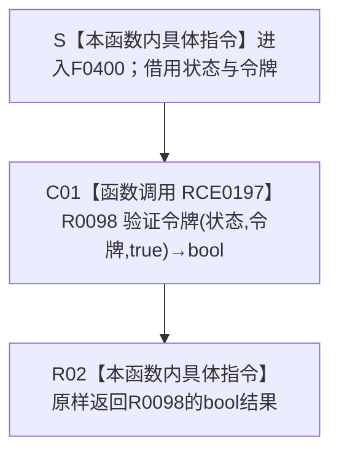

# CF-L6-0223 `结构事务协调器::生成接线` 验证独占令牌 lambda 现状流程图

图类型：现状流程图
代码版本：`9ce1a8acb973155ef7a14c307e22a2b2358c173d`
源码 blob：`946512e4b88d29bbf6d43eb07b02823471489dae`
覆盖文件：`海中鱼巣/核心/协调.结构事务.ixx:155`
唯一根函数：F0400
完整签名：`bool 海中鱼巣::结构事务协调器::生成接线()::<lambda@协调.结构事务.ixx:155>::operator()(const std::shared_ptr<void>& 状态, const 海中鱼巣::结构事务令牌& 令牌) const`
参数：无捕获 lambda；`状态` 和 `令牌` 都以 const 引用借用，仅在 RCE0197 调用期间转交，不保存引用；第三实参固定为 `true`
返回结果：原样返回 R0098 `验证令牌(状态, 令牌, true)` 的 bool；`true` 表示令牌满足当前运行期状态和独占许可要求，`false` 表示不满足
非法值 / 拒绝：本 lambda 不自行读取或拒绝空状态、无效令牌、域 / 纪元不匹配或共享许可；全部验证由 R0098 完成
已登记调用方：E0874 由 F0233 在生成接线时把无捕获 lambda 绑定为独占令牌验证函数；RCE0512 由 R0091 关系仓库接线调用；RCE0580 由 R0121 索引仓库接线调用
直接项目函数：RCE0197 调用 R0098 `bool 结构事务内部::验证令牌(const std::shared_ptr<void>&, const 结构事务令牌&, bool)`，第三实参为 `true`
外部边界：无。旧 X01071 把同一 R0098 项目函数误分类为标准库边界，本批按项目 / 外部分账删除
未解析项目调用：无；正式生产接线已把独占令牌验证函数指针唯一解析为 F0400
调用图：`流程图/主程序可达调用关系/01_main可达项目调用边表.md`
外部边界表：`流程图/主程序可达调用关系/02_main可达外部边界表.md`
逐行映射表：`流程图/代码流程图/L6/CF-L6-0223_结构事务接线验证独占令牌lambda_逐行代码映射表.md`
输入契约 / 调用语境表：本文“调用语境与结果分账”
非成功返回二分审查表：本文“调用语境与结果分账”
偏差清单：本文“当前边界与规范核对”
依据提交 / 结构化消息：冻结提交 `9ce1a8acb973155ef7a14c307e22a2b2358c173d`；F0400、R0098、E0874、RCE0512、RCE0580、RCE0197 与源码第 155 行交叉复核；X01071 经项目目标身份复核确认为重复误分类
结构读取与写入：F0400 自身不直接读写结构，只把两个借用和固定独占要求转交 R0098；R0098 的内部读取必须由其独立现状图表达
逻辑内返回：R0098 返回 false 是令牌不满足验证条件的正常拒绝结果，不是半结构成功
内部错误：本函数没有独立内部错误分支；若 R0098 抛出异常，F0400 不捕获也不形成 bool 返回
生命周期与资源释放：两个参数都是调用期 const 引用；无捕获闭包不持有运行期状态，函数返回后借用结束
异常：未声明 `noexcept`；异常合同随 R0098 传播
并发 / 幂等：F0400 不持有可变状态；相同状态快照和令牌下的结果由 R0098 当前同步读取决定
验证入口：`协调.结构事务.ixx:44-56,147-156`、E0874、RCE0512、RCE0580、RCE0197
验证输出：1 行源码完整映射；3 个项目入边、1 个项目出边、0 个外部边界、0 个未解析调用；本批不运行构建或程序
依据：`规范/0050_项目通用机器逻辑与禁止性规则总纲_20260721.md`、`规范/0600_代码函数流程图应用与维护规范.md`
不得作为施工许可：是
不得宣称：F0400 返回 true 证明事务已经提交、取得独占锁、完成结构写入或能力完成；返回 false 是内部错误；旧 X01071 是真实标准库边界；或本函数已通过运行验证

## 流程图

## 项目源码调用合同

| 调用边 | 节点 | 被调函数 | 实参与返回绑定 | 当前前置 / 结果用途 | 被调图 |
| --- | --- | --- | --- | --- | --- |
| RCE0197 | C01 | R0098 `bool 结构事务内部::验证令牌(const std::shared_ptr<void>& 状态, const 结构事务令牌& 令牌, bool 需要独占)` | `状态`、`令牌` 原引用转交；`需要独占=true`；bool 原样绑定为 F0400 返回 | 正式独占令牌验证接线被调用 | 待生成 |

## 已登记调用方

| 调用边 | 调用方 / 位置 | 当前语境 | 返回用途 |
| --- | --- | --- | --- |
| E0874 | F0233 `结构事务协调器::生成接线()` / `协调.结构事务.ixx:155` | 协调器状态非空，形成结构事务接线 | 把 F0400 函数指针绑定到 `验证独占令牌` 槽 |
| RCE0512 | R0091 / `关系仓库.cpp:92` | 关系仓库消费正式生产接线验证独占令牌 | bool 决定独占令牌是否可用于关系仓库当前操作 |
| RCE0580 | R0121 / `索引仓库.cpp:23` | 索引仓库消费正式生产接线验证独占令牌 | bool 决定独占令牌是否可用于索引仓库当前操作 |

## 调用语境与结果分账

| 语境 | 当前前置 | 当前结果 | 二分口径 | 结构后果 |
| --- | --- | --- | --- | --- |
| 生成接线 | F0233 持有非空运行期状态 | E0874 绑定无捕获函数指针 | 接线材料形成 | 不执行 F0400，不验证令牌 |
| 消费接线验证 | 关系或索引仓库已经取得正式接线 | RCE0197 调用 R0098 并原样返回 | true 接受；false 正常拒绝 | F0400 自身不写结构 |
| R0098 异常 | 被调函数未形成 bool | 异常向调用接线方传播 | 非逻辑内返回 | F0400 无补偿或结构写入 |

## 当前边界与规范核对

- 第 155 行唯一可执行调用是项目函数 R0098，正式项目边为 RCE0197；它不是标准库函数。X01071 与该调用位置、目标名和签名完全重复，属于候选工具误分类，本批删除后外部边界数为零。
- F0400 只冻结 `需要独占=true` 的适配合同，不内联 R0098 的域、纪元、许可类型、线程或运行期状态验证过程。
- E0874 是函数指针绑定边，RCE0512 / RCE0580 是两个正式消费调用边；绑定发生不等于验证已执行。
- 返回 true 只表示 R0098 当前接受令牌，不表示已取得许可、开启事务、完成写入或发布任何结构事实。
