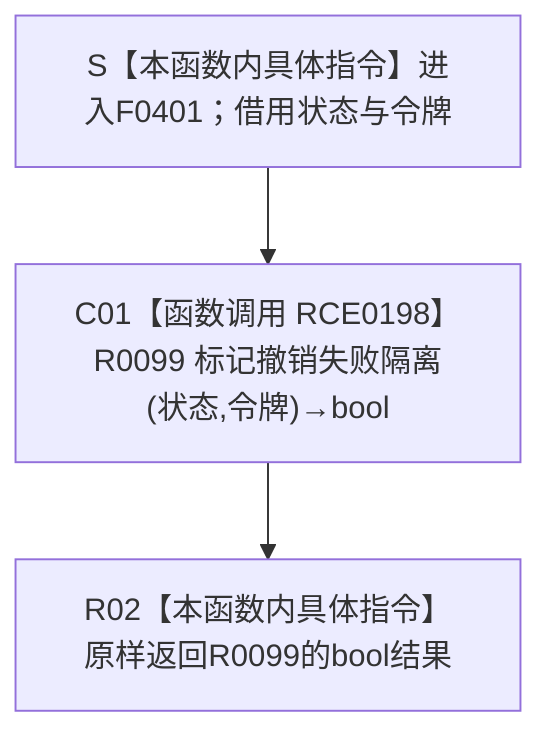

# CF-L6-0224 `结构事务协调器::生成接线` 标记撤销失败隔离 lambda 现状流程图

图类型：现状流程图
代码版本：`ff1d9bc893867acf8a9b3902e860fee85a524e14`
源码 blob：`946512e4b88d29bbf6d43eb07b02823471489dae`
覆盖文件：`海中鱼巣/核心/协调.结构事务.ixx:156`
唯一根函数：F0401
完整签名：`bool 海中鱼巣::结构事务协调器::生成接线()::<lambda@协调.结构事务.ixx:156>::operator()(const std::shared_ptr<void>& 状态, const 海中鱼巣::结构事务令牌& 令牌) const`
参数：无捕获 lambda；`状态` 和 `令牌` 均以 const 引用借用，仅在 RCE0198 调用期间原样转交，不保存引用
返回结果：原样返回 R0099 `标记撤销失败隔离(状态, 令牌)` 的 bool；`true` 表示 R0099 已把当前运行期事务域的 `已隔离` 标志设为 true，`false` 表示状态转换或独占令牌验证未通过、未执行该写入
非法值 / 拒绝：本 lambda 不自行读取或拒绝空状态、无效令牌、域 / 纪元 / 许可类型 / 活动记录 / 当前线程不匹配；这些条件由 R0099 及其调用的 R0098 验证
已登记调用方：E0875 由 F0233 在生成接线时把无捕获 lambda 绑定为撤销失败隔离函数；RCE0541 由 R0106 `结构写入执行器::标记撤销失败隔离` 经接线函数指针调用
直接项目函数：RCE0198 调用 R0099 `bool 结构事务内部::标记撤销失败隔离(const std::shared_ptr<void>&, const 结构事务令牌&)`
外部边界：无。X01072 把同一 R0099 项目函数调用误分类为 Standard library 边界；本图不把它画成第二个执行节点，共享聚合已在本批删除该重复项
未解析项目调用：无；正式生产接线已把撤销失败隔离函数指针唯一解析为 F0401
调用图：`流程图/主程序可达调用关系/01_main可达项目调用边表.md`
外部边界表：`流程图/主程序可达调用关系/02_main可达外部边界表.md`
逐行映射表：`流程图/代码流程图/L6/CF-L6-0224_结构事务接线标记撤销失败隔离lambda_逐行代码映射表.md`
输入契约 / 调用语境表：本文“调用语境与结果分账”
非成功返回二分审查表：本文“调用语境与结果分账”
偏差清单：本文“当前边界与规范核对”
依据提交 / 结构化消息：初始派发基线 `a1fce031ab77462c5a2e88227e6a6400f4bdb3ec`；main 前进到 `ff1d9bc893867acf8a9b3902e860fee85a524e14` 后复核目标源码 blob 与项目边集合无漂移；F0401、R0099、E0875、RCE0541、RCE0198、X01072 与源码第 156 行交叉复核
结构读取与写入：F0401 自身只转发两个借用并返回 bool；R0099 转换运行期状态、验证独占令牌、取得活动锁并把运行期状态的 `已隔离` 写为 true。F0401 不直接读写业务节点、关系、索引或领域记录
逻辑内返回：R0099 返回 false 时，F0401 原样返回，不伪造隔离成功；当前代码表示未完成隔离标记
内部错误：撤销无法完整恢复后，正式 4040 要求事务域在写入权释放前隔离。若 R0106 已具备有效许可和非空回调却收到 false，调用方把隔离失败计入内部不一致结果，须沿状态、令牌和接线身份追根因
生命周期与资源释放：两个参数都是调用期 const 引用；无捕获闭包不持有运行期状态或令牌，函数返回后借用结束
异常：未声明 `noexcept` 且不捕获；R0099 的锁操作若抛出则异常向调用方传播。当前唯一消费方 R0106 声明 `noexcept`，因此异常越过该边界会触发 C++ 的终止语义
并发 / 幂等：R0099 在运行期状态的活动锁内写 `已隔离=true`；同一有效独占令牌重复调用保持 true，但每次仍重新验证令牌并取得活动锁
验证入口：`协调.结构事务.ixx:58-64,147-156`、`执行器.结构写入.ixx:366-369`、E0875、RCE0541、RCE0198
验证输出：1 行源码完整映射；2 个项目入边、1 个项目出边、0 个外部边界、0 个未解析调用；重复误分类 X01072 已从共享外部边界表删除；本批不运行构建或程序
依据：`规范/0050_项目通用机器逻辑与禁止性规则总纲_20260721.md`、`规范/0600_代码函数流程图应用与维护规范.md`、`规范/4040_子规范_不透明结构事务候选确认撤销与最后发布.md`、`规范/4050_子规范_入口拒绝逻辑内结果与内部逻辑错误.md`
不得作为施工许可：是
不得宣称：E0875 绑定回调等于已经隔离；F0401 返回 true 表示撤销已经成功、结构已经恢复或事务已经发布；返回 false 是允许继续写入的普通结果；X01072 是真实标准库调用；或本函数证明事务闭环已经完成

## 流程图

## 项目源码调用合同

| 调用边 | 节点 | 被调函数 | 实参与返回绑定 | 当前前置 / 结果用途 | 被调图 |
| --- | --- | --- | --- | --- | --- |
| RCE0198 | C01 | R0099 `bool 结构事务内部::标记撤销失败隔离(const std::shared_ptr<void>& 状态, const 结构事务令牌& 令牌)` | `状态`、`令牌` 原引用转交；bool 原样绑定为 F0401 返回 | 正式撤销失败隔离接线被调用；R0099 仅在状态可转换且独占令牌验证通过时写隔离标志 | 待生成 |

## 已登记调用方

| 调用边 | 调用方 / 位置 | 当前语境 | 返回用途 |
| --- | --- | --- | --- |
| E0875 | F0233 `结构事务协调器::生成接线()` / `协调.结构事务.ixx:156` | 协调器状态非空，形成结构事务接线 | 把 F0401 函数指针绑定到 `标记撤销失败隔离` 槽；不执行 F0401 |
| RCE0541 | R0106 `结构写入执行器::标记撤销失败隔离(const 结构事务许可&) const noexcept` / `执行器.结构写入.ixx:368` | `许可.有效()` 且接线回调非空后短路条件继续 | bool 成为 R0106 结果，并由上层内部不一致路径计入隔离失败数量 |

## 调用语境与结果分账

| 语境 | 当前前置 | 当前结果 | 二分口径 | 结构后果 |
| --- | --- | --- | --- | --- |
| 生成接线 | F0233 持有非空运行期状态 | E0875 绑定无捕获函数指针 | 接线材料形成 | 不执行 F0401，不写隔离标志 |
| 消费接线并成功隔离 | R0106 已确认许可有效且函数指针非空；R0099 接受状态与独占令牌 | RCE0198 返回 true，F0401 原样返回 | 撤销失败后的内部不一致隔离收口 | R0099 在活动锁内把运行期状态 `已隔离` 写为 true |
| 消费接线但未隔离 | R0106 进入回调，R0099 无法转换状态或独占令牌验证失败 | RCE0198 返回 false，F0401 原样返回 | 追根因解决 | 不写 `已隔离`；上层结果增加隔离失败计数 |
| R0099 异常 | 被调函数未形成 bool | 异常越过 F0401 | 非逻辑内返回 | F0401 无补偿；越过 R0106 的 `noexcept` 边界会终止 |

## 当前边界与规范核对

- 第 156 行唯一可执行调用是项目函数 R0099，正式项目边为 RCE0198；它不是标准库函数。X01072 与该调用位置、目标名和签名重复，属于候选工具误分类，本批已从共享外部边界表删除。
- F0401 只表达适配和返回，不内联 R0099 的状态转换、独占令牌验证、活动锁或隔离标志写入过程；R0099 仍需自己的单函数现状图。
- E0875 是函数指针绑定边，RCE0541 是唯一正式消费调用边；绑定发生不等于隔离已执行。
- 正式 4040 要求无法恢复时在释放写入权前隔离事务域；F0401 的 true 只证明当前 R0099 调用写入隔离标志，不证明候选已经恢复、事务已经发布或后继请求行为已在本函数内验证。
