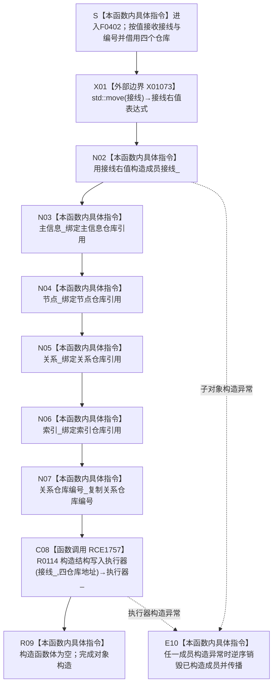

# CF-L6-0225 `存在场景数据操作::存在场景数据操作` 现状流程图

图类型：现状流程图
代码版本：`ff1d9bc893867acf8a9b3902e860fee85a524e14`
源码 blob：`524922ab2f3d0d76cfed4bdd517f0d7d57e1ae6a`
覆盖文件：`海中鱼巣/领域/数据操作.存在场景.ixx:137-151`
唯一根函数：F0402
完整签名：`海中鱼巣::存在场景数据操作::存在场景数据操作(海中鱼巣::结构事务接线 接线, 海中鱼巣::主信息仓库& 主信息, 海中鱼巣::节点仓库& 节点, 海中鱼巣::关系仓库& 关系, 海中鱼巣::索引仓库& 索引, std::uint64_t 关系仓库编号)`
参数：`接线` 按值传入并移动到成员 `接线_`；`主信息`、`节点`、`关系`、`索引` 均以非拥有引用传入并绑定到对应引用成员；`关系仓库编号` 按值复制到成员。四个仓库对象必须覆盖本对象及其 `执行器_` 的使用期
返回结果：构造完成的 `存在场景数据操作` 对象；对象持有一份结构事务接线、四个仓库引用、关系仓库编号，以及经 RCE1757 构造的 `结构写入执行器`
非法值 / 拒绝：构造函数不验证接线形态、仓库引用之间的事务域一致性或关系仓库编号是否非零。后继 `有效()` 才组合检查 `接线_.已接域()`、非零关系仓库编号和 `执行器_.有效()`
已登记调用方：F0238 经 E0880（`装配.运行期业务.ixx:66`），以接线副本、四仓库和关系仓库编号构造成员 `存在场景数据操作_`
直接项目函数：RCE1757 调用 R0114 `结构写入执行器::结构写入执行器(结构事务接线, 主信息仓库*, 节点仓库*, 关系仓库*, 索引仓库*)`，构造成员 `执行器_`
外部边界：X01073 在 144 行调用 `std::move(接线)`，把按值形参转换为用于构造成员 `接线_` 的右值表达式
未解析项目调用：无；RCE1757 已把 150 行成员构造唯一解析到 R0114
调用图：`流程图/主程序可达调用关系/01_main可达项目调用边表.md`
外部边界表：`流程图/主程序可达调用关系/02_main可达外部边界表.md`
逐行映射表：`流程图/代码流程图/L6/CF-L6-0225_存在场景数据操作构造_逐行代码映射表.md`
输入契约 / 调用语境表：本文“构造语境与有效性分账”
非成功返回二分审查表：本文“构造语境与有效性分账”；本构造函数没有结构化非成功返回
偏差清单：本文“当前边界与规范核对”
依据提交 / 结构化消息：初始派发基线 `a1fce031ab77462c5a2e88227e6a6400f4bdb3ec`；落盘后 main 前进到 `ff1d9bc893867acf8a9b3902e860fee85a524e14`，复核确认目标源码 blob、正式关系、队列和目标文件无差异 / 重叠。F0402、R0114、E0880、X01073 由正式 main 可达关系表、制图队列和当前源码交叉复核；150 行缺失直接边由顶层维护复核并分配稳定身份 RCE1757，共享正反投影已在本批同步
结构读取与写入：只建立数据操作对象内部依赖接线和引用绑定，不读取或写入节点、关系、主信息、索引、存在、场景或其它业务机器事实。R0114 只把接线副本和仓库指针保存到执行器成员
逻辑内返回：无；构造函数不以 bool、optional 或结构化结果表达接线无效。即使接线 / 编号不满足后继有效性，当前构造仍正常完成
内部错误：本函数不裁决无效装配。调用方若在未检查 `有效()` 的情况下使用无效对象，问题属于后继入口 / 装配契约；构造函数自身不补造有效状态
生命周期与资源释放：`接线_` 值式拥有移动后的接线副本；四个仓库成员是引用；`执行器_` 经 R0114 再保存一份接线值和四个仓库指针。对象析构时只按成员生命周期释放值式接线，不拥有或销毁仓库
异常：未声明 `noexcept` 且不捕获。当前成员由整数、引用、函数指针和 `shared_ptr` 接线值组成；若任一子对象构造异常，已构造成员按 C++ 逆序销毁，F0402 构造失败并传播异常
并发 / 幂等：构造过程不取得事务许可或仓库锁，也不访问共享业务结构；对象后续并发能力由接线和执行器入口裁决。重复构造会形成多个引用同一仓库的装配对象，不等于重复业务写入
验证入口：`数据操作.存在场景.ixx:137-151`、E0880、X01073、RCE1757、R0114 `执行器.结构写入.ixx:58-67`、成员声明 `数据操作.存在场景.ixx:685-691` 和调用点 `装配.运行期业务.ixx:57-72`
验证输出：137—151 共 15 行源码完整映射；11 个流程节点、1 个项目出边、1 个外部边界、0 个未解析项目调用；本批不运行构建或程序
依据：`规范/0050_项目通用机器逻辑与禁止性规则总纲_20260721.md`、`规范/0600_代码函数流程图应用与维护规范.md`、`规范/4030_子规范_基础信息服务分层与领域写授权.md`、`规范/4040_子规范_不透明结构事务候选确认撤销与最后发布.md`
不得作为施工许可：是
不得宣称：对象构造完成证明接线有效、关系仓库编号合法、执行器已经取得写许可、任何业务结构已经写入或发布，或引用成员取得四个仓库的所有权

## 流程图

## 项目源码调用合同

| 调用边 | 节点 | 被调函数 | 实参与绑定 | 结果用途 | 被调图 |
| --- | --- | --- | --- | --- | --- |
| RCE1757 | C08 | R0114 `结构写入执行器::结构写入执行器(结构事务接线 接线, 主信息仓库* 主信息, 节点仓库* 节点, 关系仓库* 关系, 索引仓库* 索引)` | `接线_ -> 接线`；`&主信息_ -> 主信息`；`&节点_ -> 节点`；`&关系_ -> 关系`；`&索引_ -> 索引` | 就地构造成员 `执行器_`；R0114 内部保存接线值和四仓库指针 | 待生成 |

## 外部边界调用合同

| 边界 | 节点 | 调用 | 实参 | 结果用途 | 当前前置 |
| --- | --- | --- | --- | --- | --- |
| X01073 | X01 | `std::move(...)` | 按值形参 `接线` | 形成构造成员 `接线_` 的右值表达式 | 构造函数参数已经完成初始化 |

## 已登记调用方

| 调用边 | 调用方 / 位置 | 当前前置与实参绑定 | 结果用途 | 调用方图 |
| --- | --- | --- | --- | --- |
| E0880 | F0238 `运行期业务装配::运行期业务装配(...)` / `装配.运行期业务.ixx:66` | `接线` 复制为本次接线形参；同一四仓库绑定；传入装配的关系仓库编号 | 构造成员 `存在场景数据操作_` | 待生成 |

## 构造语境与有效性分账

| 语境 | 当前输入 | 当前路径与结果 | 非成功口径 | 结构后果 |
| --- | --- | --- | --- | --- |
| 接线已接域且编号非零 | F0238 传入完整接线、四仓库和非零编号 | 完成全部成员与 R0114 执行器构造；后继 `有效()` 可成立 | 正常构造 | 只形成内部装配，不写业务结构 |
| 接线未接域或编号为零 | 构造函数不检查 | 仍完成对象构造；后继 `有效()` 返回 false | 构造层无拒绝结果；后继入口应在写前拒绝 | 不写业务结构 |
| 四仓库生命周期不足 | 引用在构造时可绑定，但对象使用期超过仓库 | 当前构造没有运行期生命周期证明 | 待核调用方所有权合同 | 后继访问可能悬空；构造本身不取得所有权 |
| 成员或执行器构造异常 | 任一子对象构造抛出 | E10 逆序销毁已构造成员并传播异常 | 无结构化构造失败结果 | 对象未形成；不写业务结构 |

## 当前边界与规范核对

- F0402 只建立服务专用数据操作的内部装配：值式接线、四仓库引用、关系仓库编号和结构写入执行器；构造本身不取得许可、不调用仓库写入口。
- 150 行对 R0114 的成员构造是具名项目源码调用。原聚合把 F0402 项目出边记为 0；顶层复核后已分配 RCE1757，并已更新共享身份正反投影。本图直接使用稳定边，不保留待补身份。
- X01073 只记录源码显式 `std::move` 边界；实际接线所有权变化由 N02 的成员构造完成，不能把 `std::move` 名称本身解释为资源已经迁移或接线有效。
- 未发现 RCE1757 之外的项目源码出边、额外外部边界或未解析调用。
