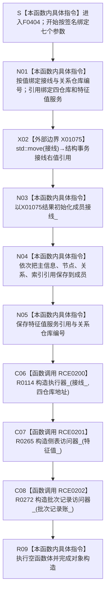

# CF-L6-0227 `特征体系数据操作::特征体系数据操作` 现状流程图

图类型：现状流程图
代码版本：`ff1d9bc893867acf8a9b3902e860fee85a524e14`
源码 blob：`a47cd9b07794d30abc6cb9d1df319056105cd596`
覆盖文件：`海中鱼巣/领域/数据操作.特征体系.ixx:458-469`
唯一根函数：F0404
完整签名：`海中鱼巣::特征体系数据操作::特征体系数据操作(海中鱼巣::结构事务接线 接线, 海中鱼巣::主信息仓库& 主信息, 海中鱼巣::节点仓库& 节点, 海中鱼巣::关系仓库& 关系, 海中鱼巣::索引仓库& 索引, 海中鱼巣::特征值服务& 特征值, std::uint64_t 关系仓库编号)`
参数：`接线` 按值传入并移动到成员；四个仓库和特征值服务以左值引用传入，构造对象保存非拥有引用；关系仓库编号按值复制。调用方必须保证全部被引用对象覆盖本对象的使用期
返回结果：构造函数无显式返回值；所有成员和三个项目子对象构造成功时形成完整 `特征体系数据操作` 对象。任一初始化器抛出时对象构造失败，已完成成员按 C++ 逆序析构
非法值 / 拒绝：本函数不验证接线完整性、仓库引用、服务引用或关系仓库编号；参数是引用时不能表达空值，语义有效性由装配方和后续执行器 / 访问器调用裁决
已登记调用方：F0238 经 E0882 在 `装配.运行期业务.ixx:68` 构造并保存 `特征体系数据操作_`
直接项目函数：RCE0200 构造 R0114 `结构写入执行器`；RCE0201 构造 R0265 `特征值原始材料侧表访问器`；RCE0202 构造 R0272 `特征批次发布记录账访问器`
外部边界：X01075 `std::move(接线)`，只形成对按值参数的右值引用，供成员 `接线_` 初始化
未解析项目调用：无
调用图：`流程图/主程序可达调用关系/01_main可达项目调用边表.md`
外部边界表：`流程图/主程序可达调用关系/02_main可达外部边界表.md`
逐行映射表：`流程图/代码流程图/L6/CF-L6-0227_特征体系数据操作构造_逐行代码映射表.md`
输入契约 / 调用语境表：本文“构造语境与生命周期分账”
非成功返回二分审查表：本文“构造语境与生命周期分账”
偏差清单：本文“当前边界与规范核对”
依据提交 / 结构化消息：初始派发基线 `a1fce031ab77462c5a2e88227e6a6400f4bdb3ec`；main 前进到 `ff1d9bc893867acf8a9b3902e860fee85a524e14` 后复核目标源码 blob 与正式边集合无漂移；F0404、E0882、RCE0200—RCE0202、X01075 与当前源码交叉复核
结构读取与写入：只形成运行期服务对象的接线值、非拥有仓库 / 服务引用、仓库编号、结构写入执行器和两个只读访问器；构造过程本身不创建、修改、删除或发布节点、关系、索引、特征值、批次记录或其它机器事实
逻辑内返回：无；构造函数不以状态码表达普通拒绝
内部错误：无显式错误分支。子对象构造失败或移动构造异常按 C++ 异常传播，整个对象不成立
生命周期与资源释放：`接线_` 拥有移动后的接线值；仓库与服务成员是非拥有引用；执行器保存接线副本 / 指针合同由 R0114 独立表达；两个访问器分别借用特征值服务和对象内批次记录账
异常：未声明 `noexcept` 且不捕获；初始化器按成员声明顺序执行，异常时已构造成员自动逆序析构
并发 / 幂等：构造函数无内部锁；并发安全取决于调用方对被引用仓库和服务的生命周期 / 发布管理。重复构造形成彼此独立的数据操作对象
验证入口：`数据操作.特征体系.ixx:458-469`、E0882、RCE0200—RCE0202、X01075，以及三个被调构造函数的独立现状图
验证输出：12 行源码完整映射；1 个项目入边、3 个项目出边、1 个外部边界、0 个未解析调用；本批不运行构建或程序
依据：`规范/0050_项目通用机器逻辑与禁止性规则总纲_20260721.md`、`规范/0600_代码函数流程图应用与维护规范.md`、`规范/4030_子规范_基础信息服务分层与领域写授权.md`、`规范/4040_子规范_不透明结构事务候选确认撤销与最后发布.md`
不得作为施工许可：是
不得宣称：对象构造完成证明任一仓库已写入、特征批次发布路径可达、接线已验证、引用对象生命周期已经自动保证、旧能力等价重建或业务能力完成

## 流程图

## 项目源码调用合同

| 调用边 | 节点 | 被调函数 | 实参与所有权 | 当前前置 / 结果用途 | 被调图 |
| --- | --- | --- | --- | --- | --- |
| RCE0200 | C06 | R0114 `结构写入执行器::结构写入执行器(结构事务接线, 主信息仓库*, 节点仓库*, 关系仓库*, 索引仓库*)` | `接线_` 按值传入；四个引用成员取地址 | 前序基础成员已初始化；形成对象内结构写入执行器 | 待生成 |
| RCE0201 | C07 | R0265 `explicit 特征值原始材料侧表访问器::特征值原始材料侧表访问器(const 特征值服务&)` | `特征值_` const 借用 | 执行器构造成功；形成原始材料只读侧表访问器 | 待生成 |
| RCE0202 | C08 | R0272 `explicit 特征批次发布记录账访问器::特征批次发布记录账访问器(const 特征批次发布记录账&)` | 对象内 `批次记录账_` const 借用 | 前序访问器构造成功；形成对象内批次记录账只读访问器 | 待生成 |

## 已登记调用方

| 调用边 | 调用方 / 位置 | 当前前置 | 构造结果用途 | 调用方图 |
| --- | --- | --- | --- | --- |
| E0882 | F0238 `运行期业务装配::运行期业务装配(...)` / `装配.运行期业务.ixx:68` | 特征值服务、存在场景数据操作和状态动态数据操作已经按成员声明顺序构造 | 结果保存为运行期业务装配的 `特征体系数据操作_` 成员 | 待生成 |

## 构造语境与生命周期分账

| 语境 | 当前前置 | 当前结果 | 二分口径 | 结构后果 |
| --- | --- | --- | --- | --- |
| 正常构造 | 七个实参已由 F0238 提供 | 九段初始化完成，空函数体结束 | 正常对象形成 | 只形成服务对象和借用关系，不执行业务写入 |
| X01075 / 接线成员构造异常 | 其它引用参数尚未保存或成员尚未完整形成 | 异常传播，对象不成立 | 非逻辑内返回 | 已构造成员按语言规则清理 |
| R0114 构造异常 | 基础成员已经初始化 | 异常传播，后两个访问器不构造 | 非逻辑内返回 | 已完成成员逆序析构 |
| R0265 / R0272 构造异常 | 前序成员与部分子对象已经构造 | 异常传播，对象不成立 | 非逻辑内返回 | 已完成成员和子对象逆序析构 |
| 后续使用 | 对象构造成功 | 方法通过成员接线、仓库和访问器工作 | 不属于本构造函数 | 被引用对象必须继续存活 |

## 当前边界与规范核对

- F0404 的三条项目出边都对应非平凡子对象构造，不能用“成员初始化”抽象节点吞并；R0114、R0265、R0272 必须各有独立现状图。
- X01075 只是 `std::move` 转换，不执行结构事务验证或移动业务结构；真正的 `接线_` 成员构造由 N03 按当前语言语义表达。
- 四仓库和特征值服务均以非拥有引用保存。当前构造函数无法证明调用方生命周期正确，只能记录 F0238 装配语境。
- `侧表访问器_` 和 `批次记录访问器_` 是只读访问器构造；它们存在不等于原始材料或批次记录已写入，也不使未接线发布路径自动可达。
- 空函数体只说明所有初始化器已经正常完成，不形成新的业务机器事实或能力完成证据。
