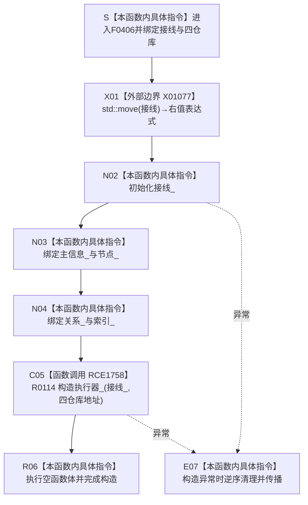

# CF-L6-0229 `轻量因果数据操作::轻量因果数据操作` 现状流程图

图类型：现状流程图
代码版本：`f7ea115bd45efe7dd5498b7346a80061c697b0a9`
源码 blob：`fdc9a1b062b28feffec733dd1a0e342812ef1ddc`
覆盖文件：`海中鱼巣/领域/数据操作.轻量因果.ixx:95-102`
唯一根函数：F0406
完整签名：`海中鱼巣::轻量因果数据操作::轻量因果数据操作(海中鱼巣::结构事务接线 接线, 海中鱼巣::主信息仓库& 主信息, 海中鱼巣::节点仓库& 节点, 海中鱼巣::关系仓库& 关系, 海中鱼巣::索引仓库& 索引)`
参数：`接线` 按值传入并移动到成员；四仓库以非拥有引用保存，调用方保证其覆盖本对象使用期
返回结果：全部成员和 R0114 子对象构造成功时形成 `轻量因果数据操作` 对象；异常时对象不成立
非法值 / 拒绝：不验证接线和仓库语义；无结构化拒绝结果
已登记调用方：F0238 经 E0884 在 `装配.运行期业务.ixx:70` 构造成员
直接项目函数：RCE1758 构造 R0114 `结构写入执行器`
外部边界：X01077 `std::move(接线)`
未解析项目调用：无
调用图：`流程图/主程序可达调用关系/01_main可达项目调用边表.md`
外部边界表：`流程图/主程序可达调用关系/02_main可达外部边界表.md`
逐行映射表：`流程图/代码流程图/L6/CF-L6-0229_轻量因果数据操作构造_逐行代码映射表.md`
输入契约 / 调用语境表：本文“构造语境”
非成功返回二分审查表：本文“构造语境”；无结构化非成功返回
偏差清单：本文“当前边界”
依据提交 / 结构化消息：F0406、E0884、RCE1758、X01077 与当前源码交叉复核；RCE1758 为第 102 行漏登项目边的稳定身份
结构读取与写入：只形成接线、仓库借用和执行器装配，不写因果、节点、关系或索引事实
逻辑内返回：无
内部错误：成员构造异常直接传播
生命周期与资源释放：接线值式拥有；仓库引用非拥有；异常时已构造成员逆序析构
异常：未声明 `noexcept`，不捕获
并发 / 幂等：不加锁、不访问仓库；重复构造只形成独立装配对象
验证入口：`数据操作.轻量因果.ixx:95-102`、E0884、RCE1758、X01077、R0114
验证输出：95—102 共 8 行完整映射；8 个节点、1 个项目出边、1 个外部边界、0 个未解析调用
依据：`规范/0050_项目通用机器逻辑与禁止性规则总纲_20260721.md`、`规范/0600_代码函数流程图应用与维护规范.md`、`规范/4030_子规范_基础信息服务分层与领域写授权.md`、`规范/4040_子规范_不透明结构事务候选确认撤销与最后发布.md`
不得作为施工许可：是
不得宣称：对象构造完成证明接线有效、执行器已取得许可、因果事实已写入或能力完成

## 流程图

## 调用合同

| 边 | 节点 | 目标 / 实参 / 结果 |
| --- | --- | --- |
| E0884 | S | F0238 传入接线与四仓库，结果保存为运行期装配成员 |
| X01077 | X01 | `接线 -> std::move(接线)`，供 `接线_` 初始化 |
| RCE1758 | C05 | `接线_` 与四仓库地址传入 R0114，结果构造成员 `执行器_` |

## 构造语境

| 语境 | 结果 | 结构后果 |
| --- | --- | --- |
| 正常构造 | 成员与执行器形成 | 仅装配，不写机器事实 |
| 接线语义无效 | 本函数仍完成构造 | 后继入口负责验证 |
| 构造异常 | 对象不成立 | 已完成成员逆序清理 |

## 当前边界

- 第 102 行 R0114 构造是具名项目调用，已以 RCE1758 闭合共享正反投影。
- X01077 只形成右值表达式，不证明接线有效或事务开始。
- 四仓库均为非拥有引用；本函数不能独立证明生命周期。
