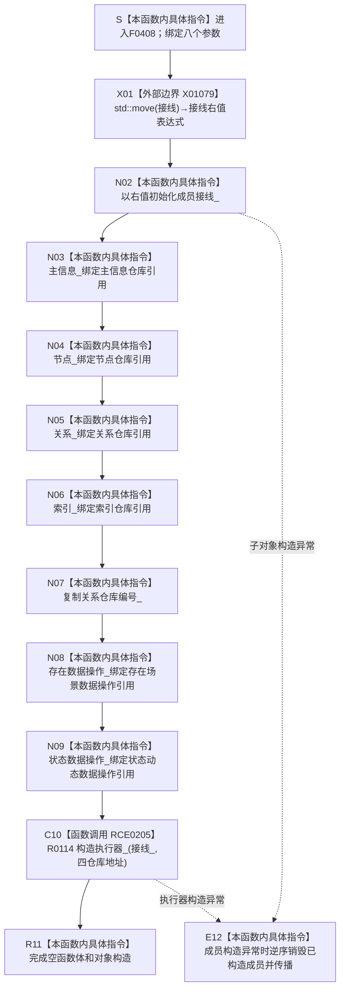

# CF-L6-0231 `需求任务方法数据操作::需求任务方法数据操作` 现状流程图

图类型：现状流程图
代码版本：`f7ea115bd45efe7dd5498b7346a80061c697b0a9`
源码 blob：`16ac9534baeda26ac8a712066e713f3339f6e0c8`
覆盖文件：`海中鱼巣/领域/数据操作.需求任务方法.ixx:863-875`
唯一根函数：F0408
完整签名：`海中鱼巣::需求任务方法数据操作::需求任务方法数据操作(海中鱼巣::结构事务接线 接线, 海中鱼巣::主信息仓库& 主信息, 海中鱼巣::节点仓库& 节点, 海中鱼巣::关系仓库& 关系, 海中鱼巣::索引仓库& 索引, std::uint64_t 关系仓库编号, 海中鱼巣::存在场景数据操作& 存在数据操作, 海中鱼巣::状态动态数据操作& 状态数据操作)`
参数：`接线` 按值传入并移动到成员；四个仓库、存在场景数据操作和状态动态数据操作均以非拥有引用传入；`关系仓库编号` 按值复制。所有被引用对象必须覆盖本对象的使用期
返回结果：构造完成的 `需求任务方法数据操作` 对象；对象持有一份接线值、四仓库引用、关系仓库编号、两个数据操作引用和经 RCE0205 构造的结构写入执行器
非法值 / 拒绝：构造函数不验证接线、关系仓库编号或两个被引用数据操作的有效性；后继 `有效()` 才组合检查这些成员
已登记调用方：F0238 经 E0886 在 `装配.运行期业务.ixx:72-74` 传入接线副本、四仓库、关系仓库编号及已构造的存在 / 状态动态数据操作
直接项目函数：RCE0205 调用 R0114 `结构写入执行器::结构写入执行器(结构事务接线, 主信息仓库*, 节点仓库*, 关系仓库*, 索引仓库*)`
外部边界：X01079 对按值形参执行 `std::move(接线)`，形成初始化成员 `接线_` 的右值表达式
未解析项目调用：无
调用图：`流程图/主程序可达调用关系/01_main可达项目调用边表.md`
外部边界表：`流程图/主程序可达调用关系/02_main可达外部边界表.md`
逐行映射表：`流程图/代码流程图/L6/CF-L6-0231_需求任务方法数据操作构造_逐行代码映射表.md`
输入契约 / 调用语境表：本文“构造语境与有效性分账”
非成功返回二分审查表：本文“构造语境与有效性分账”；本构造函数没有结构化非成功返回
偏差清单：本文“当前边界与规范核对”
依据提交 / 结构化消息：冻结提交 `f7ea115bd45efe7dd5498b7346a80061c697b0a9`；F0408、E0886、RCE0205、X01079、成员声明与当前源码交叉复核
结构读取与写入：只形成数据操作对象内部装配，不读取或写入需求、任务、方法、节点、关系、主信息或索引事实；R0114 只保存接线副本和四仓库指针
逻辑内返回：无；构造函数不返回状态码，也不因成员语义无效而拒绝
内部错误：无显式错误分支；调用方在后续使用前应通过 `有效()` 收口装配有效性
生命周期与资源释放：`接线_` 值式拥有接线；六个引用成员不取得仓库或数据操作所有权；执行器另存接线值和四仓库指针
异常：未声明 `noexcept` 且不捕获；任一子对象构造异常时，已构造成员按 C++ 逆序销毁，F0408 对象不成立
并发 / 幂等：构造过程不取得事务许可或仓库锁，也不产生业务写入；重复构造只形成多个引用同一依赖对象的数据操作实例
验证入口：`数据操作.需求任务方法.ixx:863-875,3606-3614`、E0886、RCE0205、X01079、R0114 及 `装配.运行期业务.ixx:57-74`
验证输出：863—875 共 13 行完整映射；13 个流程节点、1 个项目入边、1 个项目出边、1 个外部边界、0 个未解析调用；本批不运行构建或程序
依据：`规范/0050_项目通用机器逻辑与禁止性规则总纲_20260721.md`、`规范/0600_代码函数流程图应用与维护规范.md`、`规范/4030_子规范_基础信息服务分层与领域写授权.md`、`规范/4040_子规范_不透明结构事务候选确认撤销与最后发布.md`、`规范/3100_根规范_需求_20260720.md`、`规范/3200_根规范_任务_20260720.md`、`规范/3300_根规范_方法_20260720.md`
不得作为施工许可：是
不得宣称：对象构造完成证明接线、编号或两个数据操作有效；需求、任务或方法事实已经形成；执行器已取得写许可；或需求—任务—方法闭环已经完成

## 流程图

## 项目源码调用合同

| 调用边 | 节点 | 被调函数 | 实参与绑定 | 结果用途 | 被调图 |
| --- | --- | --- | --- | --- | --- |
| RCE0205 | C10 | R0114 `结构写入执行器::结构写入执行器(结构事务接线 接线, 主信息仓库* 主信息, 节点仓库* 节点, 关系仓库* 关系, 索引仓库* 索引)` | `接线_ -> 接线`；四个引用成员取地址传入对应指针 | 就地构造成员 `执行器_` | 待生成 |

## 外部边界调用合同

| 边界 | 节点 | 调用 | 实参 | 结果用途 |
| --- | --- | --- | --- | --- |
| X01079 | X01 | `std::move(...)` | 按值形参 `接线` | 形成用于初始化 `接线_` 的右值表达式 |

## 已登记调用方

| 调用边 | 调用方 / 位置 | 当前实参绑定 | 结果用途 | 调用方图 |
| --- | --- | --- | --- | --- |
| E0886 | F0238 `运行期业务装配::运行期业务装配(...)` / `装配.运行期业务.ixx:72-74` | 接线复制、同一四仓库、关系仓库编号、`存在场景数据操作_`、`状态动态数据操作_` | 构造成员 `需求任务方法数据操作_` | 待生成 |

## 构造语境与有效性分账

| 语境 | 当前输入 | 当前结果 | 非成功口径 | 结构后果 |
| --- | --- | --- | --- | --- |
| 全部依赖有效 | F0238 传入完整装配材料 | 全部成员和 R0114 执行器构造完成 | 正常构造 | 只形成内部装配，不写业务结构 |
| 接线、编号或被引用数据操作无效 | 构造函数不检查 | 对象仍可构造；后继 `有效()` 返回 false | 构造层无拒绝结果 | 不写业务结构 |
| 被引用对象生命周期不足 | 引用可以绑定，但后继使用时对象已销毁 | 当前构造没有生命周期证明 | 待核装配所有权合同 | 后继访问可能悬空 |
| 子对象构造异常 | 任一值式成员或执行器构造抛出 | E12 逆序销毁已构造成员并传播 | 无结构化失败结果 | F0408 对象未形成，不写业务结构 |

## 当前边界与规范核对

- F0408 只装配需求任务方法数据操作的结构依赖，不执行需求满足、任务授权 / 完成、方法选择 / 执行等业务裁决。
- 第 875 行对 R0114 的成员构造是唯一项目源码出边；两个数据操作引用绑定是本函数内指令，不调用其业务函数。
- X01079 只做右值转换；它不验证接线，也不表示事务能力已取得。
- 六个引用成员均为非拥有借用；当前函数不能单独证明调用方生命周期合同，只能记录 F0238 的成员装配语境。
- 构造完成不产生需求、任务、方法或其它领域事实，也不构成后继写入口可用的充分证明。
