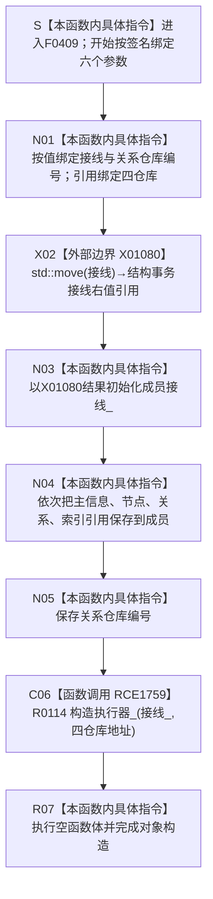

# CF-L6-0232 `系统角色数据操作::系统角色数据操作` 现状流程图

图类型：现状流程图
代码版本：`8ece4a93da2a71048282ae87b8a22fe18821b6c0`
源码 blob：`b24322d4588808299a232bc308bebd463b7a87a0`
覆盖文件：`海中鱼巣/领域/数据操作.系统角色.ixx:26-36`
唯一根函数：F0409
完整签名：`海中鱼巣::系统角色数据操作::系统角色数据操作(海中鱼巣::结构事务接线 接线, 海中鱼巣::主信息仓库& 主信息, 海中鱼巣::节点仓库& 节点, 海中鱼巣::关系仓库& 关系, 海中鱼巣::索引仓库& 索引, std::uint64_t 关系仓库编号)`
参数：`接线` 按值传入并移动到成员；四个仓库以左值引用传入，构造对象保存非拥有引用；`关系仓库编号` 按值复制。调用方必须保证四个仓库覆盖本对象及其执行器的使用期
返回结果：构造函数无显式返回值；全部成员和 R0114 子对象构造成功并执行空函数体后，形成完整 `系统角色数据操作` 对象。任一初始化器抛出时对象构造失败，已完成成员按 C++ 逆序析构
非法值 / 拒绝：本函数不验证接线是否已接域、关系仓库编号是否非零或四仓库的语义身份；引用参数不能表达空值，但本函数也不能证明被引用对象生命周期有效
已登记调用方：F0238 经 E0887 在 `海中鱼巣/装配.运行期业务.ixx:75-76` 构造并保存 `系统角色数据操作_`
直接项目函数：RCE1759 构造 R0114 `结构写入执行器`；该稳定边由顶层维护者分配，用于闭合当前共享表漏边
外部边界：X01080 `std::move(接线)`，只把按值参数转换为右值引用，供成员 `接线_` 初始化
未解析项目调用：无；第 35 行 R0114 构造已解析为稳定边 RCE1759
调用图：`流程图/主程序可达调用关系/01_main可达项目调用边表.md`
外部边界表：`流程图/主程序可达调用关系/02_main可达外部边界表.md`
逐行映射表：`流程图/代码流程图/L6/CF-L6-0232_系统角色数据操作构造_逐行代码映射表.md`
输入契约 / 调用语境表：本文“构造语境与生命周期分账”
非成功返回二分审查表：本文“构造语境与生命周期分账”
偏差清单：本文“当前边界与规范核对”
依据提交 / 结构化消息：冻结提交 `8ece4a93da2a71048282ae87b8a22fe18821b6c0`；F0409、E0887、X01080、R0114 与当前源码交叉复核；第 35 行漏边由顶层维护者分配稳定身份 RCE1759
结构读取与写入：只形成运行期数据操作对象的接线值、四个非拥有仓库引用、关系仓库编号和结构写入执行器；构造过程本身不创建、修改、删除或发布节点、主信息、关系、索引、系统角色或其它机器事实
逻辑内返回：无；构造函数不以状态码表达普通拒绝
内部错误：无显式错误分支。成员或 R0114 构造异常直接传播，整个对象不成立
生命周期与资源释放：`接线_` 拥有移动后的接线值；四仓库成员为非拥有引用；R0114 接收 `接线_` 的值副本和四仓库成员地址，其内部所有权由 R0114 独立现状图表达
异常：未声明 `noexcept` 且不捕获；初始化器按成员声明顺序执行，异常时已构造成员自动逆序析构
并发 / 幂等：构造函数无内部锁，也不执行仓库访问；并发安全依赖调用方对仓库和装配对象的生命周期管理。重复构造形成彼此独立的数据操作对象
验证入口：`海中鱼巣/领域/数据操作.系统角色.ixx:24-36,412-418`、E0887、RCE1759、X01080、R0114 `海中鱼巣/核心/执行器.结构写入.ixx:60-67`
验证输出：26—36 共 11 行源码完整映射；1 个项目入边、1 个项目出边、1 个外部边界、0 个未解析调用；本子任务不运行构建或程序
依据：`规范/0050_项目通用机器逻辑与禁止性规则总纲_20260721.md`、`规范/0600_代码函数流程图应用与维护规范.md`、`规范/4030_子规范_基础信息服务分层与领域写授权.md`、`规范/4040_子规范_不透明结构事务候选确认撤销与最后发布.md`
不得作为施工许可：是
不得宣称：对象构造完成证明接线有效、关系仓库编号有效、四仓库生命周期已自动保证、执行器已执行、系统角色已预检或发布、旧能力等价重建或业务能力完成

## 流程图

## 项目源码调用合同

| 调用边 | 节点 | 被调函数 | 实参与所有权 | 当前前置 / 结果用途 | 被调图 |
| --- | --- | --- | --- | --- | --- |
| RCE1759 | C06 | R0114 `结构写入执行器::结构写入执行器(结构事务接线 接线, 主信息仓库* 主信息, 节点仓库* 节点, 关系仓库* 关系, 索引仓库* 索引)` | `接线_` 复制到按值形参；四个引用成员取地址传入 | 前序基础成员已经初始化；形成对象内结构写入执行器 | 待生成 |

## 已登记调用方

| 调用边 | 调用方 / 位置 | 当前前置 | 构造结果用途 | 调用方图 |
| --- | --- | --- | --- | --- |
| E0887 | F0238 `运行期业务装配::运行期业务装配(...)` / `海中鱼巣/装配.运行期业务.ixx:75-76` | 需求任务方法成员已经按装配类成员声明顺序构造 | 结果保存为运行期业务装配的 `系统角色数据操作_` 成员 | 待生成 |

## 构造语境与生命周期分账

| 语境 | 当前前置 | 当前结果 | 二分口径 | 结构后果 |
| --- | --- | --- | --- | --- |
| 正常构造 | 六个实参由 F0238 提供 | 七个成员 / 子对象初始化完成，空函数体结束 | 正常对象形成 | 只形成数据操作对象、执行器和借用关系，不执行业务写入 |
| 接线成员或 R0114 构造异常 | 前序参数已绑定，部分成员可能已形成 | 异常传播，对象不成立 | 非逻辑内返回 | 已完成成员按语言规则逆序清理 |
| 后续有效性检查 | 对象已经构造成功 | 由后继 `有效()` 另行检查接线、关系仓库编号和执行器形状 | 不属于本构造函数 | 构造成功不等于有效性检查通过 |
| 后续使用 | 对象构造成功且调用方继续持有四仓库 | 方法通过成员接线、仓库和执行器执行系统角色预检、发布或读回 | 不属于本构造函数 | 被引用仓库必须继续存活 |

## 当前边界与规范核对

- 第 35 行存在 R0114 项目构造调用；本批已用稳定身份 RCE1759 写回共享身份表、项目边表和队列正反投影。
- RCE1759 对应非平凡项目子对象 R0114 构造，不能用“成员初始化”抽象节点吞并；R0114 必须有独立单函数现状图。
- X01080 只是 `std::move` 转换，不执行结构事务验证、不取得许可，也不移动仓库或业务结构；真正的 `接线_` 成员初始化由 N03 表达。
- 四个仓库均以非拥有引用保存，并把成员地址交给执行器。当前构造函数无法证明调用方生命周期正确，只能记录 F0238 装配语境。
- 空函数体只说明全部初始化器正常完成，不形成系统角色稳定键预检、世界拓扑发布、权威读回或其它业务机器事实。
