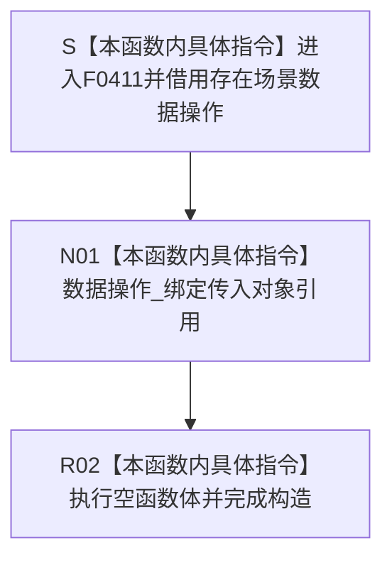

# CF-L6-0234 `存在业务服务::存在业务服务` 现状流程图

图类型：现状流程图
代码版本：`8ece4a93da2a71048282ae87b8a22fe18821b6c0`
源码 blob：`379bac36761433211580ce9122b35f10cafe0c8d`
覆盖文件：`海中鱼巣/领域/服务.存在.ixx:49-50`
唯一根函数：F0411
完整签名：`explicit 海中鱼巣::存在业务服务::存在业务服务(海中鱼巣::存在场景数据操作& 数据操作)`
参数：`数据操作` 以非拥有左值引用传入；调用方保证对象覆盖本服务使用期
返回结果：引用成员绑定成功后形成 `存在业务服务` 对象；无显式返回值
非法值 / 拒绝：引用不能表达空值；不验证数据操作语义，无结构化拒绝结果
已登记调用方：F0238 经 E0889 构造运行期业务装配成员
直接项目函数：无
外部边界：无
未解析项目调用：无
调用图：`流程图/主程序可达调用关系/01_main可达项目调用边表.md`
外部边界表：`流程图/主程序可达调用关系/02_main可达外部边界表.md`
逐行映射表：`流程图/代码流程图/L6/CF-L6-0234_存在业务服务构造_逐行代码映射表.md`
输入契约 / 调用语境表：本文“构造语境”
非成功返回二分审查表：本文“构造语境”；无非成功返回
偏差清单：本文“当前边界”
依据提交 / 结构化消息：F0411、E0889 与当前源码交叉复核
结构读取与写入：只保存非拥有引用，不读写存在、场景、节点、关系或索引事实
逻辑内返回：无
内部错误：无显式错误分支
生命周期与资源释放：本服务不拥有、不销毁数据操作对象
异常：引用成员绑定和空函数体无显式抛出操作
并发 / 幂等：不加锁、不访问共享结构
验证入口：`服务.存在.ixx:49-50`、E0889
验证输出：49—50 两行完整映射；3 个节点、0 项目出边、0 外部边界、0 未解析调用
依据：`规范/0050_项目通用机器逻辑与禁止性规则总纲_20260721.md`、`规范/0600_代码函数流程图应用与维护规范.md`、`规范/4030_子规范_基础信息服务分层与领域写授权.md`
不得作为施工许可：是
不得宣称：服务构造完成证明数据操作有效、存在事实已形成或业务能力完成

## 流程图

## 已登记调用方

| 边 | 调用方 | 实参与结果 |
| --- | --- | --- |
| E0889 | F0238 `运行期业务装配::运行期业务装配(...)` | 传入已有存在场景数据操作，结果保存为存在业务服务成员 |

## 构造语境

| 语境 | 结果 | 结构后果 |
| --- | --- | --- |
| 正常构造 | 引用成员绑定，服务对象形成 | 只形成借用，不写机器事实 |
| 来源对象生命周期不足 | 当前构造仍可完成 | 后继访问存在悬空风险 |

## 当前边界

- 两行源码没有项目函数调用、外部调用或动态调用。
- 构造只保存引用；存在场景数据操作内部过程不内联进本图。
