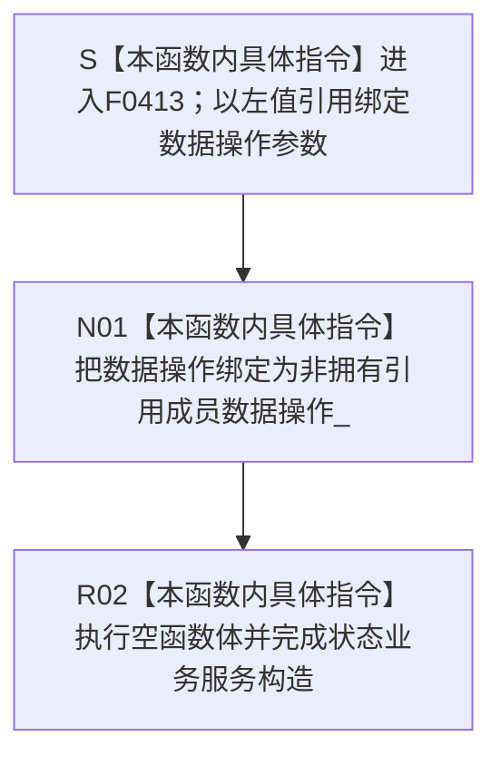

# CF-L6-0236 `状态业务服务::状态业务服务` 现状流程图

图类型：现状流程图
代码版本：`bc86af89233f1441cfedf58c9db989c7161ef1c0`
源码 blob：`0576315b712424990f8e1c0abd57be681539daf7`
覆盖文件：`海中鱼巣/领域/服务.状态.ixx:78-79`
唯一根函数：F0413
完整签名：`海中鱼巣::状态业务服务::状态业务服务(海中鱼巣::状态动态数据操作& 数据操作)`
参数：`数据操作` 以非 const 左值引用传入；构造对象把同一对象绑定为非拥有引用成员 `数据操作_`。调用方必须保证被引用的 `状态动态数据操作` 覆盖本服务对象的全部使用期
返回结果：构造函数无显式返回值；引用成员绑定完成并执行空函数体后形成 `状态业务服务` 对象
非法值 / 拒绝：引用参数不能表达空值，本函数没有入口拒绝或有效性检查；若调用方提供生命周期不足的对象，后续使用会产生悬空引用风险，本构造函数不能检测
已登记调用方：F0238 经 E0891 在 `海中鱼巣/装配.运行期业务.ixx:81` 用成员 `状态动态数据操作_` 构造并保存 `状态服务_`
直接项目函数：无
外部边界：无
未解析项目调用：无
调用图：`流程图/主程序可达调用关系/01_main可达项目调用边表.md`
外部边界表：`流程图/主程序可达调用关系/02_main可达外部边界表.md`
逐行映射表：`流程图/代码流程图/L6/CF-L6-0236_状态业务服务构造_逐行代码映射表.md`
输入契约 / 调用语境表：本文“构造语境与生命周期分账”
非成功返回二分审查表：本文“构造语境与生命周期分账”
偏差清单：本文“当前边界与规范核对”
依据提交 / 结构化消息：冻结提交 `bc86af89233f1441cfedf58c9db989c7161ef1c0`；F0413、E0891、源码第 78—79 行及成员声明第 196 行交叉复核
结构读取与写入：仅建立状态业务服务到既有状态动态数据操作对象的非拥有引用；不调用数据操作，不创建、修改、删除或发布状态节点、动态节点、关系、主信息、索引或其它机器事实
逻辑内返回：无；构造函数不返回状态码，也没有拒绝分支
内部错误：无显式内部错误分支；当前两行只有引用绑定和空函数体
生命周期与资源释放：服务不取得 `状态动态数据操作` 所有权，也不复制该对象；服务析构时不销毁被引用对象。F0238 装配类必须让 `状态动态数据操作_` 先于 `状态服务_` 构造并晚于其析构
异常：函数未声明 `noexcept`，但当前引用成员初始化和空函数体没有可抛调用；无异常处理或补偿路径
并发 / 幂等：构造函数不加锁、不访问共享状态；重复构造只形成多个指向同一或不同数据操作对象的服务引用包装
验证入口：`海中鱼巣/领域/服务.状态.ixx:76-79,196`、E0891、`海中鱼巣/装配.运行期业务.ixx:81`
验证输出：78—79 共 2 行源码完整映射；1 个项目入边、0 个项目出边、0 个外部边界、0 个未解析调用；本子任务不运行构建或程序
依据：`规范/0050_项目通用机器逻辑与禁止性规则总纲_20260721.md`、`规范/0600_代码函数流程图应用与维护规范.md`、`规范/1160_根规范_状态节点_20260720.md`、`规范/4030_子规范_基础信息服务分层与领域写授权.md`
不得作为施工许可：是
不得宣称：服务构造完成证明状态动态数据操作有效、被引用对象生命周期已自动保证、任何状态规格已形成、状态节点已创建、状态材料已读取、旧能力等价重建或业务能力完成

## 流程图

## 已登记调用方

| 调用边 | 调用方 / 位置 | 当前前置 | 构造结果用途 | 调用方图 |
| --- | --- | --- | --- | --- |
| E0891 | F0238 `运行期业务装配::运行期业务装配(...)` / `海中鱼巣/装配.运行期业务.ixx:81` | 成员 `状态动态数据操作_` 已按装配类成员声明顺序构造 | 把该数据操作成员借给 F0413，结果保存为 `状态服务_` | 待生成 |

## 构造语境与生命周期分账

| 语境 | 当前前置 | 当前结果 | 二分口径 | 结构后果 |
| --- | --- | --- | --- | --- |
| 正常构造 | F0238 已持有完成构造的 `状态动态数据操作_` | 引用成员绑定，空函数体结束 | 正常对象形成 | 只形成服务到数据操作的非拥有引用 |
| 后续使用 | F0413 构造成功 | 服务方法通过 `数据操作_` 形成规格、创建状态或读取材料 | 不属于本构造函数 | 被引用数据操作必须继续存活 |
| 生命周期违约 | 服务仍被使用但被引用数据操作已销毁 | 当前构造函数无运行期检查 | 调用方生命周期错误 | 形成悬空引用风险；不属于逻辑内返回 |

## 当前边界与规范核对

- 第 78—79 行没有具名项目函数调用、标准库调用或动态调用，当前 0 项目出边、0 外部边界和 0 未解析调用与源码一致。
- `数据操作_` 是非拥有引用，不是仓库、事务、许可或原始令牌暴露；具体状态读写仍由被引用的状态动态数据操作及其独立函数图表达。
- E0891 只证明 F0238 在当前装配路径构造服务，不证明状态数据操作有效，也不执行任何状态规格形成、创建或读取。
- 空函数体只说明引用成员绑定完成，不形成状态节点、状态值材料、主体 / 场景关系或其它业务机器事实。
