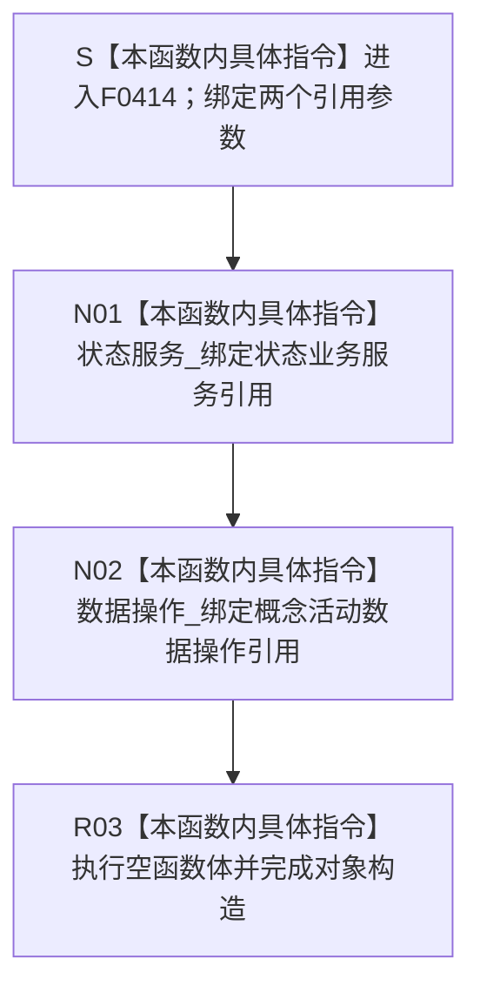

# CF-L6-0237 `概念活动业务服务::概念活动业务服务` 现状流程图

图类型：现状流程图
代码版本：`bc86af89233f1441cfedf58c9db989c7161ef1c0`
源码 blob：`c96b7a88a6486ebbe8c23948fb9cca6e8effd23e`
覆盖文件：`海中鱼巣/领域/服务.概念活动.ixx:20-24`
唯一根函数：F0414
完整签名：`海中鱼巣::概念活动业务服务::概念活动业务服务(海中鱼巣::状态业务服务& 状态服务, 海中鱼巣::概念活动数据操作& 数据操作)`
参数：`状态服务` 和 `数据操作` 均以非拥有左值引用传入；调用方保证两个对象覆盖本服务使用期
返回结果：两个引用成员绑定成功后形成 `概念活动业务服务` 对象；无显式返回值
非法值 / 拒绝：引用不能表达空值；构造函数不验证两个依赖对象的业务有效性，无结构化拒绝结果
已登记调用方：F0238 经 E0892 在 `装配.运行期业务.ixx:82` 传入已构造的状态业务服务与概念活动数据操作
直接项目函数：无
外部边界：无
未解析项目调用：无
调用图：`流程图/主程序可达调用关系/01_main可达项目调用边表.md`
外部边界表：`流程图/主程序可达调用关系/02_main可达外部边界表.md`
逐行映射表：`流程图/代码流程图/L6/CF-L6-0237_概念活动业务服务构造_逐行代码映射表.md`
输入契约 / 调用语境表：本文“构造语境”
非成功返回二分审查表：本文“构造语境”；无非成功返回
偏差清单：本文“当前边界与规范核对”
依据提交 / 结构化消息：冻结提交 `bc86af89233f1441cfedf58c9db989c7161ef1c0`；F0414、E0892、成员声明与当前源码交叉复核
结构读取与写入：只保存两个非拥有引用，不读取或写入概念活动、状态、动态、节点、关系、主信息或索引事实
逻辑内返回：无
内部错误：无显式错误分支；后继 `有效()` 仅检查概念活动数据操作的有效性
生命周期与资源释放：本服务不拥有、不销毁状态业务服务或概念活动数据操作
异常：引用成员绑定和空函数体无显式抛出操作
并发 / 幂等：构造过程不加锁、不访问共享结构；重复构造只形成多个引用同一依赖对象的服务实例
验证入口：`服务.概念活动.ixx:20-26,98-99`、E0892 及 `装配.运行期业务.ixx:77-83`
验证输出：20—24 共 5 行完整映射；4 个流程节点、1 个项目入边、0 个项目出边、0 个外部边界、0 个未解析调用；本批不运行构建或程序
依据：`规范/0050_项目通用机器逻辑与禁止性规则总纲_20260721.md`、`规范/0600_代码函数流程图应用与维护规范.md`、`规范/4030_子规范_基础信息服务分层与领域写授权.md`
不得作为施工许可：是
不得宣称：服务构造完成证明状态服务或数据操作有效；概念活动、状态或动态事实已经形成；概念活动初始化已执行；或概念活动业务闭环已经完成

## 流程图

## 已登记调用方

| 调用边 | 调用方 / 位置 | 当前实参绑定 | 结果用途 | 调用方图 |
| --- | --- | --- | --- | --- |
| E0892 | F0238 `运行期业务装配::运行期业务装配(...)` / `装配.运行期业务.ixx:82` | `状态服务_ -> 状态服务`；`概念活动数据操作_ -> 数据操作` | 构造成员 `概念活动服务_` | `流程图/代码流程图/L5/CF-L5-0113_运行期业务装配构造_现状流程图.md` |

## 构造语境

| 语境 | 当前输入 | 当前结果 | 非成功口径 | 结构后果 |
| --- | --- | --- | --- | --- |
| 正常构造 | F0238 传入两个已构造依赖对象 | 两个引用成员绑定，服务对象形成 | 正常构造 | 只形成借用，不写机器事实 |
| 任一依赖对象语义无效 | 构造函数不检查 | 服务对象仍可形成 | 构造层无拒绝结果 | 不写机器事实 |
| 任一来源对象生命周期不足 | 引用可以绑定，但后继使用时对象已销毁 | 当前构造没有生命周期证明 | 待核装配所有权合同 | 后继访问可能悬空 |

## 当前边界与规范核对

- 20—24 行没有项目函数调用、外部调用或动态调用；两个成员初始化均为本函数内引用绑定。
- 构造函数只保存状态业务服务与概念活动数据操作引用，不调用状态规格形成、活动初始化或活动视图重建入口。
- 后继 `有效()` 只转调数据操作有效性，不在本构造函数内执行，也不证明状态业务服务语义有效。
- 构造完成不产生概念活动、状态、动态或其它领域事实，不构成后继业务入口成功的充分证明。
