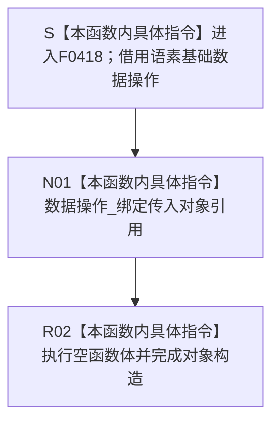

# CF-L6-0241 `基础信息业务服务::基础信息业务服务` 现状流程图

图类型：现状流程图
代码版本：`3c7258b9e84488e0ad09938df1b469d113941775`
源码 blob：`06952da7ebc216864c12e30add88e7faa280e4a5`
覆盖文件：`海中鱼巣/领域/服务.基础信息.ixx:20`
唯一根函数：F0418
完整签名：`explicit 海中鱼巣::基础信息业务服务::基础信息业务服务(海中鱼巣::语素基础数据操作& 数据操作)`
参数：`数据操作` 以非拥有左值引用传入；调用方保证对象覆盖本服务使用期
返回结果：引用成员绑定成功后形成 `基础信息业务服务` 对象；无显式返回值
非法值 / 拒绝：引用不能表达空值；构造函数不验证数据操作的业务有效性，无结构化拒绝结果
已登记调用方：F0238 经 E0896 在 `装配.运行期业务.ixx:86` 传入已构造的语素基础数据操作
直接项目函数：无
外部边界：无
未解析项目调用：无
调用图：`流程图/主程序可达调用关系/01_main可达项目调用边表.md`
外部边界表：`流程图/主程序可达调用关系/02_main可达外部边界表.md`
逐行映射表：`流程图/代码流程图/L6/CF-L6-0241_基础信息业务服务构造_逐行代码映射表.md`
输入契约 / 调用语境表：本文“构造语境”
非成功返回二分审查表：本文“构造语境”；无非成功返回
偏差清单：本文“当前边界与规范核对”
依据提交 / 结构化消息：冻结提交 `3c7258b9e84488e0ad09938df1b469d113941775`；F0418、E0896、成员声明与当前源码交叉复核
结构读取与写入：只保存语素基础数据操作的非拥有引用，不读取或写入基础信息、语素、节点、关系、主信息或索引事实
逻辑内返回：无
内部错误：无显式错误分支
生命周期与资源释放：本服务不拥有、不销毁语素基础数据操作
异常：引用成员绑定和空函数体无显式抛出操作
并发 / 幂等：构造过程不加锁、不访问共享结构；重复构造只形成多个引用同一数据操作对象的服务实例
验证入口：`服务.基础信息.ixx:20,38`、E0896 及 `装配.运行期业务.ixx:82-87`
验证输出：第 20 行完整映射；3 个流程节点、1 个项目入边、0 个项目出边、0 个外部边界、0 个未解析调用；本批不运行构建或程序
依据：`规范/0050_项目通用机器逻辑与禁止性规则总纲_20260721.md`、`规范/0600_代码函数流程图应用与维护规范.md`、`规范/4030_子规范_基础信息服务分层与领域写授权.md`
不得作为施工许可：是
不得宣称：服务构造完成证明数据操作有效；基础信息或语素事实已经形成；数据操作已经取得结构事务能力；或基础信息业务能力已经完成

## 流程图

## 已登记调用方

| 调用边 | 调用方 / 位置 | 当前实参绑定 | 结果用途 | 调用方图 |
| --- | --- | --- | --- | --- |
| E0896 | F0238 `运行期业务装配::运行期业务装配(...)` / `装配.运行期业务.ixx:86` | `语素基础数据操作_ -> 数据操作` | 构造成员 `基础信息服务_` | `流程图/代码流程图/L5/CF-L5-0113_运行期业务装配构造_现状流程图.md` |

## 构造语境

| 语境 | 当前输入 | 当前结果 | 非成功口径 | 结构后果 |
| --- | --- | --- | --- | --- |
| 正常构造 | F0238 传入已构造的语素基础数据操作 | 引用成员绑定，服务对象形成 | 正常构造 | 只形成借用，不写机器事实 |
| 数据操作语义无效 | 构造函数不检查 | 服务对象仍可形成 | 构造层无拒绝结果 | 不写机器事实 |
| 来源对象生命周期不足 | 引用可以绑定，但后继使用时对象已销毁 | 当前构造没有生命周期证明 | 待核装配所有权合同 | 后继访问可能悬空 |

## 当前边界与规范核对

- 第 20 行没有项目函数调用、外部调用或动态调用；成员初始化只是本函数内引用绑定。
- 构造函数不调用 `创建基础信息身份`、`读取基础信息` 或 `读取主键基础信息`，这些后继业务入口不内联进本图。
- 基础信息业务服务借用语素基础数据操作不改变 4030 的服务—专用数据操作分层，也不授予调用方仓库或原始事务能力。
- 构造完成不产生基础信息、语素或其它领域事实，不构成后继业务入口成功的充分证明。
