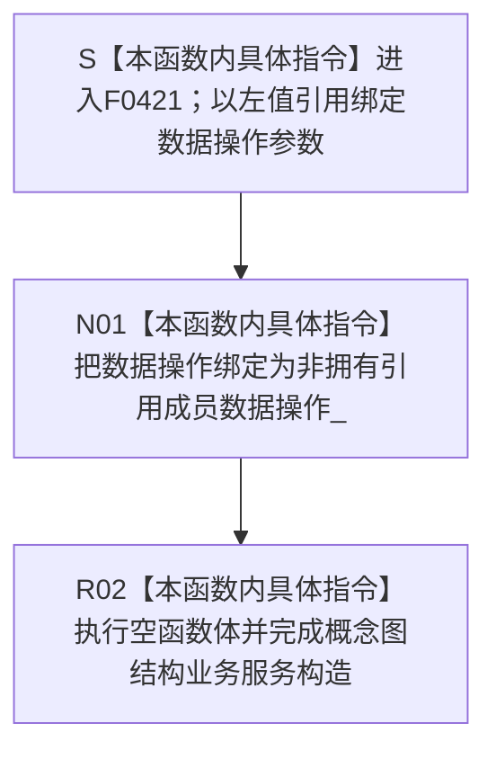

# CF-L6-0244 `概念图结构业务服务::概念图结构业务服务` 现状流程图

图类型：现状流程图
代码版本：`5be3fe52008bb19a958ba01b6c21a11a92c0ce45`
源码 blob：`32e8a8739f139f19d1fdec4e79750b922cb8b15a`
覆盖文件：`海中鱼巣/领域/服务.概念图结构.ixx:80-81`
唯一根函数：F0421
完整签名：`海中鱼巣::概念图结构业务服务::概念图结构业务服务(海中鱼巣::概念图结构数据操作& 数据操作)`
参数：`数据操作` 以非 const 左值引用传入；构造对象把同一 `概念图结构数据操作` 绑定为非拥有引用成员 `数据操作_`。调用方必须保证被引用对象覆盖本服务对象的全部使用期
返回结果：构造函数无显式返回值；参数引用绑定、引用成员初始化和空函数体完成后形成 `概念图结构业务服务` 对象
非法值 / 拒绝：引用参数不能表达空值，本函数没有入口拒绝或有效性检查；若调用方提供生命周期不足的对象，后续使用会产生悬空引用风险，本构造函数不能检测
已登记调用方：F0238 经 E0899 在 `海中鱼巣/装配.运行期业务.ixx:89` 用成员 `概念图结构数据操作_` 构造并保存 `概念图结构服务_`
直接项目函数：无
外部边界：无
未解析项目调用：无
调用图：`流程图/主程序可达调用关系/01_main可达项目调用边表.md`
外部边界表：`流程图/主程序可达调用关系/02_main可达外部边界表.md`
逐行映射表：`流程图/代码流程图/L6/CF-L6-0244_概念图结构业务服务构造_逐行代码映射表.md`
输入契约 / 调用语境表：本文“构造语境与生命周期分账”
非成功返回二分审查表：本文“构造语境与生命周期分账”
偏差清单：本文“当前边界与规范核对”
依据提交 / 结构化消息：冻结提交 `5be3fe52008bb19a958ba01b6c21a11a92c0ce45`；F0421、E0899、源码第 80—81 行及成员声明第 161 行交叉复核
结构读取与写入：仅建立概念图结构业务服务到既有概念图结构数据操作对象的非拥有引用；不调用数据操作，不创建、修改、删除或发布概念根、概念关系、定义材料、生命周期或其它机器事实
逻辑内返回：无；构造函数不返回状态码，也没有拒绝分支
内部错误：无显式内部错误分支；当前两行只有引用绑定、成员初始化和空函数体
生命周期与资源释放：服务不取得 `概念图结构数据操作` 所有权，也不复制该对象；服务析构时不销毁被引用对象。F0238 装配类必须让 `概念图结构数据操作_` 先于 `概念图结构服务_` 构造并晚于其析构
异常：函数未声明 `noexcept`，但当前引用成员初始化和空函数体没有可抛调用；无异常处理或补偿路径
并发 / 幂等：构造函数不加锁、不访问共享状态；重复构造只形成多个指向同一或不同数据操作对象的服务引用包装
验证入口：`海中鱼巣/领域/服务.概念图结构.ixx:78-81,161`、E0899、`海中鱼巣/装配.运行期业务.ixx:89`
验证输出：80—81 共 2 行源码完整映射；1 个项目入边、0 个项目出边、0 个外部边界、0 个未解析调用；本子任务不运行构建或程序
依据：`规范/0050_项目通用机器逻辑与禁止性规则总纲_20260721.md`、`规范/0600_代码函数流程图应用与维护规范.md`、`规范/4030_子规范_基础信息服务分层与领域写授权.md`、`规范/7140_子规范_概念身份生命周期退役删除与活动投影分账.md`
不得作为施工许可：是
不得宣称：服务构造完成证明概念图结构数据操作有效、被引用对象生命周期已自动保证、根角色已复核、概念关系已创建或读取、概念生命周期已形成、旧能力等价重建或业务能力完成

## 流程图

## 已登记调用方

| 调用边 | 调用方 / 位置 | 当前前置 | 构造结果用途 | 调用方图 |
| --- | --- | --- | --- | --- |
| E0899 | F0238 `运行期业务装配::运行期业务装配(...)` / `海中鱼巣/装配.运行期业务.ixx:89` | 成员 `概念图结构数据操作_` 已按装配类成员声明顺序构造 | 把该数据操作成员借给 F0421，结果保存为 `概念图结构服务_` | 待生成 |

## 构造语境与生命周期分账

| 语境 | 当前前置 | 当前结果 | 二分口径 | 结构后果 |
| --- | --- | --- | --- | --- |
| 正常构造 | F0238 已持有完成构造的 `概念图结构数据操作_` | 引用成员绑定，空函数体结束 | 正常对象形成 | 只形成服务到数据操作的非拥有引用 |
| 后续使用 | F0421 构造成功 | 服务方法通过 `数据操作_` 复核根角色、形成规格并创建或读取概念关系 | 不属于本构造函数 | 被引用数据操作必须继续存活 |
| 生命周期违约 | 服务仍被使用但被引用数据操作已销毁 | 当前构造函数无运行期检查 | 调用方生命周期错误 | 形成悬空引用风险；不属于逻辑内返回 |

## 当前边界与规范核对

- 第 80—81 行没有具名项目函数调用、标准库调用或动态调用，当前 0 项目出边、0 外部边界和 0 未解析调用与源码一致，未发现缺失直接边。
- `数据操作_` 是非拥有引用，不是仓库、事务、许可或原始令牌暴露；具体概念图结构读写仍由被引用的数据操作及其独立函数图表达。
- E0899 只证明 F0238 在当前装配路径构造服务，不证明数据操作有效，也不执行根角色复核、概念关系创建或读取。
- 空函数体只说明引用成员绑定完成，不形成概念根、实例支持概念、上下位、定义材料、概念签名或生命周期机器事实。
