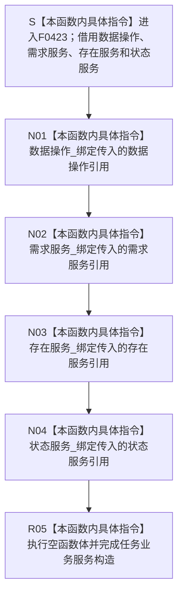

# CF-L6-0246 `任务业务服务::任务业务服务` 现状流程图

图类型：现状流程图
代码版本：`5be3fe52008bb19a958ba01b6c21a11a92c0ce45`
源码 blob：`c5deff246865c2cb569299c50d01042afbad6ade`
覆盖文件：`海中鱼巣/领域/服务.任务.ixx:61-68`
唯一根函数：F0423
完整签名：`海中鱼巣::任务业务服务::任务业务服务(海中鱼巣::需求任务方法数据操作& 数据操作, 海中鱼巣::需求业务服务& 需求服务, 海中鱼巣::存在业务服务& 存在服务, 海中鱼巣::状态业务服务& 状态服务)`
参数：`数据操作`、`需求服务`、`存在服务`、`状态服务` 均以非拥有左值引用传入；四个被引用对象必须分别覆盖本服务对象的使用期
返回结果：构造完成的 `任务业务服务` 对象；四个引用成员分别引用调用方传入的同一数据操作、需求服务、存在服务和状态服务对象
非法值 / 拒绝：引用参数不能表达空指针；本构造函数不检查四个依赖对象的内部状态，也不能验证其后续生命周期
已登记调用方：F0238 经 E0901 在 `装配.运行期业务.ixx:91` 以成员 `需求任务方法数据操作_`、`需求服务_`、`存在服务_`、`状态服务_` 构造成员 `任务服务_`
直接项目函数：无；61—67 行只接收参数并执行四个引用成员绑定
外部边界：无
未解析项目调用：无
调用图：`流程图/主程序可达调用关系/01_main可达项目调用边表.md`
外部边界表：`流程图/主程序可达调用关系/02_main可达外部边界表.md`
逐行映射表：`流程图/代码流程图/L6/CF-L6-0246_任务业务服务构造_逐行代码映射表.md`
输入契约 / 调用语境表：本文“构造语境与生命周期分账”
非成功返回二分审查表：不适用；本构造函数没有结构化非成功返回
偏差清单：本文“当前边界与规范核对”
依据提交 / 结构化消息：冻结提交 `5be3fe52008bb19a958ba01b6c21a11a92c0ce45`；F0423、E0901、成员声明与当前源码交叉复核
结构读取与写入：不读取或写入需求、任务、存在、状态、节点、关系、索引或其它机器事实，只形成服务对象到四个依赖对象的非拥有引用
逻辑内返回：无
内部错误：无显式错误分支；任一被引用对象生命周期不足会使后继调用悬空，但本构造函数不具备运行期检查手段
生命周期与资源释放：服务不拥有、不销毁四个依赖对象；服务析构只结束引用成员所在对象的生命周期，不影响被引用对象
异常：引用绑定和空函数体不抛出；当前构造路径没有异常分支
并发 / 幂等：构造过程不访问共享结构、不取得锁；多个服务对象可以引用相同依赖，后继并发、授权与幂等语义由具名任务业务入口裁决
验证入口：`服务.任务.ixx:59-70,259-262`、E0901 与 `装配.运行期业务.ixx:89-91`
验证输出：61—68 共 8 行完整映射；6 个流程节点、1 个项目入边、0 个项目出边、0 个外部边界、0 个未解析调用；本批不运行构建或程序
依据：`规范/0050_项目通用机器逻辑与禁止性规则总纲_20260721.md`、`规范/0600_代码函数流程图应用与维护规范.md`、`规范/4030_子规范_基础信息服务分层与领域写授权.md`、`规范/3200_根规范_任务_20260720.md`
不得作为施工许可：是
不得宣称：服务对象构造完成证明任一依赖有效、任务已经创建 / 授权 / 筹办 / 执行 / 完成、任务能力已经接通，或任务治理闭环已经完成

## 流程图

## 已登记调用方

| 调用边 | 调用方 / 位置 | 当前实参绑定 | 结果用途 | 调用方图 |
| --- | --- | --- | --- | --- |
| E0901 | F0238 `运行期业务装配::运行期业务装配(...)` / `装配.运行期业务.ixx:91` | `需求任务方法数据操作_ -> 数据操作`；`需求服务_ -> 需求服务`；`存在服务_ -> 存在服务`；`状态服务_ -> 状态服务` | 构造成员 `任务服务_` | 待生成 |

## 构造语境与生命周期分账

| 语境 | 当前输入 | 当前结果 | 非成功口径 | 结构后果 |
| --- | --- | --- | --- | --- |
| 正常装配 | F0238 已先构造四个依赖成员 | 四个引用成员绑定并完成服务构造 | 正常构造 | 只形成非拥有依赖，不写业务结构 |
| 任一依赖内部状态异常 | 构造函数不读取或检查依赖 | 服务对象仍构造完成 | 构造层无拒绝结果 | 不写业务结构；后继业务入口自行收口 |
| 任一被引用对象生命周期不足 | 后继使用时依赖对象已销毁 | 构造时无法检出 | 待核装配所有权合同 | 后继引用悬空 |

## 当前边界与规范核对

- F0423 是任务领域服务到任务专用数据操作及需求、存在、状态领域服务的依赖装配；它不直接接触仓库、许可或事务能力。
- 八行源码没有项目函数调用、外部调用或动态调用；E0901 只表示 F0238 构造本服务。
- 构造函数不创建任务，不读取需求目标，不创建任务运行态存在或初始状态，也不裁决授权、筹办、执行或完成；这些行为属于后继具名业务入口。
- 四个引用绑定均不转移所有权，构造完成不能证明依赖有效或生命周期已经由本函数保证。
