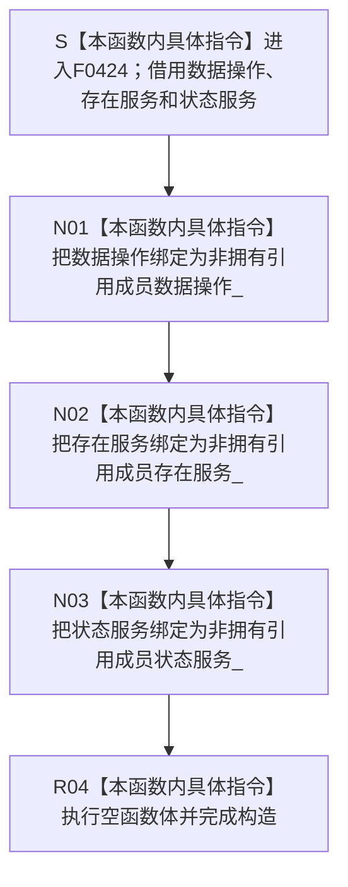

# CF-L6-0247 `方法业务服务::方法业务服务` 现状流程图

图类型：现状流程图
代码版本：`5be3fe52008bb19a958ba01b6c21a11a92c0ce45`
源码 blob：`74a839fe2d983516ff7cb623d45464f8c7fdf5fb`
覆盖文件：`海中鱼巣/领域/服务.方法.ixx:72-77`
唯一根函数：F0424
完整签名：`海中鱼巣::方法业务服务::方法业务服务(海中鱼巣::需求任务方法数据操作& 数据操作, 海中鱼巣::存在业务服务& 存在服务, 海中鱼巣::状态业务服务& 状态服务)`
参数：`数据操作`、`存在服务`、`状态服务` 均以非 const 左值引用传入；构造对象把三个来源分别绑定为非拥有引用成员，调用方必须保证它们覆盖本服务对象的全部使用期
返回结果：构造函数无显式返回值；三个引用成员绑定完成并执行空函数体后形成 `方法业务服务` 对象
非法值 / 拒绝：引用参数不能表达空值，本函数没有入口拒绝或有效性检查；任一来源对象生命周期不足都会让对应成员成为悬空引用，本构造函数不能检测
已登记调用方：F0238 经 E0902 在 `海中鱼巣/装配.运行期业务.ixx:92` 传入装配成员 `需求任务方法数据操作_`、`存在服务_`、`状态服务_`，构造并保存方法服务成员
直接项目函数：无
外部边界：无
未解析项目调用：无
调用图：`流程图/主程序可达调用关系/01_main可达项目调用边表.md`
外部边界表：`流程图/主程序可达调用关系/02_main可达外部边界表.md`
逐行映射表：`流程图/代码流程图/L6/CF-L6-0247_方法业务服务构造_逐行代码映射表.md`
输入契约 / 调用语境表：本文“构造语境与生命周期分账”
非成功返回二分审查表：本文“构造语境与生命周期分账”
偏差清单：本文“当前边界与规范核对”
依据提交 / 结构化消息：冻结提交 `5be3fe52008bb19a958ba01b6c21a11a92c0ce45`；F0424、E0902、源码第 72—77 行及本类私有引用成员交叉复核
结构读取与写入：仅建立方法业务服务到既有需求任务方法数据操作、存在业务服务、状态业务服务对象的三个非拥有引用；不调用任何依赖，不创建、修改、删除或发布方法、存在、状态、节点、关系、主信息、索引或其它机器事实
逻辑内返回：无；构造函数不返回状态码，也没有拒绝分支
内部错误：无显式内部错误分支；当前六行只有参数声明、三个引用绑定和空函数体
生命周期与资源释放：服务不取得三个依赖对象的所有权，也不复制或销毁它们；F0238 装配类必须让三个来源成员先于方法服务成员构造并晚于其析构
异常：函数未声明 `noexcept`，但当前引用成员初始化和空函数体没有可抛调用；无异常处理或补偿路径
并发 / 幂等：构造函数不加锁、不访问共享状态；重复构造只形成多个指向同一组或不同组依赖对象的服务引用包装
验证入口：`海中鱼巣/领域/服务.方法.ixx:70-77`、E0902、`海中鱼巣/装配.运行期业务.ixx:92`
验证输出：72—77 共 6 行源码完整映射；1 个项目入边、0 个项目出边、0 个外部边界、0 个未解析调用；本子任务不运行构建或程序
依据：`规范/0050_项目通用机器逻辑与禁止性规则总纲_20260721.md`、`规范/0600_代码函数流程图应用与维护规范.md`、`规范/3300_根规范_方法_20260720.md`、`规范/4030_子规范_基础信息服务分层与领域写授权.md`
不得作为施工许可：是
不得宣称：服务构造完成证明三个依赖有效、来源对象生命周期已自动保证、任何方法规格或生命周期已形成、方法节点已创建、旧能力等价重建或业务能力完成

## 流程图

## 已登记调用方

| 边 | 调用方 | 实参与结果 |
| --- | --- | --- |
| E0902 | F0238 `运行期业务装配::运行期业务装配(...)` | 传入装配成员 `需求任务方法数据操作_`、`存在服务_`、`状态服务_`，结果保存为方法业务服务成员 |

## 构造语境与生命周期分账

| 语境 | 当前结果 | 结构后果 | 非成功分类 |
| --- | --- | --- | --- |
| 三个依赖对象均覆盖服务使用期 | 服务对象形成 | 只形成三个非拥有借用，不写机器事实 | 不适用 |
| 任一来源对象生命周期不足 | 构造仍可完成 | 后继访问对应引用存在悬空风险 | 当前函数不检测，也不返回失败 |

## 当前边界与规范核对

- 第 72—77 行没有项目函数调用、外部边界或动态调用；成员初始化都是引用绑定。
- 构造函数不执行方法登记、存在材料读取或状态规格形成；这些被调函数的内部过程不得内联进本图。
- 当前代码把来源对象生命周期交给装配方保证；本文只记录该事实，不把引用绑定写成能力完成或施工许可。
