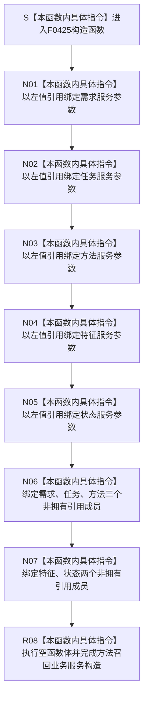

# CF-L6-0248 `方法召回业务服务::方法召回业务服务` 现状流程图

图类型：现状流程图
代码版本：`6ac48037c8036fba7a93537f8c8c75da7a6998c8`
源码 blob：`549a2a2919d699299eb1da754320c84359c1fc34`
覆盖文件：`海中鱼巣/领域/服务.方法召回.ixx:76-84`
唯一根函数：F0425
完整签名：`海中鱼巣::方法召回业务服务::方法召回业务服务(海中鱼巣::需求业务服务& 需求服务, 海中鱼巣::任务业务服务& 任务服务, 海中鱼巣::方法业务服务& 方法服务, 海中鱼巣::特征业务服务& 特征服务, 海中鱼巣::状态业务服务& 状态服务)`
参数：五个参数均以非 const 左值引用传入；构造对象把五个既有业务服务分别绑定为非拥有引用成员。调用方必须保证全部被引用服务覆盖本方法召回服务的使用期
返回结果：构造函数无显式返回值；五个参数引用与五个引用成员全部绑定并执行空函数体后形成 `方法召回业务服务` 对象
非法值 / 拒绝：引用参数不能表达空值，本函数没有入口拒绝、服务有效性或依赖一致性检查；若任一被引用服务生命周期不足，后续召回使用会产生悬空引用风险
已登记调用方：F0238 经 E0903 在 `海中鱼巣/装配.运行期业务.ixx:93` 用成员 `需求服务_`、`任务服务_`、`方法服务_`、`特征服务_`、`状态服务_` 构造并保存 `方法召回服务_`
直接项目函数：无
外部边界：无
未解析项目调用：无
调用图：`流程图/主程序可达调用关系/01_main可达项目调用边表.md`
外部边界表：`流程图/主程序可达调用关系/02_main可达外部边界表.md`
逐行映射表：`流程图/代码流程图/L6/CF-L6-0248_方法召回业务服务构造_逐行代码映射表.md`
输入契约 / 调用语境表：本文“构造语境与生命周期分账”
非成功返回二分审查表：本文“构造语境与生命周期分账”
偏差清单：本文“当前边界与规范核对”
依据提交 / 结构化消息：冻结提交 `6ac48037c8036fba7a93537f8c8c75da7a6998c8`；F0425、E0903、源码第 76—84 行及成员声明第 193—197 行交叉复核
结构读取与写入：仅建立方法召回业务服务到五个既有业务服务的非拥有引用；不调用这些服务，不读取任务、需求、方法、特征或状态，不创建、修改、删除或发布任何机器事实
逻辑内返回：无；构造函数不返回状态码，也没有拒绝分支
内部错误：无显式内部错误分支；当前九行只有参数绑定、引用成员初始化和空函数体
生命周期与资源释放：方法召回服务不取得五个依赖服务的所有权，也不复制或销毁它们。F0238 装配类必须让五个依赖服务先于 `方法召回服务_` 构造并晚于其析构
异常：函数未声明 `noexcept`，但当前引用成员初始化和空函数体没有可抛调用；无异常处理或补偿路径
并发 / 幂等：构造函数不加锁、不访问共享状态；重复构造只形成多个引用同一组或不同依赖服务的方法召回包装对象
验证入口：`海中鱼巣/领域/服务.方法召回.ixx:74-84,193-197`、E0903、`海中鱼巣/装配.运行期业务.ixx:93`
验证输出：76—84 共 9 行源码完整映射；1 个项目入边、0 个项目出边、0 个外部边界、0 个未解析调用；本子任务不运行构建或程序
依据：`规范/0050_项目通用机器逻辑与禁止性规则总纲_20260721.md`、`规范/0600_代码函数流程图应用与维护规范.md`、`规范/3300_根规范_方法_20260720.md`、`规范/4030_子规范_基础信息服务分层与领域写授权.md`、`规范/5250_子规范_任务筹办按方法能力查找到就绪因果链_20260720.md`
不得作为施工许可：是
不得宣称：服务构造完成证明五个依赖服务有效或同域、被引用对象生命周期已自动保证、方法候选已召回或排序、任务已选择方法、旧能力等价重建或业务能力完成

## 流程图

## 已登记调用方

| 调用边 | 调用方 / 位置 | 当前前置 | 构造结果用途 | 调用方图 |
| --- | --- | --- | --- | --- |
| E0903 | F0238 `运行期业务装配::运行期业务装配(...)` / `海中鱼巣/装配.运行期业务.ixx:93` | 需求、任务、方法、特征和状态五个业务服务成员均已按装配类成员声明顺序构造 | 把五个服务成员借给 F0425，结果保存为 `方法召回服务_` | 待生成 |

## 构造语境与生命周期分账

| 语境 | 当前前置 | 当前结果 | 二分口径 | 结构后果 |
| --- | --- | --- | --- | --- |
| 正常构造 | F0238 已持有完成构造的五个依赖服务 | 五个引用成员绑定，空函数体结束 | 正常对象形成 | 只形成方法召回服务到五个业务服务的非拥有引用 |
| 后续召回 | F0425 构造成功 | `召回` 经任务、需求、方法、特征和状态服务读取当前材料并形成候选结果 | 不属于本构造函数 | 五个被引用服务必须继续存活 |
| 生命周期违约 | 方法召回服务仍被使用但任一依赖服务已销毁 | 当前构造函数无运行期检查 | 调用方生命周期错误 | 形成悬空引用风险；不属于逻辑内返回 |

## 当前边界与规范核对

- 第 76—84 行没有具名项目函数调用、标准库调用或动态调用，当前 0 项目出边、0 外部边界和 0 未解析调用与源码一致，未发现缺失直接边。
- 五个成员都是非拥有服务引用，不是仓库、事务、许可、原始令牌或方法选择写权限；具体召回读取和排序过程必须由 `召回` 及其被调函数的独立流程图表达。
- E0903 只证明 F0238 在当前装配路径构造方法召回服务，不证明五个服务当前有效、材料完整或候选唯一。
- 空函数体只说明五个引用成员绑定完成，不读取任务生命周期、需求目标、方法登记根、特征当前值或目标状态，也不形成方法选择机器事实。
