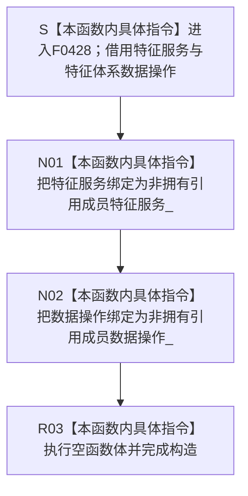

# CF-L6-0251 `特征状态组合器::特征状态组合器` 现状流程图

图类型：现状流程图
代码版本：`6ac48037c8036fba7a93537f8c8c75da7a6998c8`
源码 blob：`e1e70ac49fbfa683a9fbb238f57e123b18d22c01`
覆盖文件：`海中鱼巣/领域/组合.特征状态.ixx:26-27`
唯一根函数：F0428
完整签名：`海中鱼巣::特征状态组合器::特征状态组合器(海中鱼巣::特征业务服务& 特征服务, 海中鱼巣::特征体系数据操作& 数据操作)`
参数：`特征服务` 与 `数据操作` 均以非 const 左值引用传入；构造对象把两个来源分别绑定为非拥有引用成员，调用方必须保证它们覆盖本组合器对象的全部使用期
返回结果：构造函数无显式返回值；两个引用成员绑定完成并执行空函数体后形成 `特征状态组合器` 对象
非法值 / 拒绝：引用参数不能表达空值，本函数没有入口拒绝或有效性检查；任一来源对象生命周期不足都会让对应成员成为悬空引用，本构造函数不能检测
已登记调用方：F0238 经 E0906 在 `海中鱼巣/装配.运行期业务.ixx:96` 传入装配成员 `特征服务_`、`特征体系数据操作_`，构造并保存特征状态组合器成员
直接项目函数：无
外部边界：无
未解析项目调用：无
调用图：`流程图/主程序可达调用关系/01_main可达项目调用边表.md`
外部边界表：`流程图/主程序可达调用关系/02_main可达外部边界表.md`
逐行映射表：`流程图/代码流程图/L6/CF-L6-0251_特征状态组合器构造_逐行代码映射表.md`
输入契约 / 调用语境表：本文“构造语境与生命周期分账”
非成功返回二分审查表：本文“构造语境与生命周期分账”
偏差清单：本文“当前边界与规范核对”
依据提交 / 结构化消息：冻结提交 `6ac48037c8036fba7a93537f8c8c75da7a6998c8`；F0428、E0906、源码第 26—27 行及成员声明第 57—58 行交叉复核
结构读取与写入：仅建立特征状态组合器到既有特征业务服务、特征体系数据操作对象的两个非拥有引用；不调用任何依赖，不创建、修改、删除或发布特征槽位、特征值、状态、节点、关系、主信息、索引或其它机器事实
逻辑内返回：无；构造函数不返回状态码，也没有拒绝分支
内部错误：无显式内部错误分支；当前两行只有两个引用绑定和空函数体
生命周期与资源释放：组合器不取得两个依赖对象的所有权，也不复制或销毁它们；F0238 装配类必须让两个来源成员先于本组合器成员构造并晚于其析构
异常：函数未声明 `noexcept`，但当前引用成员初始化和空函数体没有可抛调用；无异常处理或补偿路径
并发 / 幂等：构造函数不加锁、不访问共享状态；重复构造只形成多个指向同一组或不同组依赖对象的组合器引用包装
验证入口：`海中鱼巣/领域/组合.特征状态.ixx:24-27,43,57-58`、E0906、`海中鱼巣/装配.运行期业务.ixx:96`
验证输出：26—27 共 2 行源码完整映射；1 个项目入边、0 个项目出边、0 个外部边界、0 个未解析调用；本子任务不运行构建或程序
依据：`规范/0050_项目通用机器逻辑与禁止性规则总纲_20260721.md`、`规范/0600_代码函数流程图应用与维护规范.md`、`规范/1130_根规范_特征节点_20260720.md`、`规范/2100_根规范_特征值_20260720.md`
不得作为施工许可：是
不得宣称：组合器构造完成证明两个依赖有效、来源对象生命周期已自动保证、槽位或值规格已形成、初始状态已发布、特征事实已创建、旧能力等价重建或业务能力完成

## 流程图

## 已登记调用方

| 边 | 调用方 | 实参与结果 |
| --- | --- | --- |
| E0906 | F0238 `运行期业务装配::运行期业务装配(...)` | 传入装配成员 `特征服务_`、`特征体系数据操作_`，结果保存为特征状态组合器成员 |

## 构造语境与生命周期分账

| 语境 | 当前结果 | 结构后果 | 非成功分类 |
| --- | --- | --- | --- |
| 两个依赖对象均覆盖组合器使用期 | 组合器对象形成 | 只形成两个非拥有借用，不写机器事实 | 不适用 |
| 任一来源对象生命周期不足 | 构造仍可完成 | 后继访问对应引用存在悬空风险 | 当前函数不检测，也不返回失败 |

## 当前边界与规范核对

- 第 26—27 行没有项目函数调用、外部边界或动态调用；两个成员初始化都是引用绑定。
- 构造函数不形成特征槽位或特征值规格，也不发布初始状态；这些后继函数过程不得内联进本图。
- 当前代码把来源对象生命周期交给装配方保证；本文只记录该事实，不把引用绑定写成能力完成或施工许可。
