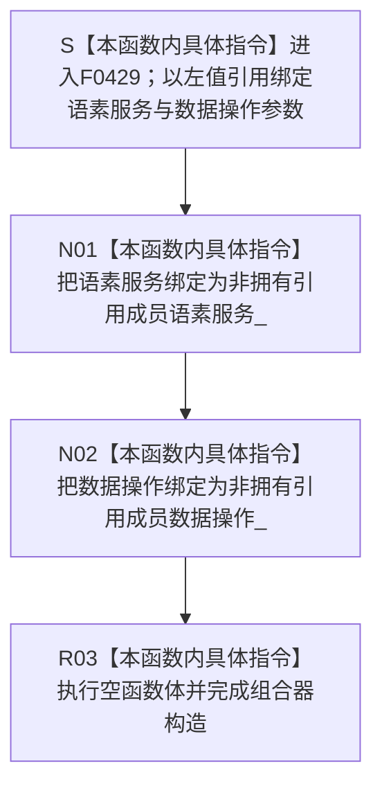

# CF-L6-0252 `语素概念入口组合器::语素概念入口组合器` 现状流程图

图类型：现状流程图
代码版本：`673def3003e6c21a2c1c03ba72b5c5438d0bf1ec`
源码 blob：`d4169e392ac26c2569759cc6132d76739e11c662`
覆盖文件：`海中鱼巣/领域/组合.语素概念入口.ixx:13-14`
唯一根函数：F0429
完整签名：`海中鱼巣::语素概念入口组合器::语素概念入口组合器(海中鱼巣::语素业务服务& 语素服务, 海中鱼巣::语素基础数据操作& 数据操作)`
参数：`语素服务` 和 `数据操作` 均以非 const 左值引用传入；构造对象把两个既有对象分别绑定为非拥有引用成员。调用方必须保证二者覆盖组合器的全部使用期
返回结果：构造函数无显式返回值；两个参数引用和两个引用成员完成绑定并执行空函数体后形成 `语素概念入口组合器` 对象
非法值 / 拒绝：引用参数不能表达空值，本函数没有入口拒绝、服务 / 数据操作有效性或同域检查；若任一被引用对象生命周期不足，后续使用会产生悬空引用风险
已登记调用方：F0238 经 E0907 在 `海中鱼巣/装配.运行期业务.ixx:97` 用成员 `语素服务_` 和 `语素基础数据操作_` 构造并保存 `语素概念入口组合器_`
直接项目函数：无
外部边界：无
未解析项目调用：无
调用图：`流程图/主程序可达调用关系/01_main可达项目调用边表.md`
外部边界表：`流程图/主程序可达调用关系/02_main可达外部边界表.md`
逐行映射表：`流程图/代码流程图/L6/CF-L6-0252_语素概念入口组合器构造_逐行代码映射表.md`
输入契约 / 调用语境表：本文“构造语境与生命周期分账”
非成功返回二分审查表：本文“构造语境与生命周期分账”
偏差清单：本文“当前边界与规范核对”
依据提交 / 结构化消息：冻结提交 `673def3003e6c21a2c1c03ba72b5c5438d0bf1ec`；F0429、E0907、源码第 13—14 行及成员声明第 25—26 行交叉复核
结构读取与写入：仅建立组合器到既有语素业务服务和语素基础数据操作的非拥有引用；不调用二者，不验证文本准入，不形成关系规格，不创建语素入口或写入任何机器事实
逻辑内返回：无；构造函数不返回状态码，也没有拒绝分支
内部错误：无显式内部错误分支；当前两行只有参数绑定、引用成员初始化和空函数体
生命周期与资源释放：组合器不取得语素服务或数据操作所有权，也不复制或销毁它们。F0238 装配类必须让两个依赖成员先于 `语素概念入口组合器_` 构造并晚于其析构
异常：函数未声明 `noexcept`，但当前引用成员初始化和空函数体没有可抛调用；无异常处理或补偿路径
并发 / 幂等：构造函数不加锁、不访问共享状态；重复构造只形成多个引用同一组或不同依赖对象的组合器包装
验证入口：`海中鱼巣/领域/组合.语素概念入口.ixx:11-14,25-26`、E0907、`海中鱼巣/装配.运行期业务.ixx:97`
验证输出：13—14 共 2 行源码完整映射；1 个项目入边、0 个项目出边、0 个外部边界、0 个未解析调用；本子任务不运行构建或程序
依据：`规范/0050_项目通用机器逻辑与禁止性规则总纲_20260721.md`、`规范/0600_代码函数流程图应用与维护规范.md`、`规范/2210_根规范_语素入口_20260720.md`、`规范/4030_子规范_基础信息服务分层与领域写授权.md`、`规范/7200_子规范_基础信息语素信息关系整合_20260720.md`
不得作为施工许可：是
不得宣称：组合器构造完成证明语素服务或数据操作有效、二者同域、被引用对象生命周期已自动保证、文本已准入、语素入口规格或关系已形成、旧能力等价重建或业务能力完成

## 流程图

## 已登记调用方

| 调用边 | 调用方 / 位置 | 当前前置 | 构造结果用途 | 调用方图 |
| --- | --- | --- | --- | --- |
| E0907 | F0238 `运行期业务装配::运行期业务装配(...)` / `海中鱼巣/装配.运行期业务.ixx:97` | `语素服务_` 和 `语素基础数据操作_` 已按装配类成员声明顺序构造 | 把两个依赖成员借给 F0429，结果保存为 `语素概念入口组合器_` | 待生成 |

## 构造语境与生命周期分账

| 语境 | 当前前置 | 当前结果 | 二分口径 | 结构后果 |
| --- | --- | --- | --- | --- |
| 正常构造 | F0238 已持有完成构造的语素服务和语素基础数据操作 | 两个引用成员绑定，空函数体结束 | 正常对象形成 | 只形成组合器到两个依赖对象的非拥有引用 |
| 后续创建入口 | F0429 构造成功 | 组合器先由语素服务形成规格，再按结果调用数据操作创建语素入口 | 不属于本构造函数 | 两个被引用对象必须继续存活 |
| 生命周期违约 | 组合器仍被使用但任一依赖对象已销毁 | 当前构造函数无运行期检查 | 调用方生命周期错误 | 形成悬空引用风险；不属于逻辑内返回 |

## 当前边界与规范核对

- 第 13—14 行没有具名项目函数调用、标准库调用或动态调用，当前 0 项目出边、0 外部边界和 0 未解析调用与源码一致，未发现缺失直接边。
- 两个成员都是非拥有引用，不是仓库、事务、许可、原始令牌或语素入口写入事实；规格形成和入口创建必须由后继函数及其被调函数的独立流程图表达。
- E0907 只证明 F0238 在当前装配路径构造组合器，不证明语素服务 / 数据操作有效、请求已准入或关系规格已形成。
- 空函数体只说明两个引用成员绑定完成，不创建语素入口、不写对应信息或概念追溯关系，也不发布索引。
