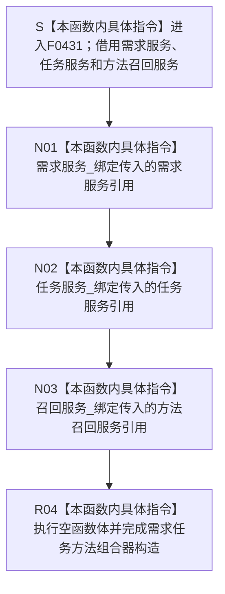

# CF-L6-0254 `需求任务方法组合器::需求任务方法组合器` 现状流程图

图类型：现状流程图
代码版本：`673def3003e6c21a2c1c03ba72b5c5438d0bf1ec`
源码 blob：`cc2765054ff01abbe91ec9334f957b0b050232b4`
覆盖文件：`海中鱼巣/领域/组合.需求任务方法.ixx:74-79`
唯一根函数：F0431
完整签名：`海中鱼巣::需求任务方法组合器::需求任务方法组合器(海中鱼巣::需求业务服务& 需求服务, 海中鱼巣::任务业务服务& 任务服务, 海中鱼巣::方法召回业务服务& 召回服务)`
参数：`需求服务`、`任务服务`、`召回服务` 均以非拥有左值引用传入；三个被引用对象必须分别覆盖本组合器对象的使用期
返回结果：构造完成的 `需求任务方法组合器` 对象；三个引用成员分别引用调用方传入的同一需求服务、任务服务和方法召回服务对象
非法值 / 拒绝：引用参数不能表达空指针；本构造函数不检查三个依赖对象的内部状态，也不能验证其后续生命周期
已登记调用方：F0238 经 E0909 在 `装配.运行期业务.ixx:99` 以成员 `需求服务_`、`任务服务_`、`方法召回服务_` 构造成员 `需求任务方法组合器_`
直接项目函数：无；74—78 行只接收参数并执行三个引用成员绑定
外部边界：无
未解析项目调用：无
调用图：`流程图/主程序可达调用关系/01_main可达项目调用边表.md`
外部边界表：`流程图/主程序可达调用关系/02_main可达外部边界表.md`
逐行映射表：`流程图/代码流程图/L6/CF-L6-0254_需求任务方法组合器构造_逐行代码映射表.md`
输入契约 / 调用语境表：本文“构造语境与生命周期分账”
非成功返回二分审查表：不适用；本构造函数没有结构化非成功返回
偏差清单：本文“当前边界与规范核对”
依据提交 / 结构化消息：冻结提交 `673def3003e6c21a2c1c03ba72b5c5438d0bf1ec`；F0431、E0909、成员声明与当前源码交叉复核
结构读取与写入：不读取或写入需求、任务、方法、节点、关系、索引或其它机器事实，只形成组合器对象到三个依赖对象的非拥有引用
逻辑内返回：无
内部错误：无显式错误分支；任一被引用对象生命周期不足会使后继调用悬空，但本构造函数不具备运行期检查手段
生命周期与资源释放：组合器不拥有、不销毁三个依赖对象；组合器析构只结束引用成员所在对象的生命周期，不影响被引用对象
异常：引用绑定和空函数体不抛出；当前构造路径没有异常分支
并发 / 幂等：构造过程不访问共享结构、不取得锁；多个组合器对象可以引用相同依赖，后继并发、授权、幂等与结算语义由具名组合入口裁决
验证入口：`组合.需求任务方法.ixx:72-81,168-170`、E0909 与 `装配.运行期业务.ixx:97-99`
验证输出：74—79 共 6 行完整映射；5 个流程节点、1 个项目入边、0 个项目出边、0 个外部边界、0 个未解析调用；本批不运行构建或程序
依据：`规范/0050_项目通用机器逻辑与禁止性规则总纲_20260721.md`、`规范/0600_代码函数流程图应用与维护规范.md`、`规范/4030_子规范_基础信息服务分层与领域写授权.md`、`规范/3100_根规范_需求_20260720.md`、`规范/3200_根规范_任务_20260720.md`、`规范/3300_根规范_方法_20260720.md`
不得作为施工许可：是
不得宣称：组合器构造完成证明任一依赖有效、需求已经形成、任务已经承接、方法已经召回、任一结算已经发生，或需求—任务—方法闭环已经完成

## 流程图

## 已登记调用方

| 调用边 | 调用方 / 位置 | 当前实参绑定 | 结果用途 | 调用方图 |
| --- | --- | --- | --- | --- |
| E0909 | F0238 `运行期业务装配::运行期业务装配(...)` / `装配.运行期业务.ixx:99` | `需求服务_ -> 需求服务`；`任务服务_ -> 任务服务`；`方法召回服务_ -> 召回服务` | 构造成员 `需求任务方法组合器_` | 待生成 |

## 构造语境与生命周期分账

| 语境 | 当前输入 | 当前结果 | 非成功口径 | 结构后果 |
| --- | --- | --- | --- | --- |
| 正常装配 | F0238 已先构造三个依赖成员 | 三个引用成员绑定并完成组合器构造 | 正常构造 | 只形成非拥有依赖，不写业务结构 |
| 任一依赖内部状态异常 | 构造函数不读取或检查依赖 | 组合器对象仍构造完成 | 构造层无拒绝结果 | 不写业务结构；后继组合入口自行收口 |
| 任一被引用对象生命周期不足 | 后继使用时依赖对象已销毁 | 构造时无法检出 | 待核装配所有权合同 | 后继引用悬空 |

## 当前边界与规范核对

- F0431 只装配需求、任务和方法召回三个领域依赖；它不直接接触仓库、许可或事务能力。
- 六行源码没有项目函数调用、外部调用或动态调用；E0909 只表示 F0238 构造本组合器。
- 构造函数不创建需求或任务，不召回方法，也不裁决任务完成、需求满足或结算；这些行为属于后继具名组合入口。
- 三个引用绑定均不转移所有权，构造完成不能证明依赖有效或生命周期已经由本函数保证。
