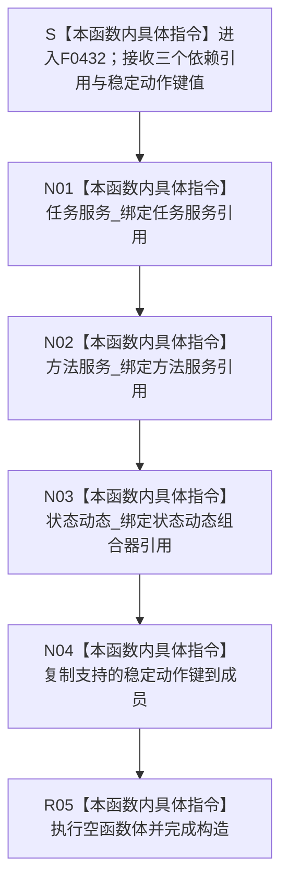

# CF-L6-0255 `任务执行组合器::任务执行组合器` 现状流程图

图类型：现状流程图
代码版本：`673def3003e6c21a2c1c03ba72b5c5438d0bf1ec`
源码 blob：`9c40191c671a1720fe3765413089c53bacc0fb11`
覆盖文件：`海中鱼巣/领域/组合.任务执行.ixx:56-63`
唯一根函数：F0432
完整签名：`海中鱼巣::任务执行组合器::任务执行组合器(海中鱼巣::任务业务服务& 任务服务, 海中鱼巣::方法业务服务& 方法服务, 海中鱼巣::状态动态组合器& 状态动态, std::uint64_t 支持的稳定动作键)`
参数：前三个参数以非 const 左值引用传入并保存为非拥有引用成员；`支持的稳定动作键` 按值复制到标量成员。调用方必须保证三个被引用对象覆盖本组合器对象的全部使用期
返回结果：构造函数无显式返回值；三个引用成员和稳定动作键成员初始化完成、空函数体执行后形成 `任务执行组合器` 对象
非法值 / 拒绝：引用参数不能表达空值，本函数不验证依赖对象；`支持的稳定动作键` 即使为 0 也允许完成构造，0 值只会由后继业务函数在入口拒绝
已登记调用方：F0238 经 E0910 在 `海中鱼巣/装配.运行期业务.ixx:100-101` 传入装配成员 `任务服务_`、`方法服务_`、`状态动态组合器_` 与装配稳定动作键，构造并保存任务执行组合器成员
直接项目函数：无
外部边界：无
未解析项目调用：无
调用图：`流程图/主程序可达调用关系/01_main可达项目调用边表.md`
外部边界表：`流程图/主程序可达调用关系/02_main可达外部边界表.md`
逐行映射表：`流程图/代码流程图/L6/CF-L6-0255_任务执行组合器构造_逐行代码映射表.md`
输入契约 / 调用语境表：本文“构造语境与生命周期分账”
非成功返回二分审查表：本文“构造语境与生命周期分账”
偏差清单：本文“当前边界与规范核对”
依据提交 / 结构化消息：冻结提交 `673def3003e6c21a2c1c03ba72b5c5438d0bf1ec`；F0432、E0910、源码第 56—63 行及私有成员交叉复核
结构读取与写入：仅建立到既有任务业务服务、方法业务服务、状态动态组合器的三个非拥有引用并保存一个无符号整数；不调用依赖，不冻结、排队、执行或迁移任务，不创建、修改、删除或发布任何机器事实
逻辑内返回：无；构造函数不返回状态码，也没有拒绝分支
内部错误：无显式内部错误分支；当前八行只有参数声明、三个引用绑定、一个标量复制和空函数体
生命周期与资源释放：组合器不取得三个依赖对象的所有权，也不复制或销毁它们；标量动作键由本对象按值持有。F0238 装配类必须让三个来源成员先于本组合器成员构造并晚于其析构
异常：函数未声明 `noexcept`，但当前引用绑定、整数复制和空函数体没有可抛调用；无异常处理或补偿路径
并发 / 幂等：构造函数不加锁、不访问共享状态；重复构造只形成独立的引用包装和动作键副本
验证入口：`海中鱼巣/领域/组合.任务执行.ixx:54-63`、E0910、`海中鱼巣/装配.运行期业务.ixx:100-101`
验证输出：56—63 共 8 行源码完整映射；1 个项目入边、0 个项目出边、0 个外部边界、0 个未解析调用；本子任务不运行构建或程序
依据：`规范/0050_项目通用机器逻辑与禁止性规则总纲_20260721.md`、`规范/0600_代码函数流程图应用与维护规范.md`、`规范/3200_根规范_任务_20260720.md`、`规范/3300_根规范_方法_20260720.md`、`规范/5230_子规范_任务筹办与执行边界_20260720.md`
不得作为施工许可：是
不得宣称：组合器构造完成证明三个依赖有效、动作键受支持、任务已冻结或排队、任务执行能力已接线、旧能力等价重建或业务能力完成

## 流程图

## 已登记调用方

| 边 | 调用方 | 实参与结果 |
| --- | --- | --- |
| E0910 | F0238 `运行期业务装配::运行期业务装配(...)` | 传入任务服务、方法服务、状态动态组合器及稳定动作键，结果保存为任务执行组合器成员 |

## 构造语境与生命周期分账

| 语境 | 当前结果 | 结构后果 | 非成功分类 |
| --- | --- | --- | --- |
| 三个依赖对象覆盖组合器使用期，动作键任意 | 组合器对象形成 | 三个非拥有借用和一个标量副本，不写机器事实 | 不适用 |
| 任一来源对象生命周期不足 | 构造仍可完成 | 后继访问对应引用存在悬空风险 | 当前函数不检测，也不返回失败 |
| 动作键为 0 | 构造仍可完成并保存 0 | 后继 `冻结任务执行请求` 入口拒绝 | 后继函数的逻辑内返回，不是本函数返回 |

## 当前边界与规范核对

- 第 56—63 行没有项目函数调用、外部边界或动态调用；成员初始化是引用绑定和标量复制。
- 构造函数不复核动作键、不冻结任务，也不触发排队或执行；这些后继函数过程不得内联进本图。
- 当前代码把来源对象生命周期交给装配方保证；本文只记录该事实，不把构造成功写成能力完成或施工许可。
