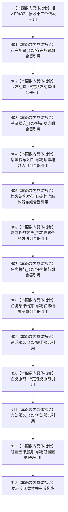

# CF-L6-0259 `运行期业务操作组合器::运行期业务操作组合器` 现状流程图

图类型：现状流程图
代码版本：`1462fcef53490379e27da2554cdc105b89bd76bd`
源码 blob：`071acf98d5996cefd1833e2e17d0cd4438972379`
覆盖文件：`海中鱼巣/领域/组合.运行期业务操作.ixx:50-75`
唯一根函数：F0436
完整签名：`海中鱼巣::运行期业务操作组合器::运行期业务操作组合器(海中鱼巣::存在场景组合器& 存在场景, 海中鱼巣::状态动态组合器& 状态动态, 海中鱼巣::特征状态组合器& 特征状态, 海中鱼巣::语素概念入口组合器& 语素概念, 海中鱼巣::概念结构发布组合器& 概念发布, 海中鱼巣::需求任务方法组合器& 需求任务方法, 海中鱼巣::任务执行组合器& 任务执行, 海中鱼巣::任务结果结算组合器& 任务结算, 海中鱼巣::需求业务服务& 需求, 海中鱼巣::任务业务服务& 任务, 海中鱼巣::方法业务服务& 方法, 海中鱼巣::轻量因果业务服务& 轻量因果)`
参数：八个组合器与四个业务服务均以非 const 左值引用传入并保存为非拥有引用成员；调用方必须保证十二个来源对象覆盖本组合器的使用期
返回结果：构造函数无显式返回值；十二个引用成员完成绑定并执行空函数体后形成 `运行期业务操作组合器` 对象
非法值 / 拒绝：引用参数不能表达空值；本函数不检查依赖内部状态或生命周期，也没有拒绝分支
已登记调用方：F0238 经 E0914 在 `海中鱼巣/装配.运行期业务.ixx:112-117` 传入八个组合器与四个业务服务并构造成员 `业务操作_`
直接项目函数：无
外部边界：无
未解析项目调用：无
调用图：`流程图/主程序可达调用关系/01_main可达项目调用边表.md`
外部边界表：`流程图/主程序可达调用关系/02_main可达外部边界表.md`
逐行映射表：`流程图/代码流程图/L6/CF-L6-0259_运行期业务操作组合器构造_逐行代码映射表.md`
结构读取与写入：只形成到十二个既有对象的非拥有引用；不调用业务操作，不读取、创建、修改、删除或发布机器事实
逻辑内返回：无
内部错误：无显式内部错误分支；来源生命周期不足的风险不由本函数检测
生命周期与资源释放：组合器不取得十二个依赖对象的所有权，也不负责销毁它们
异常：函数未声明 `noexcept`，但当前引用绑定与空函数体没有可抛调用
并发 / 幂等：构造过程不加锁、不访问共享状态；重复构造只形成独立的引用包装
验证入口：`海中鱼巣/领域/组合.运行期业务操作.ixx:50-75`、E0914、`海中鱼巣/装配.运行期业务.ixx:112-117`
验证输出：50—75 共 26 行完整映射；1 个项目入边、0 个项目出边、0 个外部边界、0 个未解析调用
依据：`规范/0050_项目通用机器逻辑与禁止性规则总纲_20260721.md`、`规范/0600_代码函数流程图应用与维护规范.md`
不得作为施工许可：是
不得宣称：构造完成证明十二个依赖有效、任何业务操作已经执行、业务操作能力已经接线或闭环能力完成

## 流程图

## 已登记调用方

| 边 | 调用方 / 位置 | 实参与结果 |
| --- | --- | --- |
| E0914 | F0238 / `装配.运行期业务.ixx:112-117` | 传入八个组合器与四个业务服务引用，结果保存为 `业务操作_` |

## 构造语境与生命周期分账

| 语境 | 当前结果 | 结构后果 | 非成功分类 |
| --- | --- | --- | --- |
| 十二个来源对象覆盖组合器使用期 | 十二个引用成员绑定并完成构造 | 只形成非拥有借用，不写机器事实 | 不适用 |
| 任一来源对象生命周期不足 | 构造仍可完成 | 后继访问对应引用存在悬空风险 | 当前函数不检测，也不返回失败 |

## 当前边界与规范核对

- 第 50—75 行没有项目函数调用、外部边界或动态调用；成员初始化均为引用绑定。
- 构造函数不调用任何组合器或服务，也不执行存在、状态、特征、语素、概念、需求、任务、方法或因果业务过程。
- 十二个引用均不转移所有权，构造完成不能证明依赖有效、业务操作发生或能力完成。
