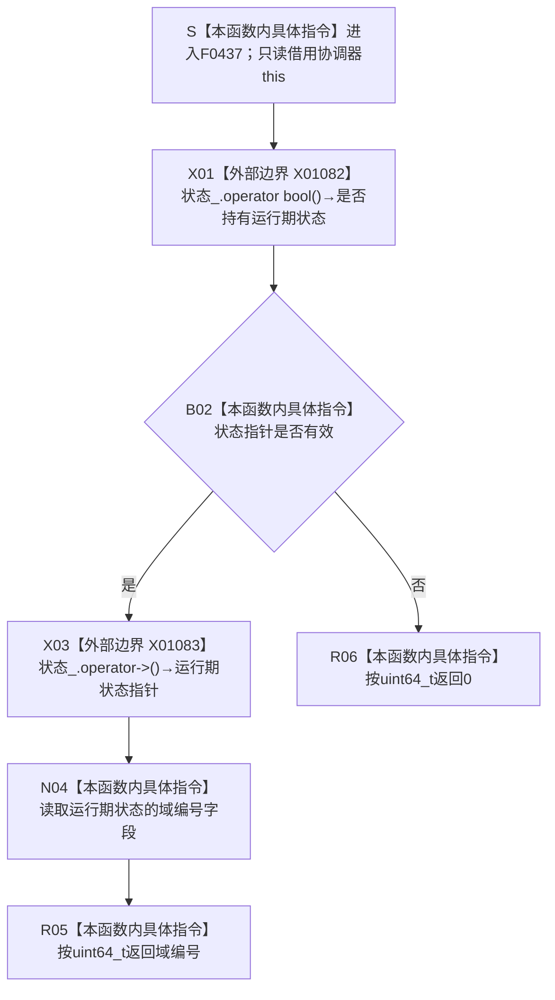

# CF-L6-0260 `结构事务协调器::读取域编号` 现状流程图

图类型：现状流程图
代码版本：`1462fcef53490379e27da2554cdc105b89bd76bd`
源码 blob：`946512e4b88d29bbf6d43eb07b02823471489dae`
覆盖文件：`海中鱼巣/核心/协调.结构事务.ixx:159-161`
唯一根函数：F0437
完整签名：`std::uint64_t 海中鱼巣::结构事务协调器::读取域编号() const`
参数：无显式参数；只读借用 `this` 及其 `状态_` 智能指针成员
返回结果：`状态_` 有效时返回当前运行期状态的 `域编号`；无状态时返回无符号整数 0
非法值 / 拒绝：无显式拒绝；空状态按协议返回 0，函数不验证非零域编号的其它结构条件
已登记调用方：F0239 经 E0916 在 `海中鱼巣/启动.运行期上下文.ixx:61` 读取协调器域编号
直接项目函数：无
外部边界：X01082 `shared_ptr::operator bool()`；X01083 `shared_ptr::operator->()`
未解析项目调用：无
调用图：`流程图/主程序可达调用关系/01_main可达项目调用边表.md`
外部边界表：`流程图/主程序可达调用关系/02_main可达外部边界表.md`
逐行映射表：`流程图/代码流程图/L6/CF-L6-0260_结构事务协调器读取域编号_逐行代码映射表.md`
结构读取与写入：只读取智能指针是否持有状态，以及有效状态的 `域编号` 字段；不修改协调器、状态、许可或仓库事实
逻辑内返回：`状态_` 为空时返回 0
内部错误：当前函数没有内部错误分支；它不把空状态升级为错误
生命周期与资源释放：`状态_` 由协调器的 `shared_ptr` 持有；本函数不复制指针、不延长状态生命周期
异常：两个智能指针访问边界均为 `noexcept`；字段读取和整数返回不抛出
并发 / 幂等：函数不加锁且不写状态；同一稳定状态下重复读取结果一致，运行期状态并发变更保证不由本函数建立
验证入口：`海中鱼巣/核心/协调.结构事务.ixx:159-161`、E0916、X01082、X01083
验证输出：159—161 共 3 行完整映射；1 个项目入边、0 个项目出边、2 个外部边界、0 个未解析调用
依据：`规范/0050_项目通用机器逻辑与禁止性规则总纲_20260721.md`、`规范/0600_代码函数流程图应用与维护规范.md`
不得作为施工许可：是
不得宣称：返回非零值证明完整接线、许可有效、事务可执行；返回 0 证明某一具名故障；当前读取函数构成事务能力完成

## 流程图

## 外部边界合同

| 边界 | 节点 | 输入与结果 | 成立条件 |
| --- | --- | --- | --- |
| X01082 | X01 | `状态_` → 是否持有对象 | 每次进入本函数 |
| X01083 | X03 | `状态_` → `结构事务运行期状态*` | X01082 返回 true |

## 已登记调用方

| 边 | 调用方 / 位置 | 结果用途 |
| --- | --- | --- |
| E0916 | F0239 / `启动.运行期上下文.ixx:61` | 把返回值用于运行期上下文结构核心完整性比较 |

## 返回分账

| 分支 | 返回 | 分类 | 当前结构后果 |
| --- | --- | --- | --- |
| `状态_` 有效 | 状态对象的 `域编号` | 正常返回 | 只读，不写机器事实 |
| `状态_` 为空 | 0 | 逻辑内返回 | 只读，不创建默认状态 |

## 当前边界与规范核对

- F0437 只读取协调器已持有状态的域编号，不取得许可，也不验证令牌或仓库接线。
- 0 是源码定义的空状态返回值；本图不把它解释成具名根因，也不把非零值解释为完整结构成立。
- X01082 与 X01083 是本函数全部已登记外部边界，项目出边为零。
