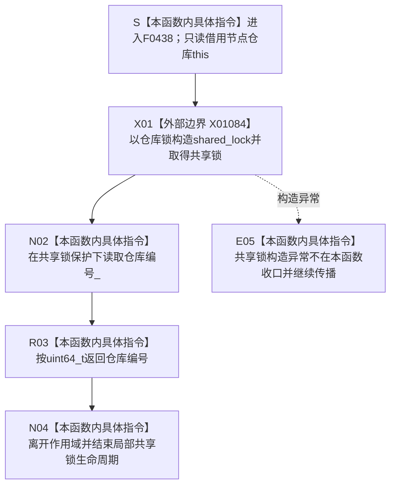

# CF-L6-0261 `节点仓库::仓库编号` 现状流程图

图类型：现状流程图
代码版本：`1462fcef53490379e27da2554cdc105b89bd76bd`
源码 blob：`f38b979a3f7cefd182a50e0b687c5a6fffebc91c`
覆盖文件：`海中鱼巣/核心/节点仓库.cpp:476-479`
唯一根函数：F0438
完整签名：`std::uint64_t 海中鱼巣::节点仓库::仓库编号() const`
参数：无显式参数；只读借用 `this`、仓库共享互斥量和 `仓库编号_` 成员
返回结果：在仓库共享锁保护下按值返回当前 `仓库编号_`
非法值 / 拒绝：无显式拒绝；即使成员为 0 也原样返回，本函数不解释编号有效性
已登记调用方：F0239 经 E0917 在 `海中鱼巣/启动.运行期上下文.ixx:62` 读取节点仓库编号
直接项目函数：无
外部边界：X01084 `std::shared_lock<std::shared_mutex>` 构造
未解析项目调用：无
调用图：`流程图/主程序可达调用关系/01_main可达项目调用边表.md`
外部边界表：`流程图/主程序可达调用关系/02_main可达外部边界表.md`
逐行映射表：`流程图/代码流程图/L6/CF-L6-0261_节点仓库仓库编号_逐行代码映射表.md`
结构读取与写入：取得共享锁后只读取 `仓库编号_`；不修改仓库、节点、主信息、关系或索引事实
逻辑内返回：无拒绝分支；0 与非零编号均作为普通值返回
内部错误：没有显式内部错误分支；锁构造异常未在本函数内收口
生命周期与资源释放：局部 `shared_lock` 在函数作用域退出时结束生命周期并释放共享锁；不转移互斥量所有权
异常：共享锁构造可能按标准库合同抛出；本函数不捕获，异常直接传播
并发 / 幂等：共享锁保护编号读取；同一编号状态下重复调用结果一致
验证入口：`海中鱼巣/核心/节点仓库.cpp:476-479`、E0917、X01084
验证输出：476—479 共 4 行完整映射；1 个项目入边、0 个项目出边、1 个外部边界、0 个未解析调用
依据：`规范/0050_项目通用机器逻辑与禁止性规则总纲_20260721.md`、`规范/0600_代码函数流程图应用与维护规范.md`
不得作为施工许可：是
不得宣称：返回非零编号证明节点仓库结构完整、接线一致或可写；返回 0 证明具名故障；当前读取函数构成仓库能力完成

## 流程图

## 外部边界合同

| 边界 | 节点 | 输入与结果 | 成立条件 |
| --- | --- | --- | --- |
| X01084 | X01 | `仓库锁_` → 持有共享锁的局部 `shared_lock` | 每次进入本函数；若构造成功继续读取 |

## 已登记调用方

| 边 | 调用方 / 位置 | 结果用途 |
| --- | --- | --- |
| E0917 | F0239 / `启动.运行期上下文.ixx:62` | 把返回值用于运行期上下文结构核心完整性比较 |

## 返回与异常分账

| 分支 | 结果 | 分类 | 当前结构后果 |
| --- | --- | --- | --- |
| 共享锁构造成功 | 原样返回 `仓库编号_` | 正常返回 | 只读，不写机器事实 |
| 共享锁构造抛出 | 异常继续传播 | 未在本函数收口的异常 | 未读取编号，不写机器事实 |

## 当前边界与规范核对

- F0438 只在共享锁保护下读取仓库编号；它不验证仓库编号非零，也不读取任何节点记录。
- X01084 是本函数唯一已登记外部边界；共享锁的作用域退出语义作为当前 C++ 生命周期事实记录，不另造边界 ID。
- 返回编号不能证明节点仓库已完整接线或拥有写许可。
