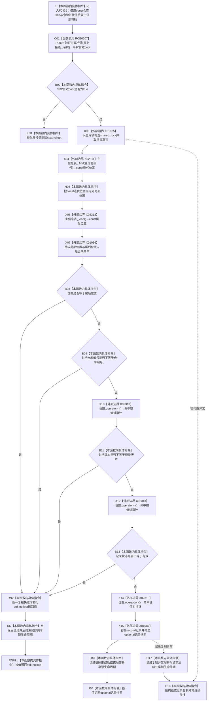

# CF-L6-0262 `主信息仓库::读取主信息(主信息句柄,const 结构事务令牌&)` 现状流程图

图类型：现状流程图
代码版本：`747223647b2cc5796db66a048009d78fa4d96ed7`
源码 blob：`11f8fa53ff961a8cbaac34cf75b69a22533ca907`
覆盖文件：`海中鱼巣/核心/主信息仓库.cpp:212-218`
唯一根函数：F0439
完整签名：`std::optional<海中鱼巣::主信息记录> 海中鱼巣::主信息仓库::读取主信息(海中鱼巣::主信息句柄 主信息, const 海中鱼巣::结构事务令牌& 令牌) const`
参数：隐式 `this` 是调用期有效的 const `主信息仓库` 非拥有借用；`主信息` 按值传入；`令牌` 以 const 引用借用且只覆盖本次同步调用
返回结果：令牌有效、编号命中、仓库编号与版本匹配且记录状态为 `有效` 时，复制命中记录并构造 `std::optional<主信息记录>` 值式快照；其它条件返回 `std::nullopt`
非法值 / 拒绝：令牌验证失败、查表不命中、错仓、错版本或记录非有效均折叠为空 optional；不修改任何仓库事实
已登记调用方：F0239 经 E0923；F0383 经 RCE0170；F0384 经 RCE0171；R0009 经 RCE0317
直接项目函数：RCE0207 调用 R0002 `验证共享令牌`
外部边界：X01085 共享锁构造；X02311 const `unordered_map::find`；X02312 const `unordered_map::end`；X01086 const 迭代器相等比较；X02313 const 迭代器 `operator->`；X01087 复制记录并构造 optional
未解析项目调用：无
调用图：`流程图/主程序可达调用关系/01_main可达项目调用边表.md`
外部边界表：`流程图/主程序可达调用关系/02_main可达外部边界表.md`
逐行映射表：`流程图/代码流程图/L6/CF-L6-0262_主信息仓库读取主信息令牌重载_逐行代码映射表.md`
输入契约 / 调用语境表：本文“读取语境与非成功分账”
非成功返回二分审查表：本文“读取语境与非成功分账”
偏差清单：本文“当前边界与规范核对”
依据提交 / 结构化消息：冻结提交 `747223647b2cc5796db66a048009d78fa4d96ed7`；F0439、RCE0207、X01085—X01087、X02311—X02313、源码第 212—218 行交叉复核
结构读取与写入：RCE0207 验证令牌后在 X01085 共享锁窗口内只读 `主信息表_`，成功时经 X01087 形成调用方独立拥有的值式快照；不创建、修改、删除、失效或发布主信息
逻辑内返回：令牌拒绝或句柄 / 记录不命中时返回 `std::nullopt`
内部错误：本函数没有具名内部错误结果；强前置保证令牌应有效时，RCE0207=false 需沿令牌接线追根因
生命周期与资源释放：局部共享锁覆盖查找、完整句柄复核和记录复制；正常空 / 值返回或异常展开均在离开函数时释放。返回值不持有仓库内部引用
异常：函数未声明 `noexcept` 且不捕获；X01085 锁构造或 X01087 记录复制可抛，已有共享锁在异常展开时释放后异常继续传播
并发 / 幂等：全部仓库读取在共享锁内完成；同一受保护状态与同一输入下重复调用结果一致。锁释放后的仓库变化不改变已返回快照
验证入口：`主信息仓库.cpp:212-218`、RCE0207、X01085—X01087、X02311—X02313
验证输出：7 行源码完整映射；4 个项目入边、1 个项目出边、6 个外部边界、0 个未解析项目调用
依据：`规范/0050_项目通用机器逻辑与禁止性规则总纲_20260721.md`、`规范/0600_代码函数流程图应用与维护规范.md`、`规范/4010_子规范_统一仓库稳定句柄与通用关系索引边界.md`、`规范/4040_子规范_不透明结构事务候选确认撤销与最后发布.md`、`规范/4050_子规范_入口拒绝逻辑内结果与内部逻辑错误.md`
不得作为施工许可：是
不得宣称：返回空 optional 唯一证明主信息不存在；返回快照在锁释放后仍代表后续仓库状态；调用方取得仓库内部记录引用；本函数具有写入、发布或恢复能力

## 流程图

## 项目源码调用合同

| 调用边 | 节点 | 被调函数 | 实参与结果 | 调用前置 | 被调图 |
| --- | --- | --- | --- | --- | --- |
| RCE0207 | C01 | R0002 `bool 验证共享令牌(const 结构事务接线&,const 结构事务令牌&)` | `事务接线_`、F0439 形参令牌 → bool | 函数进入后首先执行 | 待生成 |

## 外部边界合同

| 边界 | 节点 | 输入与结果 | 成立条件 |
| --- | --- | --- | --- |
| X01085 | X03 | `仓库锁_` → 局部共享锁 | RCE0207 返回 true |
| X02311 | X04 | const `主信息表_`、`主信息.主信息编号` → const_iterator | 共享锁已形成 |
| X02312 | X06 | const `主信息表_` → const尾后迭代器 | X02311 已返回位置 |
| X01086 | X07 | 位置、尾后位置 → 是否相等 | X02312 已形成右操作数 |
| X02313 | X10 / X12 / X14 | 命中位置 → 当前键值对指针 | X01086 已确认位置不是 end；后续调用受短路条件约束 |
| X01087 | X15 | 命中记录 const 引用 → optional 值式快照 | 仓库、版本和状态复核全部通过 |

## 已登记调用方

| 调用边 | 调用方 / 位置 | 当前用途 |
| --- | --- | --- |
| E0923 | F0239 / `启动.运行期上下文.ixx:68` | 用空句柄和已取得令牌验证结构核心拒绝形态 |
| RCE0170 | F0383 / `主信息仓库.cpp:447` | 取得记录后读取具名 I64 槽位 |
| RCE0171 | F0384 / `主信息仓库.cpp:199` | 接域普通重载把令牌与句柄转交本函数 |
| RCE0317 | R0009 / `主信息仓库.cpp:372` | 以 optional 是否有值判断句柄当前有效性 |

## 读取语境与非成功分账

| 语境 | 返回 | 二分口径 | 结构后果 |
| --- | --- | --- | --- |
| 令牌无效 | `std::nullopt` | 逻辑内返回；强前置保证下沿令牌接线追根因 | 不取得锁，零写入 |
| 查表不命中 | `std::nullopt` | 普通只读不命中 | 释放共享锁，零写入 |
| 错仓、错版本或记录非有效 | `std::nullopt` | 普通句柄 / 状态拒绝 | 释放共享锁，零写入 |
| 全部复核通过 | optional 记录快照 | 正常值式读取 | 复制记录后释放共享锁 |
| 锁构造或记录复制抛出 | 异常继续传播 | 未在本函数收口的异常 | 已形成的共享锁先释放，零写入 |

## 当前边界与规范核对

- 第 216 行严格按 `end`、仓库编号、版本、状态顺序短路；只有确认位置不等于 `end` 后才允许 X02313 解引用。
- X02313 是正式表登记的同一 const_iterator 外部边界，图中按源码三个 `位置->second` 表达式分别回指同一稳定 ID。
- X01087 返回的是记录值式快照；锁释放后调用方不持有仓库内部引用。
- 所有空结果合并多种拒绝原因，只能描述本次只读结果，不能直接升级为长期不存在事实。
