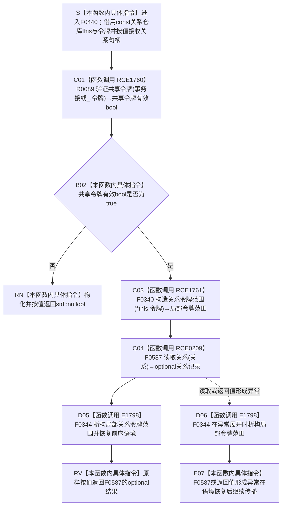

# CF-L6-0263 `关系仓库::读取关系(关系句柄,const 结构事务令牌&)` 现状流程图

图类型：现状流程图
代码版本：`747223647b2cc5796db66a048009d78fa4d96ed7`
源码 blob：`f7a9ea9a09d3065468208c16f9ea34f806b6e183`
覆盖文件：`海中鱼巣/核心/关系仓库.cpp:1430-1433`
唯一根函数：F0440
完整签名：`std::optional<海中鱼巣::关系记录> 海中鱼巣::关系仓库::读取关系(海中鱼巣::关系句柄 关系, const 海中鱼巣::结构事务令牌& 令牌) const`
参数：隐式 `this` 是调用期有效的 const `关系仓库` 非拥有借用；`关系` 按值传入；`令牌` 以 const 引用借用且只覆盖本次同步调用
返回结果：R0089 验证共享令牌失败时返回 `std::nullopt`；验证通过后由 F0340 建立当前线程关系令牌语境，调用 F0587 普通读取重载并原样返回其 `std::optional<关系记录>`
非法值 / 拒绝：共享令牌无效时不构造令牌范围、不调用 F0587，直接返回空 optional；句柄与记录拒绝由 F0587 收口
已登记调用方：F0239 经 E0927；R0038 经 RCE0380
直接项目函数：RCE1760 调用 R0089 验证共享令牌；RCE1761 构造 F0340 关系令牌范围；RCE0209 调用 F0587 普通读取重载；E1798 在正常或异常退出时析构 F0344 关系令牌范围
外部边界：无
未解析项目调用：无
调用图：`流程图/主程序可达调用关系/01_main可达项目调用边表.md`
外部边界表：`流程图/主程序可达调用关系/02_main可达外部边界表.md`
逐行映射表：`流程图/代码流程图/L6/CF-L6-0263_关系仓库读取关系令牌重载_逐行代码映射表.md`
输入契约 / 调用语境表：本文“令牌语境与返回分账”
非成功返回二分审查表：本文“令牌语境与返回分账”
偏差清单：本文“当前边界与规范核对”
依据提交 / 结构化消息：冻结提交 `747223647b2cc5796db66a048009d78fa4d96ed7`；F0440、E1798、RCE0209、RCE1760、RCE1761、宏体第 1027—1029 行与展开点 1431 行交叉复核
结构读取与写入：令牌有效时只把当前仓库与令牌指针压入 thread_local 关系令牌语境，再由 F0587 执行只读；作用域退出时 F0344 恢复前序语境。不创建、修改、删除或发布关系事实
逻辑内返回：R0089 返回 false 时返回 `std::nullopt`；F0587 的普通读取空结果原样向上传播
内部错误：本函数没有具名内部错误结果；强前置保证令牌应有效时，R0089=false 需沿事务接线追根因
生命周期与资源释放：F0340 构造的局部 `令牌范围` 覆盖 F0587 和返回表达式求值；正常返回或 F0587 异常均经 E1798 调用 F0344 恢复前序语境
异常：本函数未声明 `noexcept` 且不捕获；F0587 或返回值形成异常时先析构令牌范围，再继续传播
并发 / 幂等：关系令牌语境是 thread_local，当前调用只影响当前线程且严格按 RAII 恢复；仓库只读同步与幂等语义由 F0587 负责
验证入口：`关系仓库.cpp:64-68,87-89,1027-1029,1430-1433`、E1798、RCE0209、RCE1760、RCE1761
验证输出：1430—1433 共 4 行完整映射；2 个项目入边、4 个项目出边、0 个外部边界、0 个未解析项目调用
依据：`规范/0050_项目通用机器逻辑与禁止性规则总纲_20260721.md`、`规范/0600_代码函数流程图应用与维护规范.md`、`规范/4010_子规范_统一仓库稳定句柄与通用关系索引边界.md`、`规范/4040_子规范_不透明结构事务候选确认撤销与最后发布.md`、`规范/4050_子规范_入口拒绝逻辑内结果与内部逻辑错误.md`
不得作为施工许可：是
不得宣称：令牌验证通过证明关系存在；空 optional 唯一证明关系不存在；thread_local 令牌语境是机器事实；本函数取得写许可、修改关系或完成关系能力

## 流程图

## 项目源码调用合同

| 调用边 | 节点 | 被调函数 | 实参与结果 | 调用前置 | 被调图 |
| --- | --- | --- | --- | --- | --- |
| RCE1760 | C01 | R0089 `bool 验证共享令牌(const 结构事务接线&,const 结构事务令牌&)` | `事务接线_`、F0440 形参令牌 → bool | 函数进入后由宏展开首先执行 | 待生成 |
| RCE1761 | C03 | F0340 `关系令牌范围::关系令牌范围(const 关系仓库&,const 结构事务令牌&)` | `*this`、F0440 形参令牌 → 局部范围 | RCE1760 返回 true | 待生成 |
| RCE0209 | C04 | F0587 `std::optional<关系记录> 关系仓库::读取关系(关系句柄) const` | 同一 `this`、按值关系句柄 → optional | F0340 已建立当前线程令牌语境 | 待生成 |
| E1798 | D05 / D06 | F0344 `关系令牌范围::~关系令牌范围() noexcept` | `this=&令牌范围` → void | F0340 已完成构造；正常或异常退出 | 待生成 |

## 已登记调用方

| 调用边 | 调用方 / 位置 | 当前用途 |
| --- | --- | --- |
| E0927 | F0239 / `启动.运行期上下文.ixx:70` | 用空关系句柄和已取得令牌验证结构核心拒绝形态 |
| RCE0380 | R0038 / `会话.结构写入.ixx:590` | 在当前线程可访问后读取关系并判断 optional 是否有值 |

## 令牌语境与返回分账

| 语境 | 当前行为 | 返回 / 异常 | 结构后果 |
| --- | --- | --- | --- |
| R0089=false | 不构造 F0340，不调用 F0587 | `std::nullopt` 逻辑内返回 | 不改变 thread_local 语境，零机器事实写入 |
| R0089=true、F0587 正常返回 | F0340 压入当前语境，F0587 读取，F0344 恢复前序语境 | 原样返回 F0587 optional | 仅短暂改变当前线程辅助语境，零机器事实写入 |
| F0587 或返回值形成抛出 | 已构造的 F0340 由 F0344 在异常展开时析构 | 语境恢复后异常继续传播 | 零机器事实写入 |

## 当前边界与规范核对

- 第 1431 行的 `关系令牌入口(std::nullopt)` 必须按宏体第 1028—1029 行展开为 RCE1760 验证与 RCE1761 构造两个具名项目调用，不能把宏名当作可执行函数。
- RCE1760=false 时严格短路，F0340、F0587 和 F0344 均不发生。
- F0340 构造完成后，正常返回与异常展开都必须经 E1798 调用 F0344；图中不内联构造器、析构器或 F0587 的内部过程。
- 本函数只建立当前线程读取语境并委托普通重载，不取得写许可，也不修改关系仓库。
