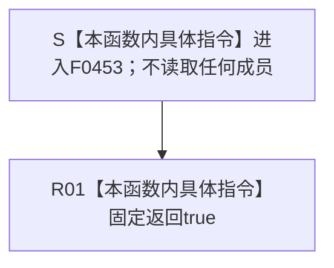

# CF-L6-0276 `运行期业务操作组合器::完整` 现状流程图

图类型：现状流程图
代码版本：`5bac9dba7bdfef727fa5fae9759228edf39fa552`
源码 blob：`071acf98d5996cefd1833e2e17d0cd4438972379`
覆盖文件：`海中鱼巣/领域/组合.运行期业务操作.ixx:77-79`
唯一根函数：F0453
完整签名：`bool 海中鱼巣::运行期业务操作组合器::完整() const noexcept`
参数：无显式参数；隐式 `this` 只读借用当前 `运行期业务操作组合器`
返回结果：固定返回 `true`；当前实现不读取任何成员，也不形成依赖有效性材料
非法值 / 拒绝：无；函数没有判断、拒绝或错误分支
已登记调用方：F0240 经 E0942 在 `装配.运行期业务.ixx:137` 把返回值作为运行期业务装配完整性的最终合取条件
直接项目函数：无
外部边界：无
未解析项目调用：无
调用图：`流程图/主程序可达调用关系/01_main可达项目调用边表.md`
外部边界表：`流程图/主程序可达调用关系/02_main可达外部边界表.md`
逐行映射表：`流程图/代码流程图/L6/CF-L6-0276_运行期业务操作组合器完整_逐行代码映射表.md`
输入契约 / 调用语境表：本文“调用语境与结果分账”
非成功返回二分审查表：不适用；当前函数固定返回成功布尔值
偏差清单：本文“当前边界与规范核对”
依据提交 / 结构化消息：起点提交 `cf2cd1ca1c51cc53f5b16234bfa100eead2f9726`，发布前复核提交 `5bac9dba7bdfef727fa5fae9759228edf39fa552`；两提交间目标源码与 F0453 / E0942 关系零差异
结构读取与写入：不读取或写入任何节点、关系、索引、需求、任务、方法、状态、动态或其它机器事实
逻辑内返回：无非成功返回
内部错误：无显式错误分支；固定 `true` 不表达成员依赖内部异常
生命周期与资源释放：不取得资源，不改变组合器或其依赖对象生命周期
异常：`noexcept`；固定布尔返回路径不抛出
并发 / 幂等：纯固定值返回；任意重复调用都得到 `true`，不访问共享状态
验证入口：`组合.运行期业务操作.ixx:77-79`、E0942 与 `装配.运行期业务.ixx:124-138`
验证输出：77—79 共 3 行完整映射；2 个流程节点、1 个项目入边、0 个项目出边、0 个外部边界、0 个未解析调用；本批不运行构建或程序
依据：`规范/0050_项目通用机器逻辑与禁止性规则总纲_20260721.md`、`规范/0600_代码函数流程图应用与维护规范.md`、`规范/4030_子规范_基础信息服务分层与领域写授权.md`
不得作为施工许可：是
不得宣称：返回 `true` 证明组合器全部依赖有效、任何业务操作可执行、运行期装配已经完整，或需求—任务—方法闭环已经接通

## 流程图

## 已登记调用方

| 调用边 | 调用方 / 位置 | 当前实参绑定 | 结果用途 | 调用方图 |
| --- | --- | --- | --- | --- |
| E0942 | F0240 `运行期业务装配::完整() const noexcept` / `装配.运行期业务.ixx:137` | `this -> 业务操作_` | 作为完整性合取表达式的最终布尔条件 | 待生成 |

## 调用语境与结果分账

| 语境 | 当前输入 | 当前结果 | 非成功口径 | 结构后果 |
| --- | --- | --- | --- | --- |
| F0240 前序完整性条件均为真 | 当前组合器对象 | 固定 `true` | 正常返回 | 无结构变化 |
| 任一组合器成员依赖内部无效 | 本函数不读取依赖 | 仍固定 `true` | 本函数无拒绝结果 | 无结构变化；不能由本返回值证明依赖有效 |

## 当前边界与规范核对

- F0453 的当前实现只是三行固定布尔返回，不检查构造时借用的任何服务或组合器成员。
- 源码没有项目函数调用、外部调用或动态调用；E0942 是唯一已登记直接调用方。
- F0240 只有在前序合取条件均为真时才调用 F0453，但这一短路语境不改变 F0453 自身固定返回 `true` 的事实。
- 本现状图只登记当前实现；是否需要把成员依赖完整性纳入目标合同属于后续设计治理，不由现状图裁决。
