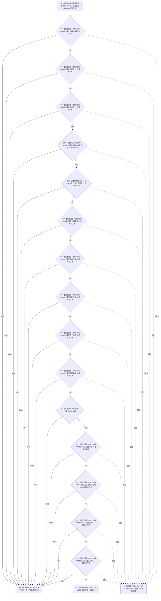

# CF-L6-0279 `系统角色主体材料::operator==` 现状流程图

图类型：现状流程图
代码版本：`747223647b2cc5796db66a048009d78fa4d96ed7`
源码 blob：`c26b12e291f7192b887ef01efce9e6dc157e9cef`
覆盖文件：`海中鱼巣/领域/系统角色清单.数据.h:160-175,212`
唯一根函数：F0456
完整签名：`bool 海中鱼巣::系统角色主体材料::operator==(const 海中鱼巣::系统角色主体材料&) const`
参数：隐式 `this` 与未命名的 `const 系统角色主体材料&`（下称 `右`）都是调用期间有效的只读借用，不转移所有权；允许同一对象自比较
返回结果：按 15 个直接成员的声明顺序短路比较；首个成员不等时返回 `false`，全部相等时返回 `true`
非法值 / 拒绝：无；本函数不调用 `完整()`，任何可构造的两个值对象都可比较
已登记调用方：F0244 经 E0949 在 `系统角色清单.数据.h:264` 的 defaulted 比较中比较 `主体`
直接项目函数：R0613 经 RCE1762 静态调用 11 次；F0457 经 RCE1763 调用 1 次；R0614 经 RCE1764 调用 2 次
外部边界：无；`std::int64_t` 的 `==` 是内建比较指令
未解析项目调用：无
调用图：`流程图/主程序可达调用关系/01_main可达项目调用边表.md`
外部边界表：`流程图/主程序可达调用关系/02_main可达外部边界表.md`
逐行映射表：`流程图/代码流程图/L6/CF-L6-0279_系统角色主体材料相等运算符_逐行代码映射表.md`
输入契约 / 调用语境表：本文“调用语境与结果分账”
非成功返回二分审查表：本文“调用语境与结果分账”；`false` 是值对象不等的正常布尔结果
偏差清单：本文“当前边界与规范核对”
依据提交 / 结构化消息：冻结提交 `747223647b2cc5796db66a048009d78fa4d96ed7`；目标源码 blob 与该提交一致
结构读取与写入：只读两个主体材料对象的全部直接成员；不写节点、主信息、关系、索引或其它机器事实
逻辑内返回：`false` 仅表示首个对应成员不相等，不表示入口拒绝、结构错误或版本漂移
内部错误：无结构化内部错误分支；被调比较若抛出，当前函数不捕获并传播原异常
生命周期与资源释放：不加锁、不分配资源、不保留借用；返回或异常传播后借用结束
异常：声明未写 `noexcept`，静态合同为 potentially-throwing
并发 / 幂等：纯只读值比较；相同对象状态下重复调用结果相同
验证入口：`系统角色清单.数据.h:160-175,212`、E0949、RCE1762—RCE1764
验证输出：17 个源码行位点映射到 19 个流程节点；1 个项目入边、3 个聚合项目出边、14 次静态项目调用、0 个外部边界、0 个未解析调用；本批不运行构建或程序
依据：`规范/0050_项目通用机器逻辑与禁止性规则总纲_20260721.md`、`规范/0600_代码函数流程图应用与维护规范.md`、`规范/4010_子规范_统一仓库稳定句柄与通用关系索引边界.md`、`规范/7130_子规范_自我内部世界成员特征与事实读取投影.md`
不得作为施工许可：是
不得宣称：两个主体材料值相等就证明材料完整、来自当前权威结构、符合节点直接身份目标，或系统角色初始化能力已经完成

## 流程图

## 节点合同

| 节点 | 类型 | 参数 / 输入绑定 | 结果 / 输出绑定 | 事实读写 | 后继条件 | 稳定边 |
| --- | --- | --- | --- | --- | --- | --- |
| S | 本函数内具体指令 | `this`、`右` | 两个只读借用 | 无 | 进入 C01 | 不适用 |
| C01—C03 | 函数调用 | 对应 `this` 身份成员与 `右` 同名成员分别绑定为 R0613 的 `this` 和右实参 | 身份成员相等布尔值 | 只读身份材料 | false 到 RF；true 到下一节点；异常到 E | RCE1762 |
| C04 | 函数调用 | `场景接纳自我关系` 两侧成员 | 关系材料相等布尔值 | 只读关系材料 | false 到 RF；true 到 C05；异常到 E | RCE1763 |
| C05—C06 | 函数调用 | `安全根需求` / `服务根需求` 两侧成员 | 根需求材料相等布尔值 | 只读根需求材料 | false 到 RF；true 到下一节点；异常到 E | RCE1764 |
| C07—C10 | 函数调用 | 对应概念根身份成员 | 身份成员相等布尔值 | 只读身份材料 | false 到 RF；true 到下一节点；异常到 E | RCE1762 |
| N11 | 本函数内具体指令 | 两侧 `动态根材料` | 内建 `std::int64_t` 相等布尔值 | 只读数值 | 不等到 RF；相等到 C12 | 不适用 |
| C12—C15 | 函数调用 | 对应方法身份 / 状态成员 | 身份成员相等布尔值 | 只读身份材料 | false 到 RF；true 到下一节点或 RT；异常到 E | RCE1762 |
| RF / RT | 本函数内具体指令 | 首个不等或全部相等 | `false` / `true` | 无 | 函数返回 | 不适用 |
| E | 本函数内具体指令 | 被调比较异常 | 原异常 | 不形成布尔结果 | 异常离开函数 | 不适用 |

## 已登记调用方

| 调用边 | 调用方 / 位置 | 当前实参绑定 | 结果用途 |
| --- | --- | --- | --- |
| E0949 | F0244 `系统角色清单::operator==(...) const` / `系统角色清单.数据.h:264` | 两侧清单对象的 `主体` 成员 | 版本成员相等后继续 defaulted 清单比较；false 使 F0244 短路返回 false |

## 调用语境与结果分账

| 语境 | 当前输入 | 当前结果 | 非成功口径 | 结构后果 |
| --- | --- | --- | --- | --- |
| F0244 defaulted 清单比较 | 两侧清单的主体材料 | 首个成员不等返回 `false`；全部相等返回 `true` | 正常值比较结果 | 无结构变化 |
| 任一 R0613 / F0457 / R0614 调用抛出 | 已进入相应成员比较 | 原异常传播 | 不形成逻辑内布尔结果 | 无结构写入；已完成的前序读取不回滚 |

## 当前边界与规范核对

- F0456 按成员声明顺序比较 11 个身份材料、1 个关系材料、2 个根需求材料和 1 个内建数值；defaulted 语义在首个不等处短路。
- RCE1762、RCE1763、RCE1764 是聚合稳定边；同一稳定边的静态调用次数分别为 11、1、2。
- 当前比较递归进入 `系统角色身份材料::主信息`，因此值式相等仍承载旧主信息句柄；本图只登记这一实现事实，不裁决目标设计。
- 函数不调用 `完整()`，相等结果不能证明任一成员有效、同仓、唯一或仍属于当前权威快照。
