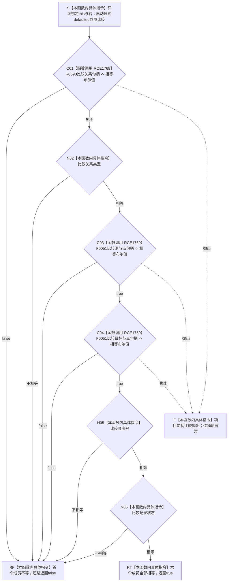

# CF-L6-0280 `系统角色关系材料::operator==` 现状流程图

图类型：现状流程图
代码版本：`747223647b2cc5796db66a048009d78fa4d96ed7`
源码 blob：`c26b12e291f7192b887ef01efce9e6dc157e9cef`
覆盖文件：`海中鱼巣/领域/系统角色清单.数据.h:125-131,140`
唯一根函数：F0457
完整签名：`bool 海中鱼巣::系统角色关系材料::operator==(const 海中鱼巣::系统角色关系材料&) const`
参数：隐式 `this` 与未命名的 `const 系统角色关系材料&`（下称 `右`）均为调用期间有效的只读借用
返回结果：按 `关系`、`类型`、`源节点`、`目标节点`、`顺序号`、`状态` 的声明顺序短路比较；首个不等返回 `false`，全部相等返回 `true`
非法值 / 拒绝：无；不调用 `完整()`，不拒绝默认值或无效句柄
已登记调用方：F0244 经 E0950 静态调用 2 次；F0456 经 RCE1763 调用 1 次
直接项目函数：R0598 经 RCE1768 调用 1 次；F0051 经 RCE1769 静态调用 2 次
外部边界：无；枚举与 `std::int64_t` 的相等比较是内建指令
未解析项目调用：无
调用图：`流程图/主程序可达调用关系/01_main可达项目调用边表.md`
外部边界表：`流程图/主程序可达调用关系/02_main可达外部边界表.md`
逐行映射表：`流程图/代码流程图/L6/CF-L6-0280_系统角色关系材料相等运算符_逐行代码映射表.md`
输入契约 / 调用语境表：本文“调用语境与结果分账”
非成功返回二分审查表：本文“调用语境与结果分账”
偏差清单：本文“当前边界与规范核对”
依据提交 / 结构化消息：冻结提交 `747223647b2cc5796db66a048009d78fa4d96ed7`；目标源码 blob 与该提交一致
结构读取与写入：只读两个关系材料对象的六个直接成员；不写关系仓库或其它机器事实
逻辑内返回：`false` 是值对象不等结果，不是入口拒绝或内部错误
内部错误：无结构化错误分支；被调句柄比较若抛出则传播原异常
生命周期与资源释放：不加锁、不分配资源、不保留借用
异常：声明未写 `noexcept`，静态合同为 potentially-throwing
并发 / 幂等：纯只读值比较
验证入口：`系统角色清单.数据.h:125-131,140`、E0950、RCE1763、RCE1768—RCE1769
验证输出：8 个源码行位点映射到 10 个流程节点；2 个聚合项目入边、2 个聚合项目出边、3 次静态项目调用、0 个外部边界、0 个未解析调用；本批不运行构建或程序
依据：`规范/0050_项目通用机器逻辑与禁止性规则总纲_20260721.md`、`规范/0600_代码函数流程图应用与维护规范.md`、`规范/4010_子规范_统一仓库稳定句柄与通用关系索引边界.md`
不得作为施工许可：是
不得宣称：两个关系材料值相等就证明关系有效、已发布、属于当前关系仓库或满足任何业务关系约束

## 流程图

## 节点合同

| 节点 | 类型 | 参数 / 输入绑定 | 结果 / 输出绑定 | 事实读写 | 后继条件 | 稳定边 |
| --- | --- | --- | --- | --- | --- | --- |
| S | 本函数内具体指令 | `this`、`右` | 两个只读借用 | 无 | 进入 C01 | 不适用 |
| C01 | 函数调用 | 两侧 `关系` 绑定为 R0598 的 `左`、`右` | 关系句柄相等布尔值 | 只读句柄字段 | false 到 RF；true 到 N02；异常到 E | RCE1768 |
| N02 | 本函数内具体指令 | 两侧 `类型` | 内建枚举相等布尔值 | 只读枚举 | 不等到 RF；相等到 C03 | 不适用 |
| C03 / C04 | 函数调用 | 两侧源节点 / 目标节点分别绑定为 F0051 的 `左`、`右` | 节点句柄相等布尔值 | 只读句柄字段 | false 到 RF；true 到下一节点；异常到 E | RCE1769 |
| N05 | 本函数内具体指令 | 两侧 `顺序号` | 内建整数相等布尔值 | 只读数值 | 不等到 RF；相等到 N06 | 不适用 |
| N06 | 本函数内具体指令 | 两侧 `状态` | 内建枚举相等布尔值 | 只读枚举 | 不等到 RF；相等到 RT | 不适用 |
| RF / RT | 本函数内具体指令 | 首个不等或全部相等 | `false` / `true` | 无 | 函数返回 | 不适用 |
| E | 本函数内具体指令 | 被调比较异常 | 原异常 | 不形成布尔结果 | 异常离开函数 | 不适用 |

## 已登记调用方

| 调用边 | 调用方 / 位置 | 静态次数 | 当前实参绑定 | 结果用途 |
| --- | --- | --- | --- | --- |
| E0950 | F0244 `系统角色清单::operator==(...) const` / `系统角色清单.数据.h:264` | 2 | 两侧清单的 `世界根到场景关系`、`场景到自我关系` | 对应关系成员不等使 F0244 短路返回 false |
| RCE1763 | F0456 `系统角色主体材料::operator==(...) const` / `系统角色清单.数据.h:212` | 1 | 两侧主体的 `场景接纳自我关系` | 该关系不等使 F0456 短路返回 false |

## 调用语境与结果分账

| 语境 | 当前输入 | 当前结果 | 非成功口径 | 结构后果 |
| --- | --- | --- | --- | --- |
| F0244 / F0456 defaulted 聚合比较 | 两侧对应关系材料 | 首个成员不等返回 `false`；全部相等返回 `true` | 正常值比较结果 | 无结构变化 |
| R0598 / F0051 调用抛出 | 已进入相应句柄成员比较 | 原异常传播 | 不形成逻辑内布尔结果 | 无结构写入 |

## 当前边界与规范核对

- defaulted 比较严格按六个直接成员的声明顺序执行，并在首个不等处短路。
- RCE1768 与 RCE1769 是聚合稳定边；后者覆盖源节点、目标节点两个静态调用点。
- 函数不检查句柄有效性、记录状态是否为有效、仓库编号一致性或关系语义；相等只证明当前字段值逐项一致。
