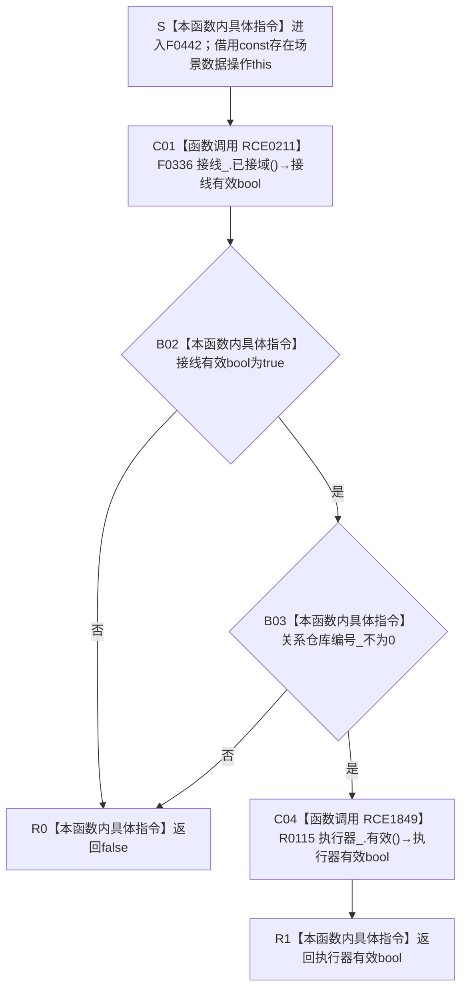

# CF-L6-0281 `存在场景数据操作::有效` 现状流程图

图类型：现状流程图
代码版本：`5cc7036de0decad163293a0b77c4789f068fd73a`
源码 blob：`524922ab2f3d0d76cfed4bdd517f0d7d57e1ae6a`
覆盖文件：`海中鱼巣/领域/数据操作.存在场景.ixx:153-155`
唯一根函数：F0442
完整签名：`bool 海中鱼巣::存在场景数据操作::有效() const noexcept`
参数：无显式参数；隐式 `this` 是调用期有效的 const `存在场景数据操作` 非拥有借用
返回结果：仅当 F0336 证明结构事务接线已接域、`关系仓库编号_ != 0` 且 R0115 证明结构写入执行器有效时返回 `true`；短路链任一条件为 false 即返回 `false`
非法值 / 拒绝：未接域、关系仓库编号为零或执行器无效均以 `false` 表达；函数不区分具体失败项
已登记调用方：F0240、F0448、R0626、R0633、R0648、R0649、R0651、R0652
直接项目函数：RCE0211 调用 F0336；RCE1849 调用 R0115
外部边界：无
未解析项目调用：0
调用图：`流程图/主程序可达调用关系/01_main可达项目调用边表.md`
逐行映射表：`流程图/代码流程图/L6/CF-L6-0281_存在场景数据操作有效_逐行代码映射表.md`
结构读取与写入：只读事务接线、关系仓库编号和执行器装配状态；不读取或修改节点、主信息、关系、索引及业务事实
逻辑内返回：任一完整性条件不成立时返回 `false`
内部错误：正式装配已保证三项完整而本函数返回 false 时须沿接线、仓库编号或执行器指针追根因；本函数不产生内部错误 DTO
生命周期与资源释放：不创建拥有型资源，不取得许可或锁
异常：声明 `noexcept`；F0336 与 R0115 当前均为只读布尔检查
并发 / 幂等：只读快照式检查；函数不提供跨后续调用保持不变的并发保证
验证入口：`数据操作.存在场景.ixx:153-155`、`结构事务接线.数据.h:77-80`、`执行器.结构写入.ixx:69-72`
验证输出：153—155 行完整覆盖；2 个项目出边、0 个外部边界、0 个未解析项目调用
依据：`规范/0050_项目通用机器逻辑与禁止性规则总纲_20260721.md`、`规范/0600_代码函数流程图应用与维护规范.md`、`规范/4040_子规范_不透明结构事务候选确认撤销与最后发布.md`
不得作为施工许可：是
不得宣称：返回 true 证明数据库、关系事实或存在场景业务能力完整；本函数取得许可、执行写入或完成运行期装配

## 流程图

## 项目源码调用合同

| 调用边 | 节点 | 被调函数 | 实参与结果 | 短路前置 | 被调图 |
| --- | --- | --- | --- | --- | --- |
| RCE0211 | C01 | F0336 `bool 结构事务接线::已接域() const` | `this=&接线_` → bool | 无；返回表达式第一项 | [CF-L6-0016](CF-L6-0016_结构事务接线已接域_现状流程图.md) |
| RCE1849 | C04 | R0115 `bool 结构写入执行器::有效() const` | `this=&执行器_` → bool | F0336=true 且 `关系仓库编号_ != 0` | 待绘制 |

## 当前边界与规范核对

- C++ `&&` 从左到右短路：F0336=false 时不读取关系仓库编号、不调用 R0115；编号为零时不调用 R0115。
- 返回 true 只表达当前三个装配字段的局部一致性，不读取任何存在、场景、关系或索引事实。
- 函数无写入、事务、许可、锁、发布或异常收口路径。
