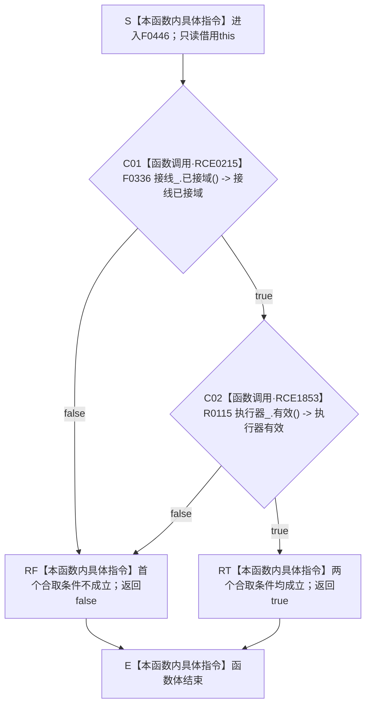

# CF-L6-0285 `轻量因果数据操作::有效` 现状流程图

图类型：现状流程图
代码版本：`5cc7036de0decad163293a0b77c4789f068fd73a`
源码 blob：`fdc9a1b062b28feffec733dd1a0e342812ef1ddc`
覆盖文件：`海中鱼巣/领域/数据操作.轻量因果.ixx:104-106`
唯一根函数：F0446
完整签名：`bool 海中鱼巣::轻量因果数据操作::有效() const noexcept`
参数：无显式参数；隐式 `this` 是调用期间有效的只读借用，不转移所有权
返回结果：接线已接域且结构写入执行器有效时返回 `true`；首个不成立条件使函数返回 `false`
非法值 / 拒绝：没有独立入口拒绝协议；`false` 是当前对象内部有效性查询的正常布尔结果
已登记调用方：F0240 经 E0935；R0423 经 RCE1319；R0689 经 RCE2034
直接项目函数：F0336 经 RCE0215；R0115 经 RCE1853
被调函数流程图：F0336 已制图为 `流程图/代码流程图/L6/CF-L6-0016_结构事务接线已接域_现状流程图.md`；R0115 在正式队列中待绘制，目标目录 `流程图/代码流程图/L9`
外部边界：无
未解析项目调用：无
调用图：`流程图/主程序可达调用关系/01_main可达项目调用边表.md`
外部边界表：`流程图/主程序可达调用关系/02_main可达外部边界表.md`
逐行映射表：`流程图/代码流程图/L6/CF-L6-0285_轻量因果数据操作有效_逐行代码映射表.md`
输入契约 / 调用语境表：本文“调用语境与结果分账”
非成功返回二分审查表：本文“调用语境与结果分账”；`false` 为有效性查询的正常结果
偏差清单：本文“当前边界与规范核对”
依据提交 / 结构化消息：冻结提交 `5cc7036de0decad163293a0b77c4789f068fd73a`；目标源码 blob 与该提交一致
结构读取与写入：只读接线和执行器有效性，不读写因果、节点、主信息、关系或索引记录
逻辑内返回：任一有效性条件不成立时返回 `false`
内部错误：无结构化内部错误结果；函数不捕获异常
生命周期与资源释放：不取得许可、锁或其它资源，不保留借用
异常：根函数声明 `noexcept`；R0115 的静态签名未声明 `noexcept`，异常越出时按 C++ 规则终止
并发 / 幂等：只读投影；相同成员状态下重复调用结果相同
验证入口：`数据操作.轻量因果.ixx:104-106`、E0935、RCE1319、RCE2034、RCE0215、RCE1853
验证输出：104—106 共 3 行完整映射；6 个流程节点、3 个项目入边、2 个项目出边、0 个外部边界、0 个未解析调用；本批不运行构建或程序
依据：`规范/0050_项目通用机器逻辑与禁止性规则总纲_20260721.md`、`规范/0600_代码函数流程图应用与维护规范.md`
不得作为施工许可：是
不得宣称：返回 `true` 证明轻量因果材料完整、因果可创建、事务许可已经取得，或轻量因果能力已经完成

## 流程图

## 节点合同

| 节点 | 类型 | 参数 / 输入绑定 | 结果 / 输出绑定 | 事实读写 | 后继条件 | 稳定边 |
| --- | --- | --- | --- | --- | --- | --- |
| S | 本函数内具体指令 | 隐式 `this` | 当前数据操作只读借用 | 无 | 进入 C01 | 不适用 |
| C01 | 函数调用 | `this->接线_` 绑定为 F0336 的 `this` | 接线已接域布尔值 | 只读接线 | false 到 RF；true 到 C02 | RCE0215 |
| C02 | 函数调用 | `this->执行器_` 绑定为 R0115 的 `this` | 执行器有效布尔值 | 只读执行器 | false 到 RF；true 到 RT | RCE1853 |
| RF / RT | 本函数内具体指令 | 首个失败条件或全部成立 | `false` / `true` | 无 | 到 E | 不适用 |
| E | 本函数内具体指令 | 已形成布尔结果 | 返回调用方 | 无 | 函数结束 | 不适用 |

## 已登记调用方

| 调用边 | 调用方 / 位置 | 当前实参绑定 | 结果用途 |
| --- | --- | --- | --- |
| E0935 | F0240 `运行期业务装配::完整() const noexcept` / `装配.运行期业务.ixx:129` | `this -> 轻量因果数据操作_` | E0934 为 true 后继续运行期装配完整性合取 |
| RCE1319 | R0423 `轻量因果数据操作::读取主键因果引用(std::uint64_t) const` / `数据操作.轻量因果.ixx:126,128` | 当前数据操作对象 | 入口和收口读取前的有效性判断 |
| RCE2034 | R0689 `轻量因果数据操作::创建轻量因果(const 轻量因果写入规格&) const` / `数据操作.轻量因果.ixx:135` | 当前数据操作对象 | 创建入口有效性判断 |

## 调用语境与结果分账

| 语境 | 当前输入 | 当前结果 | 非成功口径 | 结构后果 |
| --- | --- | --- | --- | --- |
| 三个已登记调用方查询当前数据操作 | 当前对象 | 两项均成立返回 `true` | 正常返回 | 无结构变化 |
| 接线未接域 | 当前接线成员 | 短路返回 `false` | 逻辑内返回 | 不调用 R0115 |
| 执行器无效 | 当前执行器成员 | 返回 `false` | 逻辑内返回 | 无结构变化 |

## 当前边界与规范核对

- F0446 不读取因果材料或业务记录，只查询接线和执行器两个承载条件。
- RCE0215 与 RCE1853 均为静态具名项目调用；不存在外部或动态调用。
- 当前 `true` 不能证明任一调用方后续请求有效或写入可以成功。
