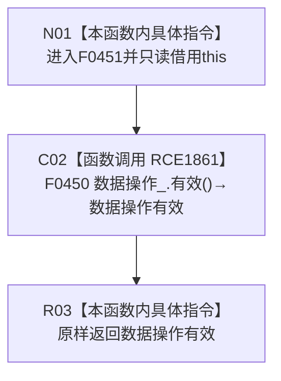

# CF-L6-0289 `概念活动业务服务::有效()` 现状流程图

图类型：现状流程图
代码版本：`5cc7036de0decad163293a0b77c4789f068fd73a`
源码 blob：`c96b7a88a6486ebbe8c23948fb9cca6e8effd23e`
覆盖文件：`海中鱼巣/领域/服务.概念活动.ixx:26`
唯一根函数：F0451
完整签名：`bool 海中鱼巣::概念活动业务服务::有效() const noexcept`
参数：无显式参数；隐式 `this` 是调用期有效的 const `概念活动业务服务` 非拥有借用
返回结果：原样返回成员 `数据操作_` 的 F0450 有效性查询结果
调用图：`流程图/主程序可达调用关系/01_main可达项目调用边表.md`
逐行映射表：`流程图/代码流程图/L6/CF-L6-0289_概念活动业务服务有效_逐行代码映射表.md`
输入契约 / 调用语境表：本文“返回语境”
非成功返回二分审查表：本文“返回语境”
偏差清单：无；本文只冻结当前代码事实
依据提交 / 结构化消息：当前提交、F0451、RCE1861 与源码第 26 行交叉复核
验证输出：1 行定义完整映射；1 个项目出边；0 个外部边界；0 个未解析调用
不得作为施工许可：是
不得宣称：返回 `true` 证明概念活动已经初始化、存在活动事实或业务状态完整

## 函数合同

```text
根函数：F0451 概念活动业务服务::有效
归属模块 / 文件 / 层级：服务.概念活动 / 海中鱼巣/领域/服务.概念活动.ixx / L6
现有或待新增：现有
完整签名：bool 海中鱼巣::概念活动业务服务::有效() const noexcept
参数：无显式参数；只读借用隐式 this
返回结果：bool，直接转发 F0450 的返回值
被调函数流程图：
- F0450 概念活动数据操作::有效：流程图/代码流程图/L5/CF-L5-0204_概念活动数据操作有效_现状流程图.md
```

## 流程图



## 节点合同

| 节点 | 类型 | 参数 / 输入绑定 | 结果 / 输出绑定 | 事实读写 | 后继条件 |
| --- | --- | --- | --- | --- | --- |
| N01 | 本函数内具体指令 | 隐式 `this` | 进入只读转发 | 无写入 | 无条件 |
| C02 | 函数调用 | 成员 `数据操作_` 作为接收者 | F0450 返回值 → 数据操作有效 | 只读被依赖对象接线 | 调用完成 |
| R03 | 本函数内具体指令 | 数据操作有效 | 原样返回 bool | 无 | 函数结束 |

## 返回语境

| 条件 | 返回 | 二分口径 | 结构变化 |
| --- | --- | --- | --- |
| F0450 返回 `false` | `false` | 有效性查询的逻辑内返回；具体原因由 F0450 合并 | 无 |
| F0450 返回 `true` | `true` | 正常转发 | 无 |

## 关键边界

- 本函数不重复检查数据操作内部条件，也不增加新的错误分类。
- 本函数不读取概念活动材料，不取得互斥锁，不产生结构或业务事实变化。
