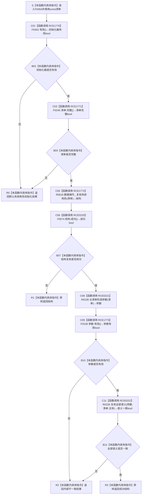

# CF-L6-0290 `系统角色初始化器::复核` 现状流程图

图类型：现状流程图
代码版本：`5cc7036de0decad163293a0b77c4789f068fd73a`
源码 blob：`adf3fb33c53aa5aeaff2f7102bc9a4d7db3ba040`
覆盖文件：`海中鱼巣/领域/初始化.系统角色.ixx:175-184`
唯一根函数：F0454
完整签名：`海中鱼巣::系统角色初始化结果 海中鱼巣::系统角色初始化器::复核(const 海中鱼巣::系统角色清单& 清单) const`
参数：隐式 `this` 是同步调用期内有效的 const 初始化器非拥有借用；`清单` 以 const 引用借用，不保存
返回结果：入口无效返回默认 `系统角色初始化结果`；结构复核失败原样返回；参数或全部语义复核失败返回 `内部不一致`；全部通过时原样返回结构复核结果
已登记调用方：F0242 经 E0946
直接项目函数：F0452/RCE1770、F0245/RCE1771、R0616/RCE1772、F0074/RCE0220、R0239/RCE0221、F0228/RCE1773、R0236/RCE0222
外部边界：无
未解析项目调用：无
调用图：`流程图/主程序可达调用关系/01_main可达项目调用边表.md`
逐行映射表：`流程图/代码流程图/L6/CF-L6-0290_系统角色初始化器复核_逐行代码映射表.md`
依据：`规范/0050_项目通用机器逻辑与禁止性规则总纲_20260721.md`、`规范/0600_代码函数流程图应用与维护规范.md`、当前代码与正式聚合关系表
不得作为施工许可：是
不得宣称：复核会创建、修复、发布或持久化系统角色；成功结果证明后续状态永不漂移

## 流程图

## 调用合同

| 调用边 | 节点 | 被调函数 | 实参与结果 | 当前作用 |
| --- | --- | --- | --- | --- |
| RCE1770 | C01 | F0452 `系统角色初始化器::有效()` | 隐式 `this` → bool | 入口接线门禁 |
| RCE1771 | C03 | F0245 `系统角色清单::完整()` | `清单` → bool | 清单值式完整性门禁 |
| RCE1772 | C05 | R0616 `系统角色数据操作::复核系统角色` | `清单` → 初始化结果 | 读取并复核正式结构 |
| RCE0220 | C06 | F0074 `系统角色初始化结果::成功()` | `结构` → bool | 校正后的真实静态类型调用 |
| RCE0221 | C08 | R0239 `从清单形成参数` | `清单` → 初始化参数 | 形成后续语义复核参数 |
| RCE1773 | C09 | F0228 `系统角色初始化参数::有效()` | `参数` → bool | 参数完整性门禁 |
| RCE0222 | C11 | R0236 `复核全部语义` | `参数, 清单.主体` → bool | 复核全部系统角色语义 |

## 非成功返回与当前边界

| 分支 | 返回 | 二分口径 | 结构变化 |
| --- | --- | --- | --- |
| 初始化器无效或清单不完整 | 默认结果 | 入口拒绝，逻辑内返回 | 无 |
| 数据操作复核失败 | 原样 `结构` | 由被调结果承载；强前置成立时追查数据操作 | 无 |
| 参数无效或语义不一致 | `内部不一致` | 前置结构已通过后的内部一致性异常，追根因解决 | 无 |
| 全部通过 | 原样 `结构` | 正常只读复核 | 无 |

本函数不取得锁、不写仓库、不更新 `最终清单_`；所有结构读取和一致性判定由具名被调函数承担。RCE0220 已按局部变量 `结构` 的真实静态类型绑定 F0074，不再指向已退出可达闭包的 R0330。
