# CF-L6-0291 `系统角色初始化器::初始化` 现状流程图

图类型：现状流程图
代码版本：`5cc7036de0decad163293a0b77c4789f068fd73a`
源码 blob：`adf3fb33c53aa5aeaff2f7102bc9a4d7db3ba040`
覆盖文件：`海中鱼巣/领域/初始化.系统角色.ixx:66-173`
唯一根函数：F0455
完整签名：`海中鱼巣::系统角色初始化结果 海中鱼巣::系统角色初始化器::初始化(const 海中鱼巣::系统角色初始化参数& 参数)`
参数：隐式 `this` 是调用期有效的可变初始化器非拥有借用；`参数` 以 const 引用借用且不保存
返回结果：入口拒绝、幂等冲突、许可/版本/内部错误等由具名结果返回；完整写前与写后复核、拓扑发布和最终读回通过后返回 `已提交` 或 `幂等读回` 及最终清单
并发：X02314/X02315 以 `初始化锁_` 建立覆盖整个函数的互斥窗口
结构写入：本函数通过具名服务/数据操作创建或幂等读取根结构，并由 R0409 发布世界拓扑；本函数自身只累计结果、形成材料、更新 `最终清单_` 并返回
已登记调用方：F0243 经 E0948
直接项目函数：正式调用边 RCE0223—RCE0231、RCE1774—RCE1785、RCE1863—RCE1879、RCE2170—RCE2173
外部边界：X02314—X02317、X02486—X02487
未解析项目调用：无
调用图：`流程图/主程序可达调用关系/01_main可达项目调用边表.md`
逐行映射表：`流程图/代码流程图/L6/CF-L6-0291_系统角色初始化器初始化_逐行代码映射表.md`
依据：`规范/0050_项目通用机器逻辑与禁止性规则总纲_20260721.md`、`规范/0600_代码函数流程图应用与维护规范.md`、当前代码与正式聚合关系表
不得作为施工许可：是
不得宣称：所有旧能力已重建；任一中途成功即证明完整初始化完成；返回成功证明后续结构不再漂移

## 流程图

```mermaid
flowchart TD
    S["S【本函数内具体指令】进入F0455并借用初始化参数"]
    X01["X01【外部边界 X02314】以初始化锁_构造lock_guard"]
    C02["C02【函数调用 RCE1774】F0452 有效()→初始化器有效bool"]
    C03["C03【函数调用 RCE1775】F0228 参数.有效()→参数有效bool"]
    B04{"B04【本函数内具体指令】两项入口门禁是否都通过"}
    R0["R0【本函数内具体指令】返回默认入口拒绝结果"]
    C05["C05【函数调用 RCE0228】R0422 预检稳定键(参数)→写前"]
    C06["C06【函数调用 RCE1776】R0617 写前.成功()→bool"]
    B07{"B07【本函数内具体指令】写前预检是否成功"}
    R1["R1【本函数内具体指令】返回写前状态"]
    C08["C08【函数调用 RCE0229】R0232 已有语义匹配(参数,写前)→bool"]
    B09{"B09【本函数内具体指令】已有语义是否匹配"}
    R2["R2【本函数内具体指令】返回幂等冲突"]
    N10["N10【本函数内具体指令】初始化改变了结构=false"]

    C11["C11【函数调用 RCE0230】R0496 创建基础信息身份→世界根"]
    C12["C12【函数调用 RCE1777】R0618 世界根.成功()→bool"]
    C13["C13【函数调用 RCE1779】R0620 映射世界根状态→系统角色状态"]
    R3["R3【本函数内具体指令】世界根失败时返回映射状态"]
    C14["C14【函数调用 RCE1778】R0619 世界根.改变了结构()→bool"]
    N15["N15【本函数内具体指令】累计改变了结构"]

    C16["C16【函数调用 RCE1780】R0621 创建场景→自我场景"]
    C17["C17【函数调用 RCE1781】R0622 自我场景.成功()→bool"]
    C18["C18【函数调用 RCE1783】R0624 映射自我场景状态"]
    R4["R4【本函数内具体指令】自我场景失败时返回映射状态"]
    C19["C19【函数调用 RCE1782】R0623 自我场景.改变了结构()→bool"]
    N20["N20【本函数内具体指令】累计改变了结构"]

    N21["N21【本函数内具体指令】默认构造自我存在结果"]
    C22["C22【函数调用 RCE0231】R0565 查找自我场景和自我存在占用材料"]
    C23["C23【函数调用 RCE1784】R0625 两项材料.已占用()→bool"]
    X24["X24【外部边界 X02316】场景接纳自我关系.has_value()→bool"]
    B25{"B25【本函数内具体指令】三项既有结构是否齐全"}
    X26["X26【外部边界 X02317】解引用既有接纳关系"]
    N27["N27【本函数内具体指令】形成幂等读回自我存在结果"]
    C28["C28【函数调用 RCE1863】R0643 在已有场景中创建并接纳实际存在→自我存在"]
    C29["C29【函数调用 RCE1781】R0622 自我存在.成功()→bool"]
    C30["C30【函数调用 RCE1783】R0624 映射自我存在状态"]
    R5["R5【本函数内具体指令】自我存在失败时返回映射状态"]
    C31["C31【函数调用 RCE1782】R0623 自我存在.改变了结构()→bool"]
    N32["N32【本函数内具体指令】累计改变了结构"]

    C33["C33【函数调用 RCE0223】R0229 创建安全根需求组→安全组"]
    B34{"B34【本函数内具体指令】安全组.成功字段是否为true"}
    R6["R6【本函数内具体指令】返回安全组状态"]
    N35["N35【本函数内具体指令】累计安全组改变标志"]
    C36["C36【函数调用 RCE0223】R0229 创建服务根需求组→服务组"]
    B37{"B37【本函数内具体指令】服务组.成功字段是否为true"}
    R7["R7【本函数内具体指令】返回服务组状态"]
    N38["N38【本函数内具体指令】累计服务组改变标志"]

    C39["C39【函数调用 RCE1864】R0646 创建实际存在→概念存在根"]
    C40["C40【函数调用 RCE1781】R0622 概念存在根.成功()→bool"]
    C41["C41【函数调用 RCE1783】R0624 映射概念存在根状态"]
    R8["R8【本函数内具体指令】概念存在根失败时返回映射状态"]
    C42["C42【函数调用 RCE1782】R0623 概念存在根.改变了结构()→bool"]
    N43["N43【本函数内具体指令】累计改变标志"]

    C44["C44【函数调用 RCE1865】R0657 创建抽象动态→概念动态根"]
    C45["C45【函数调用 RCE1866】R0658 概念动态根.成功()→bool"]
    C46["C46【函数调用 RCE1876】R0660 映射动态状态"]
    R9["R9【本函数内具体指令】概念动态根失败时返回映射状态"]
    C47["C47【函数调用 RCE1867】R0659 概念动态根.改变了结构()→bool"]
    N48["N48【本函数内具体指令】累计改变标志"]

    C49["C49【函数调用 RCE1868】R0680 创建轻量因果→概念因果根"]
    C50["C50【函数调用 RCE1869】R0681 概念因果根.成功()→bool"]
    C51["C51【函数调用 RCE1877】R0725 映射轻量因果状态"]
    R10["R10【本函数内具体指令】概念因果根失败时返回映射状态"]
    C52["C52【函数调用 RCE1870】R0682 概念因果根.改变了结构()→bool"]
    N53["N53【本函数内具体指令】累计改变标志"]

    C54["C54【函数调用 RCE1871】R0697 创建组合二次特征→概念关系根"]
    C55["C55【函数调用 RCE2170】R0369 概念关系根.成功()→bool"]
    C56["C56【函数调用 RCE1878】R0601 映射特征体系状态"]
    R11["R11【本函数内具体指令】概念关系根失败时返回映射状态"]
    C57["C57【函数调用 RCE2171】R0370 概念关系根.改变了结构()→bool"]
    N58["N58【本函数内具体指令】累计改变标志"]

    C59["C59【函数调用 RCE1872】R0711 复核根角色组→根角色"]
    C60["C60【函数调用 RCE1873】R0716 根角色.完整()→bool"]
    B61{"B61【本函数内具体指令】根角色是否完整"}
    R12["R12【本函数内具体指令】返回内部不一致"]
    C62["C62【函数调用 RCE0224】R0499 创建登记根→方法登记根"]
    C63["C63【函数调用 RCE1874】R0721 方法登记根.成功()→bool"]
    C64["C64【函数调用 RCE1879】R0602 映射方法状态"]
    R13["R13【本函数内具体指令】方法登记根失败时返回映射状态"]
    C65["C65【函数调用 RCE2172】R0603 状态已提交(方法状态)→bool"]
    N66["N66【本函数内具体指令】累计改变标志"]

    C67["C67【函数调用 RCE0228】R0422 再次预检稳定键→写后"]
    C68["C68【函数调用 RCE1776】R0617 写后.成功()→bool"]
    B69{"B69【本函数内具体指令】写后预检是否成功"}
    R14["R14【本函数内具体指令】返回写后状态"]
    C70["C70【函数调用 RCE0225】R0231 形成主体材料→optional主体"]
    X71["X71【外部边界 X02486】主体.has_value()→bool"]
    X72["X72【外部边界 X02487】解引用主体"]
    C73["C73【函数调用 RCE0226】R0236 复核全部语义(参数,*主体)→bool"]
    B74{"B74【本函数内具体指令】主体存在且语义复核通过"}
    R15["R15【本函数内具体指令】返回内部不一致"]

    C75["C75【函数调用 RCE0227】R0409 发布世界拓扑(*主体)→拓扑"]
    X74B["X74B【外部边界 X02487】再次解引用主体"]
    C76["C76【函数调用 RCE2173】F0074 拓扑.成功()→bool"]
    B77{"B77【本函数内具体指令】拓扑发布是否成功"}
    R16["R16【本函数内具体指令】原样返回拓扑失败结果"]
    C78["C78【函数调用 RCE0226】R0236 复核拓扑清单全部语义→bool"]
    B79{"B79【本函数内具体指令】发布后语义是否一致"}
    R17["R17【本函数内具体指令】返回内部不一致"]
    C80["C80【函数调用 RCE1785】R0616 复核系统角色(拓扑.清单)→最终复核"]
    C81["C81【函数调用 RCE2173】F0074 最终复核.成功()→bool"]
    B82{"B82【本函数内具体指令】最终复核是否成功"}
    R18["R18【本函数内具体指令】原样返回最终复核失败结果"]
    N83["N83【本函数内具体指令】最终清单_=最终复核.清单"]
    C84["C84【函数调用 RCE1875】R0722 拓扑.改变了结构()→bool"]
    N85["N85【本函数内具体指令】按累计改变标志选择已提交或幂等读回并形成返回结果"]
    X86["X86【外部边界 X02315】离开函数并释放初始化互斥锁"]
    R19["R19【本函数内具体指令】返回最终状态与清单"]

    S --> X01 --> C02 --> C03 --> B04
    B04 -->|否| R0 --> X86
    B04 -->|是| C05 --> C06 --> B07
    B07 -->|否| R1 --> X86
    B07 -->|是| C08 --> B09
    B09 -->|否| R2 --> X86
    B09 -->|是| N10 --> C11 --> C12
    C12 -->|否| C13 --> R3 --> X86
    C12 -->|是| C14 --> N15 --> C16 --> C17
    C17 -->|否| C18 --> R4 --> X86
    C17 -->|是| C19 --> N20 --> N21 --> C22 --> C23 --> X24 --> B25
    B25 -->|是| X26 --> N27 --> C29
    B25 -->|否| C28 --> C29
    C29 -->|否| C30 --> R5 --> X86
    C29 -->|是| C31 --> N32 --> C33 --> B34
    B34 -->|否| R6 --> X86
    B34 -->|是| N35 --> C36 --> B37
    B37 -->|否| R7 --> X86
    B37 -->|是| N38 --> C39 --> C40
    C40 -->|否| C41 --> R8 --> X86
    C40 -->|是| C42 --> N43 --> C44 --> C45
    C45 -->|否| C46 --> R9 --> X86
    C45 -->|是| C47 --> N48 --> C49 --> C50
    C50 -->|否| C51 --> R10 --> X86
    C50 -->|是| C52 --> N53 --> C54 --> C55
    C55 -->|否| C56 --> R11 --> X86
    C55 -->|是| C57 --> N58 --> C59 --> C60 --> B61
    B61 -->|否| R12 --> X86
    B61 -->|是| C62 --> C63
    C63 -->|否| C64 --> R13 --> X86
    C63 -->|是| C65 --> N66 --> C67 --> C68 --> B69
    B69 -->|否| R14 --> X86
    B69 -->|是| C70 --> X71 --> B74
    B74 -->|否| R15 --> X86
    B74 -->|是| X72 --> C73 --> X74B --> C75 --> C76 --> B77
    B77 -->|否| R16 --> X86
    B77 -->|是| C78 --> B79
    B79 -->|否| R17 --> X86
    B79 -->|是| C80 --> C81 --> B82
    B82 -->|否| R18 --> X86
    B82 -->|是| N83 --> C84 --> N85 --> X86 --> R19
```

## 阶段与失败收口

| 阶段 | 主要调用 | 失败返回 | 当前结构边界 |
| --- | --- | --- | --- |
| 入口与写前 | F0452、F0228、R0422、R0617、R0232 | 默认拒绝、写前状态、幂等冲突 | 尚未由本函数发起新的业务写入 |
| 世界根与自我场景 | R0496、R0621、R0643 | 映射后的系统角色状态 | 被调服务可能创建或幂等读回结构 |
| 安全/服务根需求 | R0229 两次 | 根需求组状态 | 依次形成两组根需求 |
| 四类概念根 | R0646、R0657、R0680、R0697 | 各业务状态映射结果 | 依次形成存在、动态、因果、关系根 |
| 角色与方法根 | R0711、R0499、R0603 | 内部不一致或方法状态映射 | 复核角色组并创建/读回方法登记根 |
| 写后与发布 | R0422、R0231、R0236、R0409、R0616 | 写后状态、内部不一致或原样失败结果 | 形成主体、发布拓扑、发布后读回 |
| 最终返回 | R0722 | 无额外失败 | 更新 `最终清单_`，返回已提交或幂等读回 |

## 关键边界

- X02314/X02315 的互斥窗口覆盖所有提前返回；每条返回路径离开函数时均释放 `初始化锁_`。
- `改变了结构` 只是各具名结果的累计值；最终状态还会并入拓扑发布结果 R0722。
- RCE2170—RCE2173 是本轮逐行复核补齐的直接调用：特征体系结果 `成功()`、`改变了结构()`、方法状态 `状态已提交()`，以及两个系统角色初始化结果的 `成功()`。
- X02316/X02317 只对应 `optional<关系句柄>`；X02486/X02487 独立对应 `optional<系统角色主体材料>`。两种模板实例及真实调用位置没有合并为笼统 `optional<T>`。
- 本图只描述当前代码路径。中途被调服务已经产生的结构变化不会因本函数随后返回失败而被本图解释为自动撤销。
