# CF-L6-0292 `系统角色主体材料::完整` 现状流程图

图类型：现状流程图
代码版本：`3920a74638264f9f539d50f32f3c9fe5fb1982ab`
源码 blob：`c26b12e291f7192b887ef01efce9e6dc157e9cef`
覆盖文件：`海中鱼巣/领域/系统角色清单.数据.h:188-210`
唯一根函数：F0458
完整签名：`bool 海中鱼巣::系统角色主体材料::完整() const noexcept`
参数：无显式参数；隐式 `this` 是调用期有效的 const `系统角色主体材料` 非拥有借用
返回结果：全部具名身份、关系与根需求材料完整，21 项身份同仓库且稳定主键、节点句柄、主信息句柄两两不重复，并且场景接纳自我关系精确为 `自我场景 --归属/顺序0--> 自我存在` 时返回 `true`；任一检查失败返回 `false`
非法值 / 拒绝：任何子材料不完整、身份仓库号不一致、身份键/节点/主信息重复或场景接纳关系端点/类型/顺序不符均折叠为 `false`
已登记调用方：F0245 经 E0953
正式项目出边：RCE0232 → R0563；RCE2174 → F0459；RCE2175 → R0727；RCE0233 → R0564；RCE2176 → F0051；RCE2177 → R0615
源码实际项目函数：R0563 `系统角色身份材料::完整()`；F0459 `系统角色关系材料::完整()`；R0727 `系统根需求角色材料::完整()`；R0564 `读取身份组()`；F0051 节点句柄相等；R0615 主信息句柄相等
外部边界：X02490 `std::array::front`；X02491 `std::array::size`；X02492 `std::array::operator[]`
未解析项目调用：0
调用图：`流程图/主程序可达调用关系/01_main可达项目调用边表.md`
外部边界表：`流程图/主程序可达调用关系/02_main可达外部边界表.md`
逐行映射表：`流程图/代码流程图/L6/CF-L6-0292_系统角色主体材料完整_逐行代码映射表.md`
结构读取与写入：只读当前值式材料字段和局部 `std::array` 指针投影；不修改系统角色、节点、主信息、关系、索引或其它机器事实
逻辑内返回：任一完整性或一致性检查失败返回 `false`
内部错误：正式系统角色清单已通过冻结构造或权威读回却在此失败时，应沿具体材料、仓库归属、唯一性或接纳关系追根因；裸 bool 不承载失败位置
生命周期与资源释放：局部 `身份组` 按值持有 21 个 const 指针，不拥有被指向材料；函数结束时数组平凡析构
异常：声明 `noexcept`；当前项目调用均为 `noexcept` 或值式比较路径
并发 / 幂等：只读值式材料；调用方必须保证所借用主体在调用期间不被并发修改
验证入口：`系统角色清单.数据.h:116-120,133-138,152-155,177-210`、`句柄.h:139-145`
验证输出：188—210 行完整覆盖；6 条正式项目出边和 3 条正式外部边界均已绑定
依据：`规范/0050_项目通用机器逻辑与禁止性规则总纲_20260721.md`、`规范/0600_代码函数流程图应用与维护规范.md`
不得作为施工许可：是
不得宣称：返回 true 证明系统角色已发布、数据库已恢复、角色对应节点仍当前可读或相关业务能力完成

## 流程图

```mermaid
flowchart TD
    S["S【本函数内具体指令】进入F0458；借用const系统角色主体材料this"]
    C01["C01【函数调用 RCE0232】R0563 世界根.完整()→bool"]
    C02["C02【函数调用 RCE0232】R0563 自我场景.完整()→bool"]
    C03["C03【函数调用 RCE0232】R0563 自我存在.完整()→bool"]
    C04["C04【函数调用 RCE2174】F0459 场景接纳自我关系.完整()→bool"]
    C05["C05【函数调用 RCE2175】R0727 安全根需求.完整()→bool"]
    C06["C06【函数调用 RCE2175】R0727 服务根需求.完整()→bool"]
    C07["C07【函数调用 RCE0232】R0563 概念存在根.完整()→bool"]
    C08["C08【函数调用 RCE0232】R0563 概念动态根.完整()→bool"]
    C09["C09【函数调用 RCE0232】R0563 概念关系根.完整()→bool"]
    C10["C10【函数调用 RCE0232】R0563 概念因果根.完整()→bool"]
    C11["C11【函数调用 RCE0232】R0563 方法登记根.完整()→bool"]
    C12["C12【函数调用 RCE0232】R0563 方法登记角色状态.完整()→bool"]
    C13["C13【函数调用 RCE0232】R0563 方法活跃状态.完整()→bool"]
    C14["C14【函数调用 RCE0232】R0563 方法失效状态.完整()→bool"]
    B15{"B15【本函数内具体指令】上述左到右短路检查是否全部为true"}
    RF["RF【本函数内具体指令】返回false"]
    C16["C16【函数调用 RCE0233】R0564 读取身份组()→21项const身份指针数组"]
    C17["C17【函数调用·外部边界 X02490】身份组.front()→首身份指针"]
    N18["N18【本函数内具体指令】读取首身份节点仓库编号为基准仓库编号"]
    X19["X19【函数调用·外部边界 X02491】身份组.size()→元素数"]
    L19{"L19【本函数内具体指令】左索引是否小于元素数"}
    X20A["X20A【函数调用·外部边界 X02492】身份组[左]→左身份指针"]
    C20["C20【函数调用 RCE0232】R0563 左身份.完整()→bool"]
    B20{"B20【本函数内具体指令】左身份完整bool为true"}
    X20B["X20B【函数调用·外部边界 X02492】身份组[左]→左身份指针"]
    B21{"B21【本函数内具体指令】左身份节点仓库编号等于基准"}
    X22["X22【函数调用·外部边界 X02491】身份组.size()→元素数"]
    L22{"L22【本函数内具体指令】右索引是否小于元素数"}
    X23A["X23A【函数调用·外部边界 X02492】身份组[左]→左身份指针"]
    X23B["X23B【函数调用·外部边界 X02492】身份组[右]→右身份指针"]
    B23{"B23【本函数内具体指令】左右稳定主键是否相等"}
    X24A["X24A【函数调用·外部边界 X02492】身份组[左]→左身份指针"]
    X24B["X24B【函数调用·外部边界 X02492】身份组[右]→右身份指针"]
    C24["C24【函数调用 RCE2176】F0051 比较左右节点句柄→相等bool"]
    X25A["X25A【函数调用·外部边界 X02492】身份组[左]→左身份指针"]
    X25B["X25B【函数调用·外部边界 X02492】身份组[右]→右身份指针"]
    C25["C25【函数调用 RCE2177】R0615 比较左右主信息句柄→相等bool"]
    B26{"B26【本函数内具体指令】键、节点或主信息是否任一重复"}
    N27["N27【本函数内具体指令】右索引加1"]
    N28["N28【本函数内具体指令】左索引加1并把右索引重置为左+1"]
    B29{"B29【本函数内具体指令】接纳关系类型为归属"}
    C30["C30【函数调用 RCE2176】F0051 接纳关系源节点==自我场景节点→bool"]
    C31["C31【函数调用 RCE2176】F0051 接纳关系目标节点==自我存在节点→bool"]
    B32{"B32【本函数内具体指令】关系端点均相等且顺序号为0"}
    RT["RT【本函数内具体指令】返回true"]

    S --> C01 --> C02 --> C03 --> C04 --> C05 --> C06 --> C07 --> C08 --> C09 --> C10 --> C11 --> C12 --> C13 --> C14 --> B15
    B15 -->|否| RF
    B15 -->|是| C16 --> C17 --> N18 --> X19 --> L19
    L19 -->|否| B29
    L19 -->|是| X20A --> C20 --> B20
    B20 -->|否| RF
    B20 -->|是| X20B --> B21
    B21 -->|否| RF
    B21 -->|是| X22 --> L22
    L22 -->|否| N28 --> X19
    L22 -->|是| X23A --> X23B --> B23
    B23 -->|是| RF
    B23 -->|否| X24A --> X24B --> C24
    C24 -->|是| RF
    C24 -->|否| X25A --> X25B --> C25 --> B26
    B26 -->|是| RF
    B26 -->|否| N27 --> L22
    B29 -->|否| RF
    B29 -->|是| C30 --> C31 --> B32
    B32 -->|否| RF
    B32 -->|是| RT
```

## 项目源码调用合同

| 身份 / 状态 | 调用点 | 被调函数 | 实参与结果 | 被调图 |
| --- | --- | --- | --- | --- |
| RCE0232 | C01—C03、C07—C14、C20 | R0563 `系统角色身份材料::完整() const noexcept` | 各身份材料 const `this` → bool | 待绘制 |
| RCE2174 | C04 | F0459 `系统角色关系材料::完整() const noexcept` | `this=&场景接纳自我关系` → bool | [CF-L6-0293](CF-L6-0293_系统角色关系材料完整_现状流程图.md) |
| RCE2175 | C05 / C06 | R0727 `系统根需求角色材料::完整() const noexcept` | 安全/服务根需求 const `this` → bool | [R0727](../L7/CF-L7-0004_系统根需求角色材料完整_现状流程图.md) |
| RCE0233 | C16 | R0564 `系统角色主体材料::读取身份组() const noexcept` | 同一 `this` → const 指针数组 | 待绘制 |
| RCE2176 | C24 / C30 / C31 | F0051 `operator==(const 节点句柄&,const 节点句柄&)` | 左右节点句柄 const 借用 → bool | [F0051](../L4/CF-L4-0015_节点句柄_operator_equal_现状流程图.md) |
| RCE2177 | C25 | R0615 `operator==(const 主信息句柄&,const 主信息句柄&)` | 左右主信息句柄 const 借用 → bool | [R0615](../L8/CF-L8-0001_主信息句柄相等运算符_现状流程图.md) |

## 外部边界调用合同

| 边界身份 | 节点 | 完整签名 | 源码行 |
| --- | --- | --- | --- |
| X02490 | C17 | `const 海中鱼巣::系统角色身份材料* const& std::array<const 海中鱼巣::系统角色身份材料*, 21>::front() const noexcept` | 197 |
| X02491 | X19 / X22 | `constexpr std::size_t std::array<const 海中鱼巣::系统角色身份材料*, 21>::size() const noexcept` | 198、200 |
| X02492 | X20A / X20B / X23A / X23B / X24A / X24B / X25A / X25B | `const 海中鱼巣::系统角色身份材料* const& std::array<const 海中鱼巣::系统角色身份材料*, 21>::operator const noexcept` | 199、201—203 |

## 当前调用事实闭合

- F0458 的 6 个项目被调身份均以 RCE0232、RCE2174—RCE2177、RCE0233 绑定；同一边身份覆盖对应静态调用点。
- `std::array::front/size/operator[]` 分别以 X02490—X02492 绑定；循环条件和各次下标访问均在图中显式表示。
