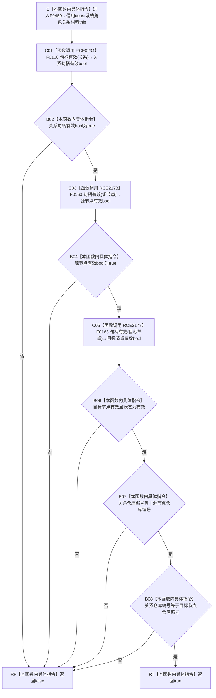

# CF-L6-0293 `系统角色关系材料::完整` 现状流程图

图类型：现状流程图
代码版本：`3920a74638264f9f539d50f32f3c9fe5fb1982ab`
源码 blob：`c26b12e291f7192b887ef01efce9e6dc157e9cef`
覆盖文件：`海中鱼巣/领域/系统角色清单.数据.h:133-138`
唯一根函数：F0459
完整签名：`bool 海中鱼巣::系统角色关系材料::完整() const noexcept`
参数：无显式参数；隐式 `this` 是调用期有效的 const `系统角色关系材料` 非拥有借用
返回结果：关系句柄、源节点句柄和目标节点句柄均有效，记录状态为有效，且关系句柄仓库编号同时等于源、目标节点仓库编号时返回 `true`；否则返回 `false`
已登记调用方：F0245 经 E0954；R0538 经 RCE1550
正式项目出边：RCE0234 → F0168；RCE2178 → F0163
源码实际项目函数：F0168 关系句柄有效；F0163 节点句柄有效
外部边界：无
未解析项目调用：0
调用图：`流程图/主程序可达调用关系/01_main可达项目调用边表.md`
逐行映射表：`流程图/代码流程图/L6/CF-L6-0293_系统角色关系材料完整_逐行代码映射表.md`
结构读取与写入：只读当前值式材料；零机器事实写入
逻辑内返回：任一条件不成立返回 `false`
内部错误：正式权威读回已保证完整关系材料却返回 false 时须沿句柄、状态或仓库归属追根因
生命周期与资源释放：无拥有型局部对象
异常：声明 `noexcept`
并发 / 幂等：只读值式比较，调用方负责材料生命周期和并发稳定性
验证输出：133—138 行完整覆盖；RCE0234 与 RCE2178 均已绑定
依据：`规范/0050_项目通用机器逻辑与禁止性规则总纲_20260721.md`、`规范/0600_代码函数流程图应用与维护规范.md`
不得作为施工许可：是
不得宣称：返回 true 证明关系记录仍存在、关系端点当前可读、关系类型符合具体业务或关系已经发布

## 流程图

## 项目源码调用合同

| 身份 / 状态 | 节点 | 被调函数 | 实参与结果 | 被调图 |
| --- | --- | --- | --- | --- |
| RCE0234 | C01 | F0168 `bool 句柄有效(const 关系句柄&)` | `关系` const 借用 → bool | [F0168](../L5/CF-L5-0048_关系句柄有效_现状流程图.md) |
| RCE2178 | C03 / C05 | F0163 `bool 句柄有效(const 节点句柄&)` | `源节点` / `目标节点` const 借用 → bool | [F0163](../L5/CF-L5-0044_节点句柄有效_现状流程图.md) |

## 当前边界与规范核对

- `&&` 从左到右短路，前一项失败后不执行后续句柄或字段检查。
- 仓库编号一致只证明三个句柄的仓库字段相同，不证明关系记录存在或端点当前可读。
- F0459→F0163 的两个静态调用点共用正式边身份 RCE2178。
