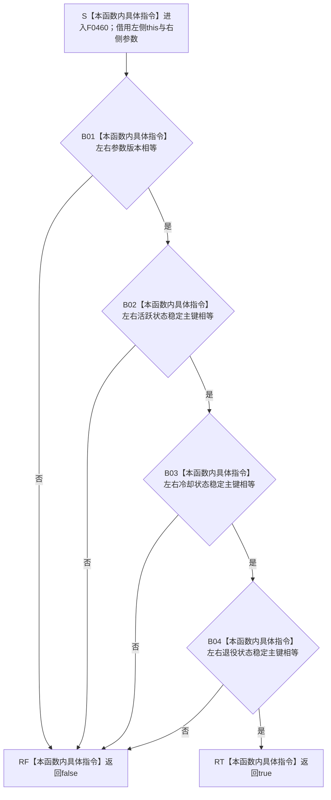

# CF-L6-0294 `概念活动初始化参数::operator==` 现状流程图

图类型：现状流程图
代码版本：`3920a74638264f9f539d50f32f3c9fe5fb1982ab`
源码 blob：`a4090a7643aa12c41f2830eb5f51593aabde7488`
覆盖文件：`海中鱼巣/领域/概念活动状态.数据.h:52`
唯一根函数：F0460
完整签名：`bool 海中鱼巣::概念活动初始化参数::operator==(const 海中鱼巣::概念活动初始化参数& 右) const`
参数：隐式 `this` 与显式 `右` 都是调用期间借用的 const `概念活动初始化参数`；均不复制、不保存
返回结果：编译器生成的默认相等运算按声明顺序比较 `参数版本`、`活跃状态稳定主键`、`冷却状态稳定主键`、`退役状态稳定主键`；四个标量字段全部相等时返回 `true`，否则返回 `false`
已登记调用方：F0227 经 E0952；F0247 经 E0962；F0250 经 E0967
直接项目函数：无
外部边界：无；四个字段均为固定宽度整数，使用内建相等比较
未解析项目调用：0
调用图：`流程图/主程序可达调用关系/01_main可达项目调用边表.md`
逐行映射表：`流程图/代码流程图/L6/CF-L6-0294_概念活动初始化参数相等运算符_逐行代码映射表.md`
结构读取与写入：只读左右参数值，不修改项目结构
逻辑内返回：任一字段不同返回 `false`
内部错误：无具名内部错误；调用方若已保证同一冻结参数而比较失败，应追查传入材料或版本漂移
生命周期与资源释放：无局部拥有型资源
异常：默认生成的四个整数比较不抛出
并发 / 幂等：纯值比较；调用方保证两个借用对象在调用期间稳定
验证输出：第 52 行完整映射；0 个项目出边、0 个外部边界、0 个未解析调用
依据：`规范/0050_项目通用机器逻辑与禁止性规则总纲_20260721.md`、`规范/0600_代码函数流程图应用与维护规范.md`
不得作为施工许可：是
不得宣称：相等证明参数有效、稳定主键已登记或概念活动已经初始化

## 流程图

## 当前边界与规范核对

- `= default` 冻结的是四个非静态数据成员的逐成员相等语义，不调用 `有效()`，也不把三个稳定主键排序后比较。
- 比较结果只表达两个 DTO 当前字段按值相等，不证明任一 DTO 满足版本、非零或互异门禁。
