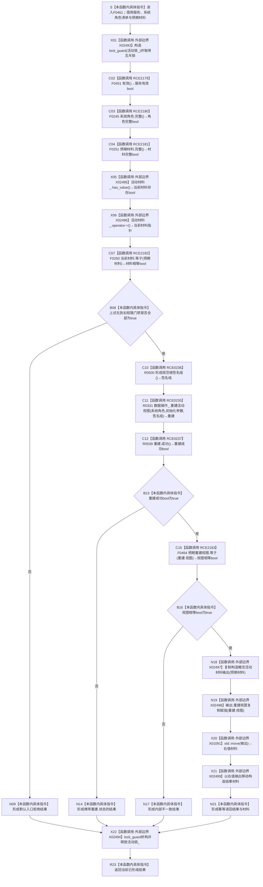

# CF-L6-0295 `概念活动业务服务::复核` 现状流程图

图类型：现状流程图
代码版本：`3920a74638264f9f539d50f32f3c9fe5fb1982ab`
源码 blob：`c96b7a88a6486ebbe8c23948fb9cca6e8effd23e`
覆盖文件：`海中鱼巣/领域/服务.概念活动.ixx:67-82`
唯一根函数：F0461
完整签名：`海中鱼巣::概念活动初始化结果 海中鱼巣::概念活动业务服务::复核(const 海中鱼巣::系统角色清单& 系统角色, const 海中鱼巣::概念活动材料& 预期材料) const`
参数：隐式 `this` 是 const `概念活动业务服务` 非拥有借用；`系统角色` 与 `预期材料` 均为调用期间借用的 const 引用，不保存
返回结果：入口或当前材料不匹配时返回默认 `概念活动初始化结果`；重建失败时返回携带重建状态的结果；重建视图不等时返回内部不一致；全部复核通过时复制预期材料、以重建视图替换副本中的视图，并返回 `幂等读回` 与移动后的材料副本
非法值 / 拒绝：服务无效、系统角色清单不完整、预期材料不完整、服务未持有活动材料或当前材料与预期不等均折叠为默认入口拒绝结果
已登记调用方：F0248 经 E0964
正式项目出边：RCE2179 → F0451；RCE2180 → F0245；RCE2181 → F0251；RCE2182 → F0250；RCE0236 → R0500；RCE0235 → R0331；RCE0237 → R0539；RCE2183 → F0464
源码实际项目函数：F0451 `有效()`；F0245 `系统角色清单::完整()`；F0251 `概念活动材料::完整()`；F0250 `概念活动材料::等于()`；R0500 `形成规范根签名组()`；R0331 `重建活动视图()`；R0539 `成功()`；F0464 `概念活动重建视图::等于()`
外部边界：X02493—X02494 `std::lock_guard<std::mutex>` 构造/析构；X02495—X02496 `std::optional<概念活动材料>::has_value/operator->`；X02497 材料复制构造；X02498 视图复制赋值；X01091 `std::move`；X02499 材料移动构造
未解析项目调用：0
调用图：`流程图/主程序可达调用关系/01_main可达项目调用边表.md`
外部边界表：`流程图/主程序可达调用关系/02_main可达外部边界表.md`
逐行映射表：`流程图/代码流程图/L6/CF-L6-0295_概念活动业务服务复核_逐行代码映射表.md`
结构读取与写入：在 `活动锁_` 保护下读取当前服务活动材料；局部重建视图由数据操作只读形成；只修改局部 `输出` 副本，不修改服务材料或机器事实
逻辑内返回：入口门禁不满足返回默认结果；R0331 合法非成功状态原样映射返回
内部错误：R0331 报成功但重建视图与预期不等时返回内部不一致；强前置保证材料一致而入口门禁失败也须追根因
生命周期与资源释放：X02493 构造的 `lock_guard` 覆盖全部复核和返回值形成；所有正常返回与异常展开均经 X02494 析构解锁。`输出` 经 X02497 从预期材料复制构造，成功时先经 X01091 转为右值，再经 X02499 移动构造结果中的材料
异常：未声明 `noexcept` 且不捕获；锁构造、重建、材料复制/赋值或返回构造异常向调用方传播，已构造锁按栈展开释放
并发 / 幂等：服务锁串行保护 `活动材料_` 读取；相同冻结材料下复核不修改服务状态并具幂等读回语义
验证输出：67—82 行完整覆盖；8 条正式项目出边和 8 个正式外部边界身份均已绑定
依据：`规范/0050_项目通用机器逻辑与禁止性规则总纲_20260721.md`、`规范/0600_代码函数流程图应用与维护规范.md`、`规范/4040_子规范_不透明结构事务候选确认撤销与最后发布.md`、`规范/4050_子规范_入口拒绝逻辑内结果与内部逻辑错误.md`
不得作为施工许可：是
不得宣称：复核成功创建或发布概念活动、修改服务材料、证明数据库状态、解除计划门禁或完成概念活动能力

## 流程图

## 项目源码调用合同

| 身份 / 状态 | 节点 | 被调函数 | 实参与结果 | 被调图 |
| --- | --- | --- | --- | --- |
| RCE2179 | C02 | F0451 `概念活动业务服务::有效() const noexcept` | 同一 `this` → bool | [F0451](CF-L6-0289_概念活动业务服务有效_现状流程图.md) |
| RCE2180 | C03 | F0245 `系统角色清单::完整() const noexcept` | `系统角色` const 借用 → bool | [F0245](../L5/CF-L5-0121_系统角色清单完整_现状流程图.md) |
| RCE2181 | C04 | F0251 `概念活动材料::完整() const noexcept` | `预期材料` const 借用 → bool | [F0251](../L5/CF-L5-0127_概念活动材料完整_现状流程图.md) |
| RCE2182 | C07 | F0250 `概念活动材料::等于(const 概念活动材料&) const noexcept` | 当前活动材料、预期材料 → bool | [F0250](../L5/CF-L5-0126_概念活动材料等值比较_现状流程图.md) |
| RCE0236 | C10 | R0500 `概念活动业务服务::形成规范根签名组()` | 无显式参数 → 签名数组 | 待绘制 |
| RCE0235 | C11 | R0331 `概念活动数据操作::重建活动视图(...) const` | 系统角色、预期初始化参数、签名组 → 重建结果 | 待绘制 |
| RCE0237 | C12 | R0539 `概念活动重建结果::成功() const noexcept` | `this=&重建` → bool | 待绘制 |
| RCE2183 | C15 | F0464 `概念活动重建视图::等于(const 概念活动重建视图&) const noexcept` | 预期视图、重建视图 → bool | [F0464](CF-L6-0298_概念活动重建视图等于_现状流程图.md) |

## 外部边界调用合同

| 边界身份 | 节点 | 完整签名 | 源码行 |
| --- | --- | --- | --- |
| X02493 | X01 | `std::lock_guard<std::mutex>::lock_guard(std::mutex&)` | 70 |
| X02494 | X22 | `std::lock_guard<std::mutex>::~lock_guard()` | 70—82 |
| X02495 | X05 | `bool std::optional<海中鱼巣::概念活动材料>::has_value() const noexcept` | 72 |
| X02496 | X06 | `const 海中鱼巣::概念活动材料* std::optional<海中鱼巣::概念活动材料>::operator->() const noexcept` | 72 |
| X02497 | N18 | `海中鱼巣::概念活动材料::概念活动材料(const 海中鱼巣::概念活动材料&)` | 79 |
| X02498 | N19 | `海中鱼巣::概念活动重建视图& 海中鱼巣::概念活动重建视图::operator=(const 海中鱼巣::概念活动重建视图&)` | 80 |
| X01091 | X20 | `constexpr std::remove_reference_t<海中鱼巣::概念活动材料&>&& std::move<海中鱼巣::概念活动材料&>(海中鱼巣::概念活动材料&) noexcept` | 81 |
| X02499 | X21 | `海中鱼巣::概念活动材料::概念活动材料(海中鱼巣::概念活动材料&&)` | 81 |

## 调用语境与返回分账

| 语境 | 当前结果 | 二分口径 | 结构后果 |
| --- | --- | --- | --- |
| 任一入口门禁失败 | 默认初始化结果 | 一般入口拒绝为逻辑内返回；强前置矛盾须追根因 | 零写入 |
| R0331 返回非成功 | `{重建.状态}` | 依 R0331 状态传播；内部结构异常须追根因 | 零写入 |
| R0331 成功但视图不等 | 内部不一致 | 明确内部错误 | 零写入 |
| 全部一致 | 幂等读回 + 移动后的输出副本 | 成功只读复核 | 仅修改局部副本，零机器事实写入 |

## 当前调用事实闭合

- F0461 的 8 个项目被调身份均以 RCE2179—RCE2183、RCE0235—RCE0237 绑定。
- 锁、optional、复制/移动与赋值调用均以 X02493—X02499、X01091 绑定；X02494 覆盖正常返回和异常展开时的锁释放。
