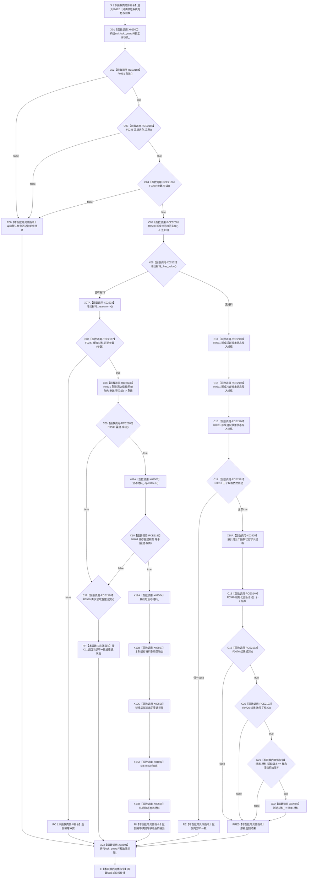

# CF-L6-0296 `概念活动业务服务::初始化` 现状流程图

图类型：现状流程图
代码版本：`04b66401f3aed237bb89bf885a63e2b3d0a877dc`
源码 blob：`c96b7a88a6486ebbe8c23948fb9cca6e8effd23e`
覆盖文件：`海中鱼巣/领域/服务.概念活动.ixx:28-65`
唯一根函数：F0462
完整签名：`海中鱼巣::概念活动初始化结果 海中鱼巣::概念活动业务服务::初始化(const 海中鱼巣::系统角色清单& 系统角色, const 海中鱼巣::概念活动初始化参数& 参数)`
参数：`系统角色` 与 `参数` 均为调用期间有效的 const 只读借用，不转移所有权；隐式 `this` 可修改服务私有 `活动材料_`
返回结果：入口无效返回默认结果；已有材料分支返回幂等冲突、内部不一致、重建状态或幂等读回；全新分支返回内部不一致或数据操作形成的初始化结果
已登记调用方：F0249 经 E0966 在 `海中鱼巣/装配.运行期业务.ixx:159` 调用
直接项目函数：F0451 经 RCE2184；F0245 经 RCE2185；F0229 经 RCE2186；R0500 经 RCE0238；F0247 经 RCE2187；R0331 经 RCE0239；R0539 经 RCE2188；F0464 经 RCE2189；R0511 经 RCE2190；R0510 经 RCE2191；R0340 经 RCE0240；F0076 经 RCE2192；R0726 经 RCE2193
外部边界：X02500 锁构造、X02501 锁析构、X02502 `has_value`、X02503 `operator->`、X02504 材料 `operator*`、X02505 规格 `operator*`、X02506 optional 赋值、X02507 材料复制、X02508 视图赋值、X02509 材料移动，以及 X01092 `std::move(...)`
未解析项目调用：无
调用图：`流程图/主程序可达调用关系/01_main可达项目调用边表.md`
外部边界表：`流程图/主程序可达调用关系/02_main可达外部边界表.md`
逐行映射表：`流程图/代码流程图/L6/CF-L6-0296_概念活动业务服务初始化_逐行代码映射表.md`
输入契约 / 调用语境表：本文“调用语境与结果分账”
非成功返回二分审查表：本文“调用语境与结果分账”
偏差清单：本文“聚合关系闭合核对”
结构读取与写入：持有服务私有互斥锁；已有材料分支只更新局部输出副本；全新分支成功后把 `结果.材料` 写入服务私有 `活动材料_`
逻辑内返回：入口材料无效、参数不匹配导致幂等冲突、已有材料成功重建后的幂等读回
内部错误：已缓存材料与权威重建视图不等、三个状态规格任一形成失败；数据操作返回的其它状态原样收口
生命周期与资源释放：所有返回路径离开作用域时释放 `活动锁_`；局部规格、重建结果和输出值随作用域结束释放
异常：函数未声明 `noexcept` 且不捕获异常；异常传播前由 lock_guard 析构释放互斥锁
并发 / 幂等：同一服务对象的初始化由 `活动锁_` 串行；已有匹配参数材料走重建核对和幂等读回
验证入口：`服务.概念活动.ixx:28-65`、E0966、RCE0238—RCE0240、X01092
验证输出：28—65 共 38 行完整映射；1 个项目入边、13 个项目出边、11 个外部边界、0 个未解析调用
依据：`规范/0050_项目通用机器逻辑与禁止性规则总纲_20260721.md`、`规范/0600_代码函数流程图应用与维护规范.md`
不得作为施工许可：是
不得宣称：本图证明概念活动初始化已经验证通过、私有材料已经发布为跨服务机器事实，或概念活动能力已经完成

## 流程图

## 调用语境与结果分账

| 语境 | 返回结果 | 非成功口径 | 私有结构变化 |
| --- | --- | --- | --- |
| 服务、系统角色或参数无效 | 默认初始化结果 | 逻辑内返回 | 无 |
| 已有材料但参数不匹配 | 幂等冲突 | 逻辑内返回 | 无 |
| 已有材料且重建失败或视图不等 | 重建状态或内部不一致 | 前置通过后的内部一致性收口 | 无；仅形成局部量 |
| 已有材料且重建一致 | 幂等读回与局部更新副本 | 正常返回 | 不修改 `活动材料_` |
| 任一状态规格形成失败 | 内部不一致 | 前置通过后的内部结果异常 | 无 |
| 全新初始化结果不满足成功、改变结构或初始版本 | 原样返回结果 | 数据操作结果收口 | 是否有底层结构变化由 R0340 结果承载；本服务不写缓存 |
| 全新初始化满足全部后置 | 原样返回结果 | 正常返回 | `活动材料_ = 结果.材料` |

## 聚合关系闭合核对

- `服务.概念活动.ixx:32-61` 的全部项目调用已由 RCE2184—RCE2193 与既有 RCE0238—RCE0240 覆盖。
- `概念活动初始化结果::改变了结构() const noexcept` 已登记为 R0726，并由 RCE2193 连接 F0462。
- `:31-65` 的 RAII、optional 和材料复制 / 赋值 / 移动边界已由 X02500—X02509 覆盖；`:44` 的 `std::move` 保持 X01092。
