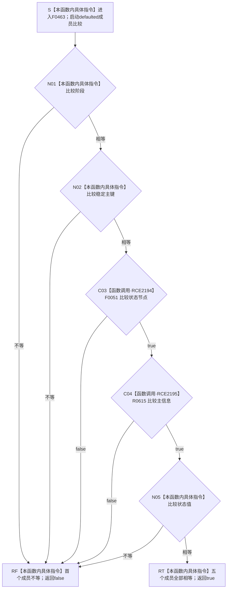

# CF-L6-0297 `概念活动状态角色材料::operator==` 现状流程图

图类型：现状流程图
代码版本：`04b66401f3aed237bb89bf885a63e2b3d0a877dc`
源码 blob：`a4090a7643aa12c41f2830eb5f51593aabde7488`
覆盖文件：`海中鱼巣/领域/概念活动状态.数据.h:70`
唯一根函数：F0463
完整签名：`bool 海中鱼巣::概念活动状态角色材料::operator==(const 海中鱼巣::概念活动状态角色材料&) const`
参数：隐式 `this` 与未命名 const 右实参均为只读借用
返回结果：按成员声明顺序短路比较阶段、稳定主键、状态节点、主信息和状态值；首个不等返回 `false`，全部相等返回 `true`
已登记调用方：F0250 经 E0968；F0251 经 E0973
直接项目函数：F0051 经 RCE2194 比较 `状态节点`；R0615 经 RCE2195 比较 `主信息`
外部边界：无；枚举和整数成员使用内建比较
逐行映射表：`流程图/代码流程图/L6/CF-L6-0297_概念活动状态角色材料相等运算符_逐行代码映射表.md`
结构读取与写入：只读两个值对象的五个成员，不写机器事实
异常：声明未写 `noexcept`；defaulted 比较按被调成员比较的异常合同传播
验证输出：第 70 行完整映射；2 个项目入边、2 个项目出边
依据：`规范/0050_项目通用机器逻辑与禁止性规则总纲_20260721.md`、`规范/0600_代码函数流程图应用与维护规范.md`
不得作为施工许可：是
不得宣称：相等结果证明材料完整、节点和主信息仍可读，或概念活动状态正确

## 流程图

## 已登记调用方

| 调用边 | 调用方 / 位置 | 当前用途 |
| --- | --- | --- |
| E0968 | F0250 `概念活动材料::等于` / `概念活动状态.数据.h:188` | `std::array` 按元素短路比较 |
| E0973 | F0251 `概念活动材料::完整` / `概念活动状态.数据.h:163` | 当前材料与重建视图的状态角色数组按元素比较 |

## 聚合关系闭合核对

- defaulted 定义位于第 70 行；成员声明顺序固定在 56—60 行。
- `状态节点` 的静态类型是 `节点句柄`，解析到 F0051；`主信息` 的静态类型是 `主信息句柄`，解析到 R0615。
- RCE2194、RCE2195 已按 defaulted 成员声明顺序冻结两个静态项目调用。
